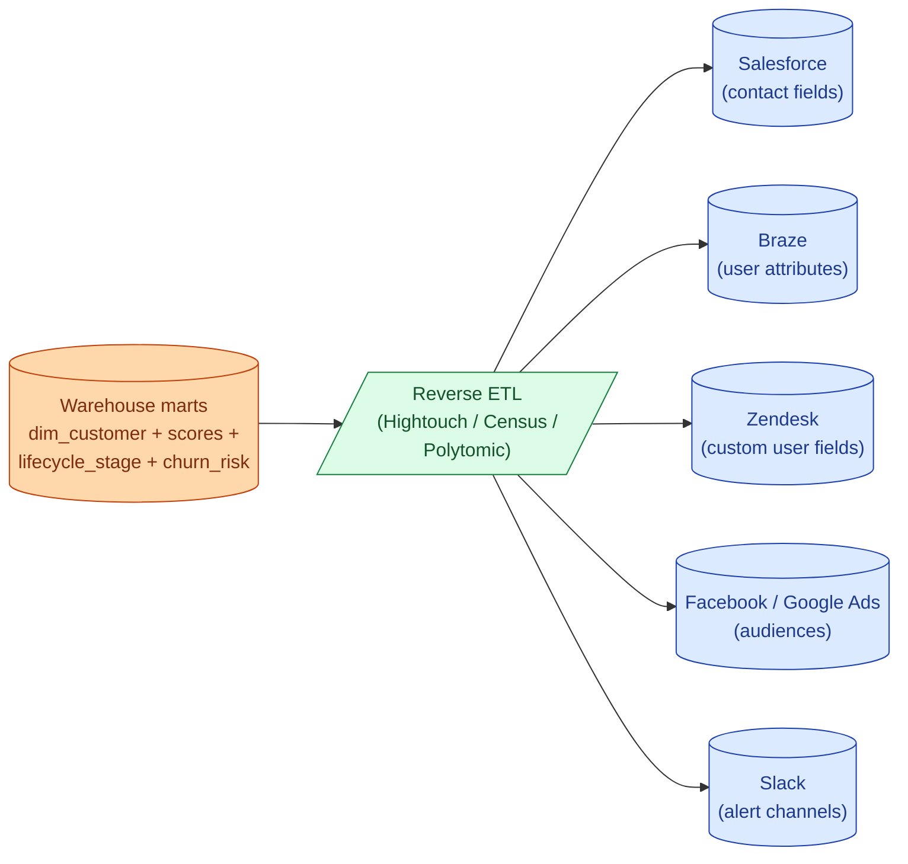
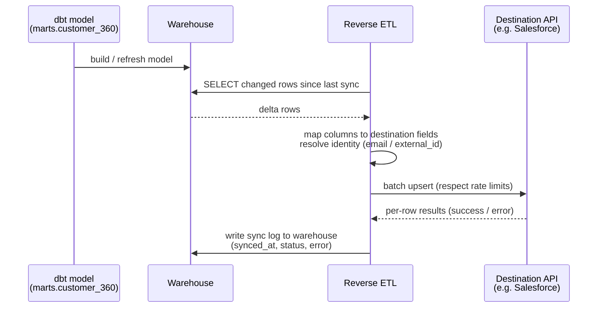
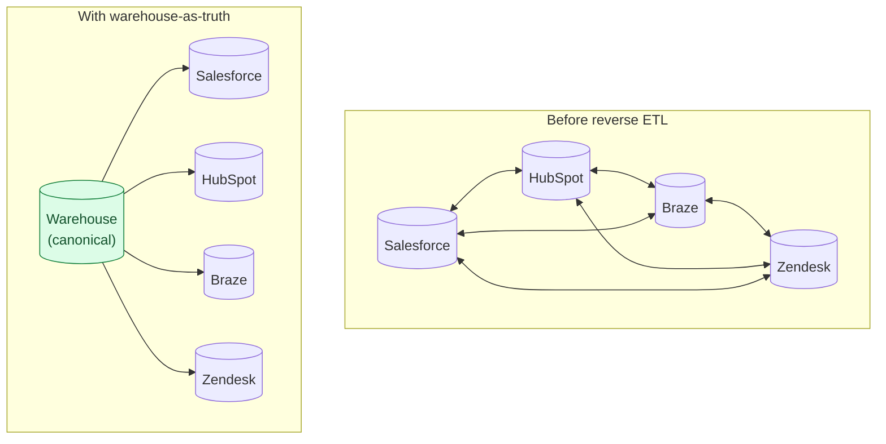

Regular ETL pulls operational data into the warehouse for analytics. Reverse ETL pushes warehouse models back out to operational tools: customer scores into Salesforce, lifecycle stages into Braze, retargeting audiences into Facebook Ads, support tier into Zendesk. The warehouse becomes the canonical answer to "who is this customer right now?" and reverse ETL is the glue that gets that answer into the systems that use it.

The category exists because the modern data stack made the warehouse the cleanest place to model customer state. The CRM does not know the customer's LTV; dbt does. Reverse ETL is the path back.

## What it actually does

The flow is one-way out of the warehouse: a query (a dbt model, a SQL snippet, or an audience definition in the tool's UI) defines the rows to sync, the tool maps columns to destination fields, and a schedule (or a trigger) pushes the changes. Most tools track which rows changed since the last sync so destinations only get the delta.

## The sequence of a sync

Two parts deserve attention: identity resolution and rate-limit handling. The destination usually doesn't speak your warehouse's `customer_id`; it wants `email`, `salesforce_id`, or its own internal ID. The tool has to resolve "the row in my warehouse" to "the record in the destination" before it can write. And every destination has rate limits the tool has to back off against without losing rows.

## Side by side

| | Hightouch | Census | Polytomic |
|---|---|---|---|
| **Founded** | 2018 | 2018 | 2020 |
| **Pricing model** | Per destination + per active row tier | Per destination + per active row tier | Per destination, flat-ish |
| **Destinations** | 250+ | 200+ | 150+ |
| **Source model** | Warehouse-first; recently added "Composable CDP" layer | Warehouse-first | Warehouse-first; also DB-to-DB |
| **SQL vs UI audiences** | Both; strong audience-builder for marketers | Both; SQL-first | Both |
| **dbt integration** | Direct: read models from dbt Cloud / Core | Direct: same | Yes |
| **Identity resolution** | Built-in identity graph + match merge | Match keys + lookup tables | Match keys |
| **Marketing-team friendliness** | Strongest of the three | Moderate | Lowest |
| **Engineering-team friendliness** | Good | Strongest | Strong (Git-style config) |
| **Best at** | Marketing-led activation, audience-heavy | Engineering-led, SQL-defined syncs | Mid-market, simpler use cases |

Hightouch and Census are the two real heavyweights and have converged on features over the last two years. The honest split: Hightouch is the pick when marketing or growth teams will be operating the tool directly (the audience builder is genuinely better), Census is the pick when a data engineer owns every sync and wants SQL-first definitions. Polytomic is the lower-cost option for teams with a smaller set of destinations.

## Why this category exists

Before reverse ETL, the way customer scores got into Salesforce was usually a Zapier hack, a Python script in a forgotten cron job, or a manual CSV upload from someone in ops. The data was stale, the logic lived in three places, and nobody could explain why two systems disagreed about a customer.

Reverse ETL is the operational consequence of "the warehouse is the source of truth." Once dbt is the place customer state is modelled, you need a clean way to publish that state to the systems that act on it. The category formed because the alternative (point-to-point integrations between every SaaS app) does not scale past a handful of tools.

The right-hand picture is the operational shape teams want. Reverse ETL is just the arrow out of the warehouse.

## When NOT to use reverse ETL

This is the part the vendors do not lead with. Reverse ETL only works if your warehouse is genuinely the source of truth. If the marts that feed Salesforce are six hours stale, syncing them creates the illusion of freshness while the sales rep is looking at old data. The tool is fine; the prerequisite is not met.

Common situations where reverse ETL is the wrong answer:

- The destination needs sub-minute freshness (use streaming or a CDP with event ingestion).
- The data is generated in the destination itself (don't round-trip data that started in Salesforce; transform in the warehouse and only sync derived fields).
- There is no canonical identity (no clean way to match a warehouse row to a destination record). Fix identity resolution first.

## CDP vs reverse ETL

Customer Data Platforms (Segment, mParticle, RudderStack) ingest events from your apps, build a profile, and forward them to destinations. Reverse ETL takes warehouse-modelled state and pushes it. The two coexist:

- Use the **CDP** for event-time data (page views, button clicks, sign-ups) that needs to reach destinations in seconds.
- Use **reverse ETL** for modelled state (LTV, churn risk, segment) that the warehouse computes and that updates in hours, not seconds.

Hightouch's "Composable CDP" pitch is that you can do both jobs with reverse ETL plus a thin streaming layer, using the warehouse as the profile store. This works for many teams and is genuinely cheaper than a full Segment deployment, but it's not the right answer for every event-heavy product.

## Pricing models

Hightouch and Census both bill on a combination of destination count and synced rows / users per month. Pricing tiers in 2026 sit roughly in the same band: a small team with three to five destinations and a few hundred thousand synced users lands in the $1k-$2k/month range; an enterprise deployment with dozens of destinations and millions of users runs into five-figure monthly bills. Polytomic is the cheaper option at the low end.

The cost lever that surprises people: a "user" or "row" usually counts toward the metered total every time it appears in any sync. A customer profile synced to Salesforce, Braze, Zendesk, and an ads audience is four billable rows, not one. Plan destination count carefully; consolidate where it makes sense.

## Common mistakes

- **Treating reverse ETL as a CDP.** Event-time data needs streaming. Reverse ETL is for state that changes in hours, not seconds.
- **Skipping identity resolution.** Without a clean `customer_id` to `salesforce_id` mapping, the syncs create duplicates and overwrite the wrong records.
- **Pushing raw warehouse columns to destinations.** Model the destination-facing view in dbt, sync that. Don't tie a Salesforce field directly to a raw source column.
- **Ignoring rate limits.** Salesforce's Bulk API, Marketo's hourly cap, Braze's burst limits all exist and they vary by tier. Configure batch size and retries per destination.
- **Not handling deletes.** Removing a user from an audience often means writing a "false" or null, not deleting a row. Each destination has its own semantics; test them.
- **Letting marketing build syncs straight from raw tables.** Schema drift on a raw table will break syncs silently. Always go through a modelled dbt mart with tests on it.
- **Forgetting to log sync status back to the warehouse.** When a sync silently fails, you want to know. Land sync logs in the warehouse and put a freshness check on them.

## Quick recap

- Reverse ETL pushes warehouse-modelled state to operational tools (Salesforce, Braze, Zendesk, ad networks).
- The category exists because the warehouse is now the source of truth for customer state, and the alternative (point-to-point integrations) doesn't scale.
- Hightouch and Census are the two heavyweights and have converged on features. Hightouch is better when marketing operates it; Census is better when data engineering owns every sync.
- Identity resolution and rate-limit handling are the two engineering problems that bite teams. Solve identity before turning on syncs.
- Reverse ETL is not a CDP. Use streaming or a CDP for event-time data; use reverse ETL for state that updates in hours.
- The prerequisite is that your warehouse is actually fresh and trusted. Fix freshness before syncing stale data into operational tools.

This concept sits in **Stage 6 (Reliability, debugging, cost)** of the [Data Engineering Roadmap](/practice/data-engineering/roadmap/).
