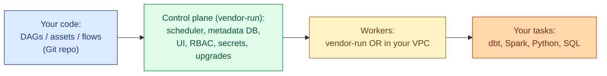
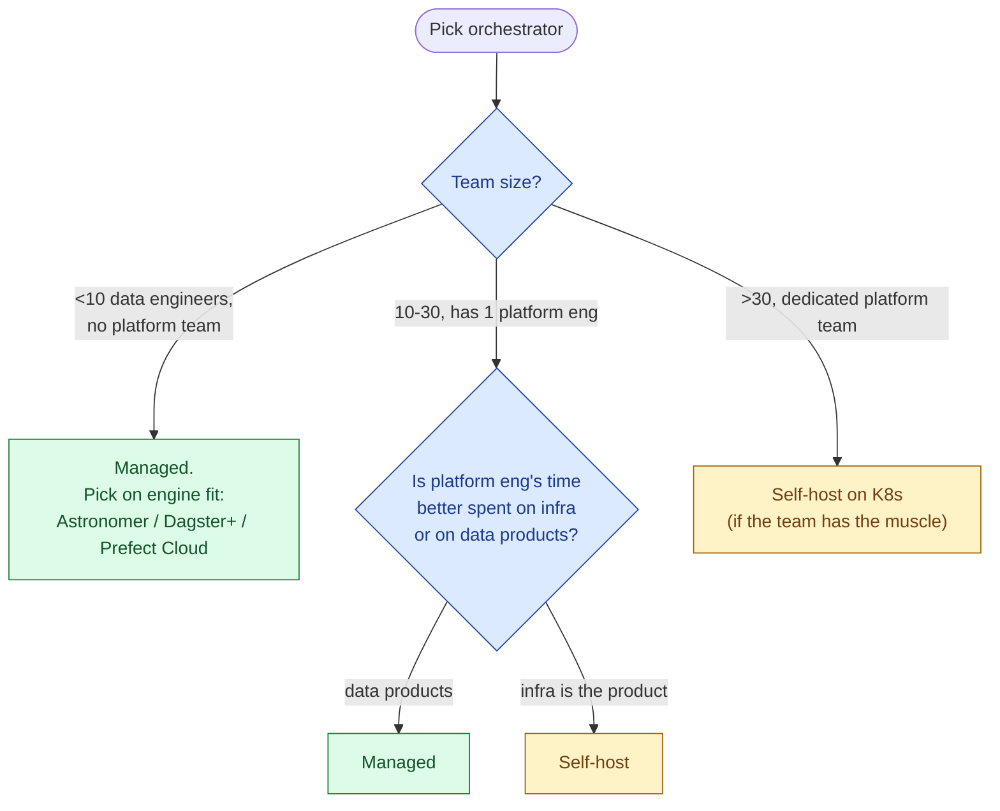
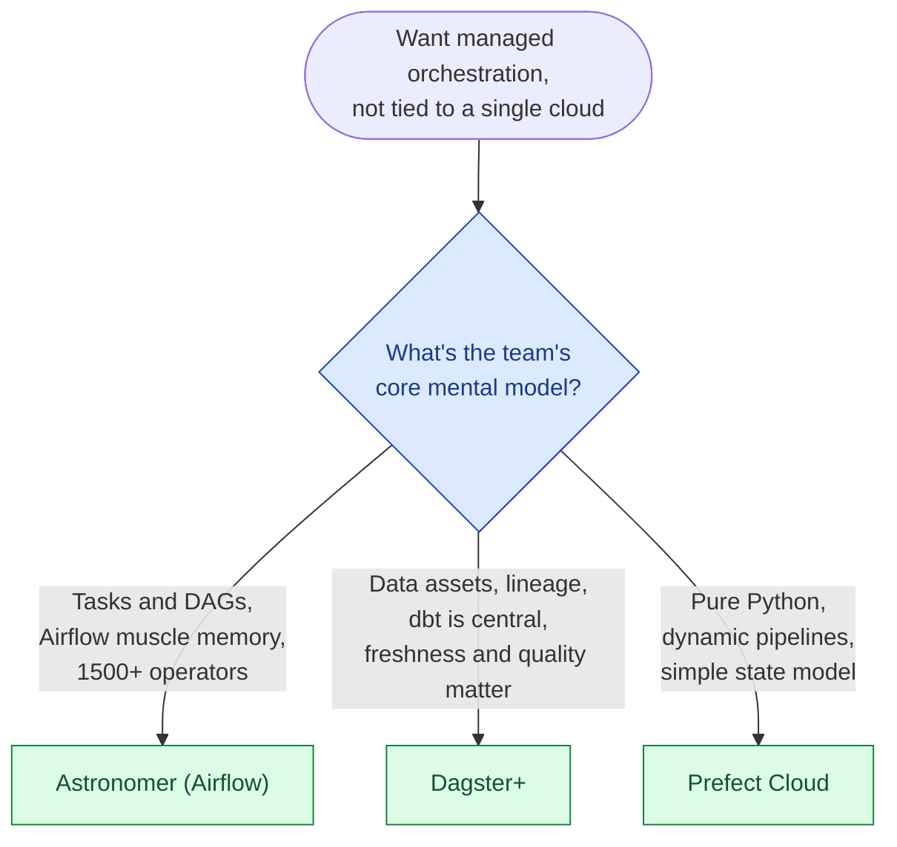
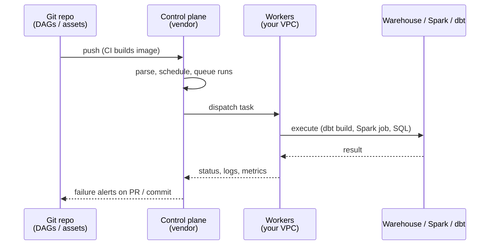

Running Airflow on Kubernetes is a project. So is running Dagster, Prefect, or any other orchestrator at production scale. Managed orchestration services take the platform team off the critical path: they run the scheduler, the metadata database, the workers, the upgrades, the security patches. You write DAGs or assets; they keep the runtime alive.

The 2026 landscape has five real options: Astronomer (managed Airflow), Dagster+ (managed Dagster), Prefect Cloud (managed Prefect), AWS MWAA (Amazon's managed Airflow), and Cloud Composer (Google's managed Airflow). They aim at slightly different teams.

## What the managed service actually does

The control plane is what is genuinely hard to run: scheduler high availability, the metadata DB, observability of every run, upgrade migrations. Workers are easier; many of these tools (Dagster+, Prefect Cloud) default to a hybrid model where the control plane is hosted but workers run in your VPC, which keeps data inside your boundary.

## Side by side

| | Astronomer | Dagster+ | Prefect Cloud | MWAA (AWS) | Cloud Composer (GCP) |
|---|---|---|---|---|---|
| **Engine** | Airflow | Dagster | Prefect | Airflow | Airflow |
| **Pricing** | Per Astro deploy / committed compute | Per active dev seat + compute | Per dev seat tier + run minutes | Per environment-size hour | Per environment-size hour |
| **Control plane** | Vendor | Vendor | Vendor | AWS | Google |
| **Workers** | Vendor or hybrid | Hybrid by default | Hybrid by default | AWS (in your VPC) | Google (in your VPC) |
| **Mental model** | Tasks + DAGs | Assets + ops + sensors | Flows + tasks + states | Tasks + DAGs | Tasks + DAGs |
| **Observability** | Airflow UI + Astro UI | Asset graph, lineage, asset checks | Run history, state, logs | Airflow UI | Airflow UI + Cloud Logging |
| **dbt integration** | dbt Cloud / Cosmos / BashOperator | dagster-dbt (first-class assets) | prefect-dbt | Same as Airflow | Same as Airflow |
| **Best at** | Enterprises that want pure Airflow with phone support | Asset-graph + lineage + data-aware teams | Python-first teams with dynamic pipelines | Already-on-AWS, cost-conscious | Already-on-GCP |
| **Worst at** | Cost at scale | Smaller ecosystem than Airflow | Smaller ecosystem than Airflow | Slow upgrade cadence, ops still partially yours | Same |

## Feature differences, opinionated

**Astronomer** is the purest "managed Airflow" pick. Its value is operational: phone support, fast upgrades to new Airflow versions, deploy isolation, RBAC, audit logs, secret backends. If you already use Airflow and you want it to keep being Airflow without you owning Kubernetes, Astronomer is the cleanest answer. It's the most expensive of the bunch at scale, and the price is roughly justified by what you do not have to staff.

**Dagster+** is the pick if you think about data as assets, not tasks. The asset graph (every dbt model, every table, every ML feature view is a node) gives you lineage, freshness checks, and asset-level retries that Airflow approximates with effort. The integration with dbt is the strongest of the three engines; dbt models appear as first-class assets in the same graph as Python transforms and Spark jobs. The trade is a smaller ecosystem than Airflow's 1500+ operators.

**Prefect Cloud** is the simplest mental model: a flow is a Python function, a task is a smaller Python function, runs have states (Pending, Running, Failed, Cached). The pitch is "Python-first, dynamic pipelines, less boilerplate than Airflow." Best for teams whose workflows change shape at runtime (different branches per input, dynamic fan-out). The ecosystem is smaller and the asset-graph story is weaker than Dagster+.

**MWAA** is Amazon's managed Airflow. It works. The drawbacks are real: upgrade cadence lags upstream Airflow by months to a year, the worker autoscaling is less responsive than Astronomer's, and you still own a non-trivial amount of operational work (VPC networking, IAM, environment sizing). It's the right call when "stays on AWS" is non-negotiable and budget is tight.

**Cloud Composer** is the GCP equivalent: same shape, same trade-offs. Composer 3 fixed a lot of the cold-start and scaling issues from earlier versions. Same logic as MWAA: pick it when the team is GCP-native and Astronomer is out of budget.

## When managed beats self-hosted

The break-even maths is straightforward: a managed orchestration bill of, say, $40k a year is cheaper than half a platform engineer's loaded cost. Below ten data engineers, the answer is almost always managed. The exception is "infra is our product" companies (data infrastructure vendors themselves), where running the orchestrator yourself is part of the operational competence you have to build anyway.

## Picking between the three independent vendors

The honest answer: if the team already knows Airflow, Astronomer (or MWAA / Composer if cloud-locked) is the path of least resistance. If you're starting fresh and dbt is the centre of the stack, Dagster+ is genuinely better. Prefect Cloud is the lightest cognitive load but the smallest community.

## The exit story

Switching orchestrators is more work than vendors admit. DAG syntax differs, operator ecosystems differ, the metadata models differ. The portable thing is what your tasks do, not how they are scheduled. Two patterns that protect you:

- **Keep task logic in standalone modules** (`my_pipeline.transforms.daily_revenue`). The orchestrator's DAG file should call these modules, not contain the business logic.
- **Treat dbt as the transformation layer**. dbt models port cleanly between any orchestrator. The orchestrator only needs to know "run this dbt selection."

Done well, switching from Astronomer to Dagster+ is a few weeks of rewriting DAG definitions, not a quarter of rewriting business logic.

## The hybrid execution pattern

Most teams in 2026 land on the same operational shape regardless of vendor: a hosted control plane and self-hosted workers.

The data never leaves your VPC; the metadata (run history, schedule, lineage) lives at the vendor. This is the sweet spot most regulated and most cost-conscious teams want, and all three independent vendors (Astronomer, Dagster+, Prefect Cloud) support it natively in 2026.

## Common mistakes

- **Self-hosting Airflow on Kubernetes "to save money."** The first time the scheduler dies during a release window, the savings vanish. Budget honestly for an SRE before committing.
- **Picking the orchestrator based on the engine alone.** The mental model (tasks vs assets vs flows) matters more than the syntax. Match the model to how your team thinks about data.
- **Putting business logic in DAG files.** When you switch tools, you'll rewrite all of it. Keep DAGs thin; logic in modules.
- **Running MWAA / Composer and underestimating remaining ops work.** They take the worst parts away but leave you with sizing, IAM, networking, and upgrade lag.
- **Ignoring observability until something breaks.** Pick a tool whose UI is genuinely useful for the on-call engineer; you'll be there at 3 a.m.
- **Optimising orchestrator cost while the warehouse bill is 10x bigger.** Spend the optimisation time where the money is.
- **Trusting that "Airflow expertise" is portable to managed Airflow.** It mostly is, except the deploy model, secrets handling, and connection management all differ from Astronomer to MWAA to Composer.

## Quick recap

- For most teams, managed orchestration is the right answer. Below ~10 data engineers it's almost never worth self-hosting.
- Astronomer is the cleanest managed Airflow. Dagster+ wins when the asset graph and lineage matter. Prefect Cloud is the simplest mental model.
- MWAA and Cloud Composer are the cheaper, cloud-native picks; pick them when you're locked into a cloud and budget rules out Astronomer.
- Hybrid (control plane managed, workers in your VPC) is the default modern shape. Keeps data inside your network without you running the scheduler.
- Keep DAGs thin and task logic in standalone modules. That is what makes the exit story bearable.

This concept sits in **Stage 6 (Reliability, debugging, cost)** of the [Data Engineering Roadmap](/practice/data-engineering/roadmap/).
