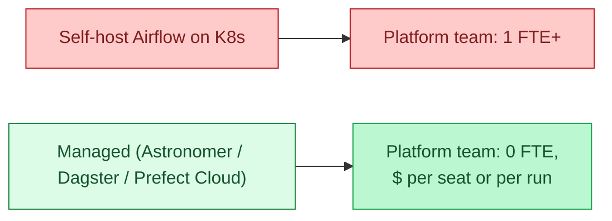

Running Airflow on Kubernetes is a project. So is running Dagster, Prefect, or any other orchestrator at production scale. Managed orchestration services take the platform team off the critical path: they run the scheduler, the metadata DB, the workers, the upgrades. You write DAGs; they keep the runtime alive.

| | Astronomer (Airflow) | Dagster Cloud | Prefect Cloud | Cloud-native (MWAA, Composer) |
|---|---|---|---|---|
| **What you get** | Managed Airflow, support | Managed Dagster, Cloud-native UI | Managed Prefect | AWS / GCP / Azure managed services |
| **Cost** | High | Medium | Medium | Variable |
| **Best at** | Enterprise Airflow + support | Asset-graph teams, dbt-heavy | Python-first pipelines | Already-on-cloud teams |
| **Lock-in** | Low (it is Airflow) | Medium | Medium | Medium-high |

**What this page will cover.**

- The break-even cost: when paying for managed orchestration is cheaper than a platform engineer's salary.
- MWAA, Cloud Composer, Azure Data Factory: the cloud-native managed Airflows.
- Astronomer vs MWAA: support, upgrade cadence, deployment model.
- Dagster Cloud and Prefect Cloud's hybrid model (control plane managed, workers self-hosted).
- The honest 2026 take: small teams should always be on a managed service.
- The exit story: leaving each platform without rewriting every DAG.

*Page coming soon.*

This concept sits in **Stage 6 (Reliability, debugging, cost)** of the [Data Engineering Roadmap](/practice/data-engineering/roadmap/).
