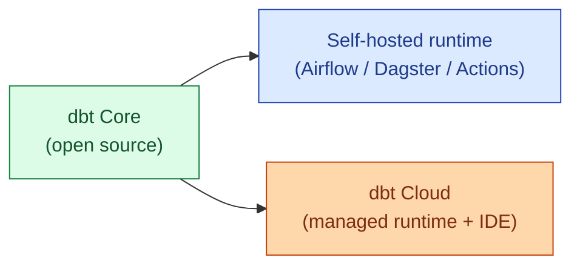

dbt Core is the open-source command-line tool. dbt Cloud is the managed service: scheduler, IDE, job runs, observability, semantic layer, all on top of dbt Core. The runtime is the same. The decision is about who runs the scheduler, who maintains the integrations, and whether the team needs an IDE in the browser.

| | dbt Core (self-hosted) | dbt Cloud |
|---|---|---|
| **Runtime** | Your own (Airflow, Dagster, GitHub Actions, cron) | Managed by dbt Labs |
| **Cost** | Free + your platform | Per developer seat |
| **IDE** | Your local editor | Browser IDE included |
| **Observability** | Build it yourself (Elementary, custom) | dbt Cloud's run logs + alerts |
| **Best at** | Teams with an existing orchestrator and platform team | Teams that want dbt to just work |

**What this page will cover.**

- What dbt Cloud actually adds on top of dbt Core (scheduler, IDE, run history, semantic layer).
- The cost math: per-seat pricing vs the engineering time to maintain self-hosted dbt.
- Running dbt Core in Airflow: the dbt-airflow operator and the gotchas.
- Running dbt Core in Dagster: the dagster-dbt integration, asset-graph style.
- Running dbt Core in GitHub Actions: the cheap setup that works for small teams.
- The 2026 honest take: dbt Cloud for teams without a strong platform engineer, dbt Core for everyone else.

*Page coming soon.*

This concept sits in **Stage 6 (Reliability, debugging, cost)** of the [Data Engineering Roadmap](/practice/data-engineering/roadmap/).
