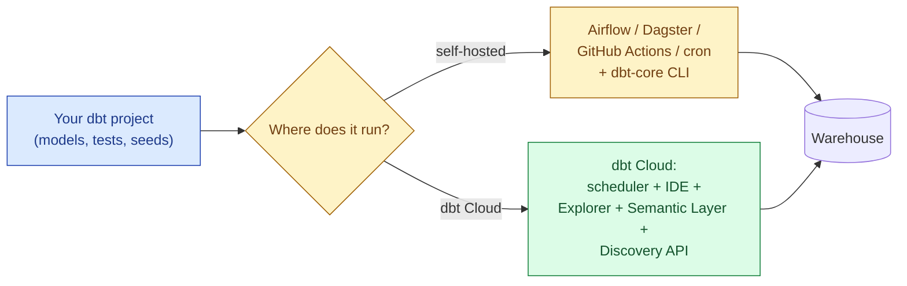
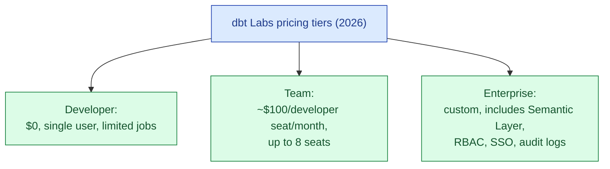
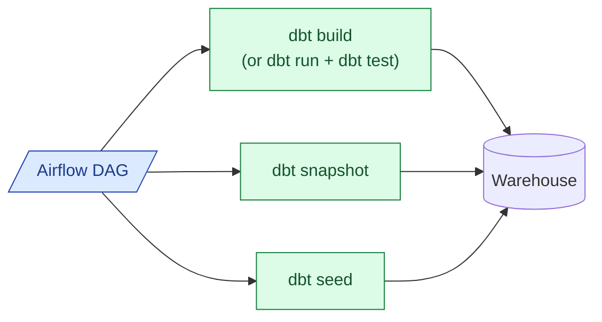

dbt Core is the open-source command-line tool. dbt Cloud is the managed service from dbt Labs: scheduler, browser IDE, run history, alerting, Semantic Layer, Explorer, Discovery API, all on top of dbt Core. The model-compilation runtime is the same on both. The decision is about who runs the scheduler, who maintains the integrations, and how much your team needs the things dbt Cloud adds on top.

## What each one is

The same dbt project (the `models/`, `tests/`, `dbt_project.yml`, `profiles.yml`) compiles and runs identically on both sides. dbt Cloud is not a fork; it is dbt Core plus a runtime and a set of paid features around it.

## What dbt Cloud adds on top

| Feature | What it does | Self-host equivalent |
|---|---|---|
| **Scheduler** | Runs jobs on cron, on PR merges, on webhooks | Airflow / Dagster / GitHub Actions |
| **Browser IDE** | Web-based editor with autocompletion, lineage, model preview | VS Code + dbt Power User extension |
| **Run history + alerts** | Per-run logs, failure alerts, Slack/PagerDuty | Logs in Airflow / Dagster + custom alerting |
| **Explorer** | Catalogue and lineage UI for the whole project | Elementary, OpenLineage + DataHub |
| **Semantic Layer** | Query metrics from BI tools via the MetricFlow server | Self-host MetricFlow (open source as of 2024) |
| **Discovery API** | GraphQL API for project metadata | dbt artifacts in S3 + custom service |
| **Fusion engine** (preview through 2026) | Rust-based parser, faster compile, partial parse | dbt Core's Python parser |
| **CI integration** | Slim CI, defer state, PR previews | Possible with dbt Core + state files, more setup |

The two features that move the needle for most teams are the IDE (for analytics engineers who do not want a local Python environment) and Slim CI with deferred state (for fast PR validation that only rebuilds what changed). The Semantic Layer is genuinely useful but adoption depends on whether your BI tools can speak it.

## Pricing in 2026

Per-developer-seat pricing means dbt Cloud scales with the size of your analytics engineering team, not with data volume. This is friendly to small teams (one or two seats, low total cost) and hostile to large ones (20 analysts = real budget).

Self-hosted dbt Core has no license fee. Your costs are the runtime (Airflow / Dagster / Actions), the engineering time to set up CI, and the time to build the things dbt Cloud gives you for free.

## When dbt Cloud is worth it

- **No platform engineer.** A two-person data team should not be running Airflow just to schedule dbt. Pay for dbt Cloud and ship.
- **Analytics engineers without a Python environment.** The browser IDE means they never `pip install` anything. Real productivity win for non-engineering hires.
- **You want Semantic Layer with low setup.** Self-hosting MetricFlow is possible but a real project.
- **You want Slim CI without building it.** Deferring against prod state, only running changed models on PRs, this works out of the box on dbt Cloud and is fiddly to replicate.
- **Sub-15-seat teams.** The seat math works out cheaper than half an engineer's time maintaining the equivalent setup.

## When self-hosted dbt Core wins

- **You already have Airflow or Dagster.** Adding dbt as a task there is straightforward and avoids a second scheduler.
- **You're past 20 seats.** Per-seat pricing starts to bite, and you probably have the platform team to run the equivalent yourself.
- **Multi-tenant or unusual deployment.** dbt Cloud's deploy model assumes one repo, one warehouse target per project. If you run dbt across many environments or tenants, self-hosted is more flexible.
- **You want full control over the CI pipeline.** Custom test orchestration, custom artifact handling, non-standard deploy gates.
- **Strict data residency.** dbt Cloud runs in dbt Labs' infrastructure (in your chosen region); some regulated industries want the runner inside their own VPC.

## The Airflow + dbt pattern

The cleanest pattern is one Airflow DAG that runs `dbt build` against a selection of models. Astronomer's Cosmos and Dagster's dagster-dbt go further and turn each dbt model into its own task (Airflow) or asset (Dagster), giving you per-model retries and lineage at the orchestrator level. Cosmos is the better option for Airflow teams that want this granularity; dagster-dbt is the gold standard if you've already picked Dagster.

## The Fusion / VS Code IDE story

In 2026 dbt Labs is rolling out two related projects worth knowing about. **Fusion** is a Rust rewrite of the dbt parser and compiler, designed to make `dbt parse` and `dbt compile` an order of magnitude faster on large projects. It's in preview at the time of writing, with stable rollout expected over the year. **The dbt VS Code extension** brings most of the dbt Cloud IDE features (lineage, model preview, autocompletion) into VS Code, narrowing the IDE gap between Cloud and Core. Both are real and worth tracking; both reduce the "Cloud is the only place to get a good editor experience" argument. Adjust your bake-off accordingly.

## Semantic Layer: the feature worth a closer look

dbt's Semantic Layer turns metric definitions in your dbt project into a queryable API: BI tools (Hex, Mode, Lightdash, Cube, Tableau via connector) ask the Semantic Layer for "revenue by region last quarter," and the Layer compiles that into the right SQL using your dbt-defined metrics. The point is that one metric definition lives in version-controlled YAML, and every BI tool that asks gets the same answer.

The catch: it only pays off if more than one consumer queries the same metric. A single Looker dashboard with hand-written SQL is faster to ship without it. Once you have three or more BI tools or a metrics-heavy product, the consistency win is real.

In 2026 the Semantic Layer is a paid dbt Cloud feature; MetricFlow (the engine underneath) is open source and can be self-hosted, but the production-grade hosting is meaningful work. Most teams who want the Semantic Layer end up on dbt Cloud for it.

## Common mistakes

- **Picking Cloud or Core on cost alone.** The seat cost is rarely the deciding factor below 15 seats. Pick on what your team needs.
- **Underestimating the cost of self-hosted observability.** Run history, alerting, freshness checks, and lineage cost engineering time to build well. dbt Cloud or Elementary give you most of it for free.
- **Running dbt Cloud and Airflow side by side without a plan.** Two schedulers fighting over the same warehouse causes confused dependencies. Pick one orchestrator.
- **Skipping Slim CI.** Whether on Cloud or Core, deferring against prod state for PR runs is the single biggest CI speed-up. Set it up early.
- **Ignoring the IDE story for analytics engineers.** Analysts hate `pip install`. Either pay for dbt Cloud or invest in setting up the VS Code extension well.
- **Treating dbt Cloud lock-in as zero.** Job definitions, environment configs, and Semantic Layer definitions all live in dbt Cloud. Migrating off is annoying but bounded.
- **Letting "we already have Airflow" auto-decide for you.** Even with Airflow, dbt Cloud's IDE and Explorer can be worth the seat cost. Compare on team experience, not just runtime cost.

## Quick recap

- dbt Cloud is dbt Core + scheduler + IDE + Explorer + Semantic Layer + Discovery API. Compilation and runtime semantics are identical.
- Below ~15 seats and without a platform engineer, dbt Cloud is the default. The seat price is less than the engineering time to build the equivalent.
- Past ~15 seats, or when Airflow is already in production, self-hosted dbt Core in Airflow or Dagster usually wins on cost and flexibility.
- Slim CI and a good IDE are the two features that matter most day to day. Make sure your chosen setup gives you both.
- Fusion and the VS Code extension are narrowing the IDE gap in 2026. Re-evaluate every six months; the calculus is moving.
- Keep dbt project structure clean and standard; both runtimes consume the same project and switching directions later is bounded work.

This concept sits in **Stage 6 (Reliability, debugging, cost)** of the [Data Engineering Roadmap](/practice/data-engineering/roadmap/).
