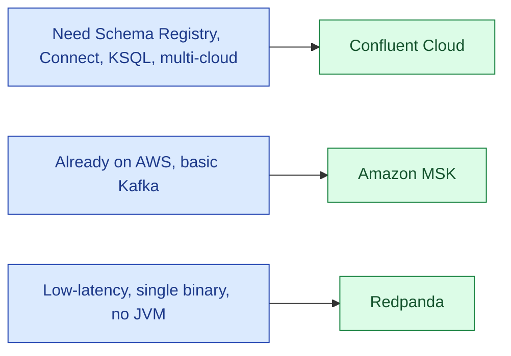

For new streaming systems in 2026, you almost always pick a managed Kafka. The three real choices are Confluent Cloud (the original company, broadest features), Amazon MSK (AWS-native, simple), and Redpanda (Kafka API, no JVM, designed for low latency). All three speak the Kafka protocol. The differences are operational, not API-level.

| | Confluent Cloud | Amazon MSK | Redpanda |
|---|---|---|---|
| **Underlying** | Apache Kafka + KSQL + Schema Registry | Apache Kafka | Kafka-compatible (C++, no JVM) |
| **Best at** | Enterprise features, multi-cloud, broad ecosystem | Already-on-AWS, lower cost | Low latency, single-binary simplicity |
| **Cost** | Highest | Moderate | Moderate |
| **Lock-in** | Confluent extensions | AWS-only | Lower (Kafka API) |

**What this page will cover.**

- The Kafka API as the universal interface; clients almost never care which backend.
- Confluent Cloud's premium features: Schema Registry, Connect, KSQL, stream catalogue.
- MSK Serverless vs MSK Provisioned, and when each fits.
- Redpanda's "no JVM" pitch and the latency it actually delivers.
- WarpStream as the "Kafka on object storage" newer entrant.
- The 2026 honest take: if you don't have a strong reason, default to whichever your cloud already runs.

*Page coming soon.*

This concept sits in **Stage 4 (Streaming and event-driven)** of the [Data Engineering Roadmap](/practice/data-engineering/roadmap/).
