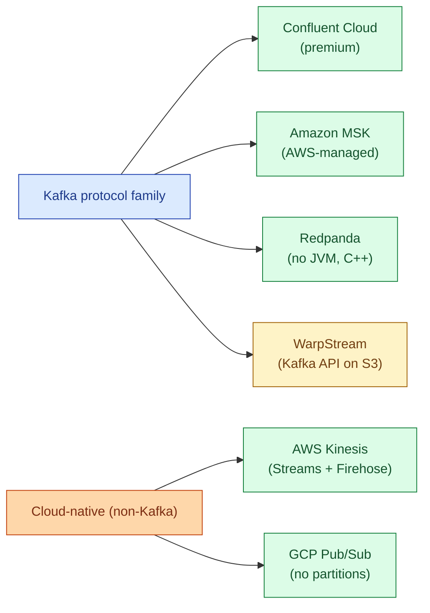
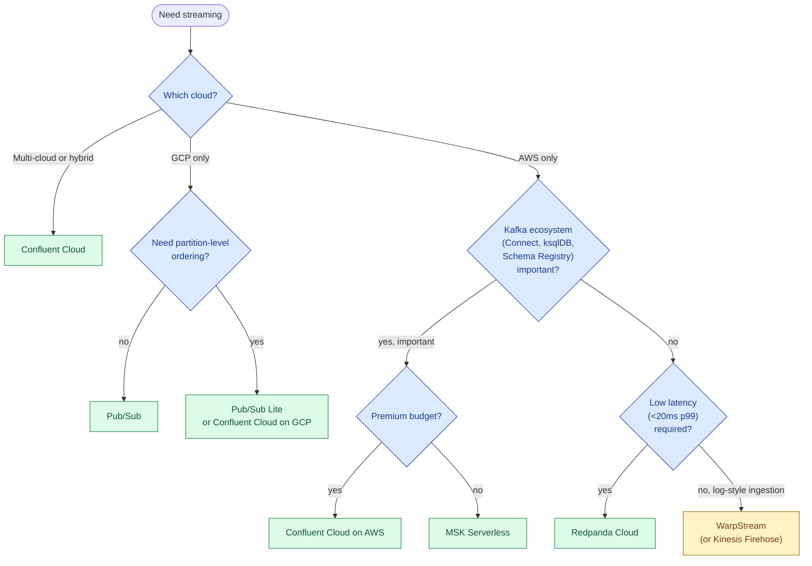

For a new streaming system in 2026 the practical shortlist is five options: Confluent Cloud (the original Kafka company, deepest features), Amazon MSK (AWS-managed Kafka), Redpanda (Kafka-compatible, single binary, no JVM), AWS Kinesis (AWS-native, different API), and Google Pub/Sub (GCP-native, simplest mental model). The first three speak the Kafka protocol; the last two are their own APIs. Picking between them is mostly about your cloud, your team, and how exotic you need the operational story to be.

## The five options at a glance

## Side by side

| | Confluent Cloud | MSK (Serverless) | Redpanda Cloud | Kinesis | Pub/Sub |
|---|---|---|---|---|---|
| **API** | Kafka | Kafka | Kafka | Kinesis SDK | Pub/Sub SDK |
| **Owner** | Confluent | AWS | Redpanda Data | AWS | Google |
| **Cloud** | AWS, GCP, Azure | AWS | AWS, GCP, Azure | AWS | GCP |
| **Pricing model** | eCKU + storage + ingress/egress | Cluster hours + storage + data in/out | GB ingress + storage tier | Shard-hour + PUT payloads | Per message + storage |
| **Latency floor** | p99 ~10-50ms | p99 ~50-150ms | p99 ~5-15ms | ~70ms typical | ~100ms typical |
| **Partition concept** | Yes (Kafka) | Yes (Kafka) | Yes (Kafka) | Yes (shards) | Hidden from user |
| **Schema Registry** | Built in | Self-managed (AWS Glue) | Built in | Glue or custom | Schema service built in |
| **Connect ecosystem** | Largest (200+ connectors managed) | Open-source Kafka Connect, self-managed | Yes, growing | Kinesis Firehose covers common sinks | Dataflow templates |
| **Ksqldb / stream processing** | Built in | Self-managed | Self-managed | Kinesis Data Analytics (Flink) | Dataflow |
| **Best at** | Multi-cloud enterprise, broadest features | AWS-native, predictable workloads | Latency-sensitive, simpler ops | AWS-only, no-Kafka teams | GCP, message-bus simplicity |
| **Worst at** | Cost predictability | Cluster sizing UX | Smaller ecosystem than Confluent | Lower throughput per shard | Per-partition ordering when you need it |

## What each one is really good at

**Confluent Cloud** is the deepest-featured managed Kafka. Schema Registry, Connect (200+ managed connectors), Stream Governance, ksqlDB, Tableflow (Iceberg landing), and exactly-once semantics are all production-grade. It is also the most expensive option at any non-trivial scale. The honest framing: Confluent is the right answer when you need the full ecosystem and have the budget, or when "multi-cloud Kafka" is a hard requirement.

**Amazon MSK** comes in two flavours. MSK Provisioned is straightforward managed Kafka brokers; MSK Serverless removes the cluster-sizing decision but is more expensive per byte. In 2026, MSK Serverless is the default for most AWS teams who want Kafka without operational toil. The trade-offs: AWS lags upstream Kafka by 6-12 months, the Connect story is "run it yourself on ECS or MSK Connect," and Schema Registry is AWS Glue rather than the native Confluent one.

**Redpanda** is Kafka-compatible (the protocol, the client libraries, mostly the admin API) but written in C++ with a thread-per-core architecture. The practical wins are lower p99 latency, no JVM tuning, no ZooKeeper (and never had it), and a single binary that is genuinely easy to operate. Redpanda Cloud is the managed version; the self-hosted OSS version is real for teams that want their own cluster. Best when latency or operational simplicity matter more than ecosystem breadth.

**AWS Kinesis** is the AWS-native streaming primitive. Kinesis Data Streams gives you shards and a different SDK than Kafka; Kinesis Firehose is the "drop streamed data into S3, Redshift, or OpenSearch" managed sink. Best for AWS-only teams that do not need Kafka-ecosystem tools and want the smallest moving parts. The Kinesis API is its own world; libraries and tooling are AWS-flavoured.

**Google Pub/Sub** is the simplest mental model of the five. There are no partitions exposed to the user, no consumer groups, no rebalances. You publish a message, subscribers receive it with at-least-once delivery, and Google manages everything else. The trade is that ordered processing requires Pub/Sub Lite or careful use of ordering keys, and per-key ordering is harder than in Kafka. Best for GCP-native teams using Pub/Sub as a message bus rather than a log.

## The "Kafka on object storage" newer entrant

WarpStream is worth knowing about. It speaks the Kafka protocol but stores log segments directly on S3 / GCS / R2, with no local broker disks. The result: drastically lower storage cost (S3 is cheap), no inter-AZ replication charges (S3 handles that), and a stateless broker tier that auto-scales. The cost is higher p99 latency (S3 is not a local disk) and a smaller ecosystem.

In 2026 WarpStream is the right pick for high-throughput, latency-tolerant pipelines (log ingestion, clickstream to warehouse) where the AWS networking bill on regular Kafka is the dominant cost. It's the wrong pick for low-latency event-driven apps where 200ms tail latency matters.

## Picking decision tree

The honest default in 2026: stay with your cloud's native option unless something specific pushes you off it. Confluent Cloud is the universal "I want the best Kafka regardless of cloud" answer; everything else is a cost or ecosystem trade-off against it.

## What changes per cloud

AWS bills for inter-AZ traffic, which is the largest hidden cost of any Kafka deployment (Confluent, MSK, Redpanda, all hit the same bill). Plan producer / consumer placement to stay in-AZ where possible, or use a tool like WarpStream that sidesteps the issue with object storage.

GCP networking is more forgiving on cross-zone traffic; Pub/Sub's lack of partitions means cross-zone is invisible to the user.

Azure adoption of Kafka is mostly Confluent Cloud on Azure or Event Hubs (which has a Kafka-compatible endpoint). Event Hubs is rarely the best pick if you have a real choice; the Kafka surface is partial and the operational story is worse than the other options.

## A note on stream processing

Choosing the broker is half the question; the other half is what processes the stream. The realistic options in 2026:

- **Flink (Apache + managed: Confluent's Flink, AWS Managed Service for Flink, Ververica).** The serious answer for stateful streaming, exactly-once joins, and complex event processing. Steep learning curve.
- **ksqlDB** (Confluent only). SQL on Kafka topics. Easy on-ramp; full Flink wins on the hard problems.
- **Kafka Streams** (library). Good if your team is a Java shop and you want stream processing in your service code.
- **Spark Structured Streaming** (Databricks or self-host). The right pick when the same code needs to batch and stream the same data.
- **Dataflow** (GCP). The natural processor for Pub/Sub; Apache Beam underneath, deeply integrated with GCP.

The broker choice does not fully decide the processor choice, but it narrows it. Confluent Cloud + Flink is the canonical premium stack in 2026; MSK + Flink (managed) is the AWS-native equivalent; Pub/Sub + Dataflow is the GCP-native equivalent.

## Common mistakes

- **Picking Kafka because "everyone uses Kafka."** If your team is AWS-only and your use case is "drop events into S3," Kinesis Firehose is simpler and cheaper. The right tool is not always the famous one.
- **Underestimating inter-AZ networking.** Three-broker, three-AZ Kafka on AWS quietly costs more in cross-AZ data transfer than in compute. Read the bill.
- **Running self-hosted Kafka with no SRE.** Possible, painful, regretted. Pick managed unless operating brokers is your team's core competence.
- **Treating Pub/Sub like Kafka.** No partitions, no consumer groups, different ordering semantics. Map your design to the API, not the other way around.
- **Skipping Schema Registry.** Schemaless events are technical debt that compounds. Pick a registry on day one (Confluent's, AWS Glue, or Redpanda's).
- **Optimistic latency assumptions on Kinesis.** Kinesis is throughput-friendly, not low-latency. If p99 under 50ms matters, Kinesis is the wrong choice.
- **Using exactly-once semantics as a checkbox.** It's available in Kafka and Confluent Cloud but has real cost and complexity. Many pipelines work fine with at-least-once and idempotent consumers.
- **Picking WarpStream for low-latency event-driven apps.** It's built for cheap throughput, not for sub-50ms tail latency.

## Quick recap

- Kafka API is the universal interface; Confluent Cloud, MSK, Redpanda, and WarpStream all speak it. Kinesis and Pub/Sub are their own APIs.
- Confluent Cloud is the deepest-featured and most expensive. Pick it when you need the ecosystem or multi-cloud.
- MSK is the AWS-default pick; Serverless removes most of the cluster-sizing pain. Lags upstream Kafka by months.
- Redpanda wins on latency and operational simplicity; smaller ecosystem than Confluent.
- Kinesis is fine for AWS-only, no-Kafka teams. Pub/Sub is the simplest message bus on GCP.
- WarpStream is the right answer when cross-AZ networking is your dominant Kafka cost and latency is not the constraint.
- Default rule: match the cloud you're on, the latency you need, and the ecosystem features you actually use. Most teams over-buy Kafka features they will never touch.

This concept sits in **Stage 4 (Streaming and event-driven)** of the [Data Engineering Roadmap](/practice/data-engineering/roadmap/).
