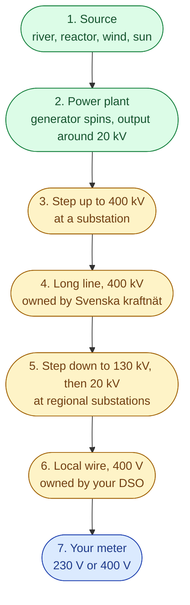
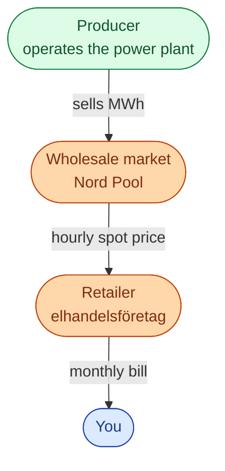
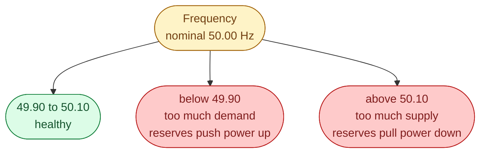
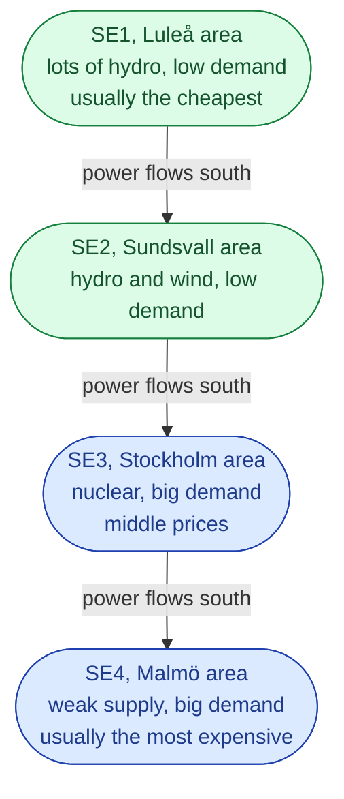
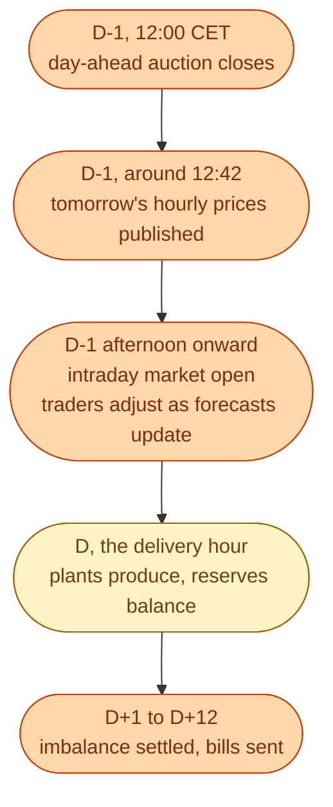

You turn on a kettle in Malmö. Where does the electricity come from? Who is paid for it? Who makes sure the lights stay on?

This page answers all three questions in one go. After reading it, you will have a working picture of the Swedish energy market. The rest of the library zooms into each part.

We sell electricity by the **kilowatt-hour** (**kWh**). The hard part: wires cannot store much electricity. So the amount made and the amount used must match every second, all day, forever. Most of the strange things about this market come from that one rule.

## The journey of one kWh

Step by step, from a river in the north to your kettle in the south.

Two things to spot.

First, the voltage goes **up** for the long ride, then **back down** before it reaches you. Long wires need high voltage to lose less heat. We will see why in a later entry.

Second, two different companies own the wires. **Svenska kraftnät** is the **TSO**. It is one company, state owned, and it owns the 400 kV national grid. After the regional substation, the wire belongs to a **DSO** (a local grid company). Sweden has around 170 DSOs. The biggest are Vattenfall Eldistribution, Ellevio, and E.ON Energidistribution. You cannot pick your DSO. It depends on where you live.

## Who pays whom

Money flows along a second chain that runs in parallel.

A **producer** makes the power. Big names in Sweden: Vattenfall, Fortum, Statkraft, OX2.

A **retailer** sells you a contract. Tibber, Bixia, Greenely, Vattenfall Sälj. The retailer owns no wires and no plants. They just buy MWh on Nord Pool and sell it on to you.

This is why your bill has two parts. The **energy** part goes to the retailer. The **network** part (**nätavgift**) goes to the DSO. The DSO part is the same whoever your retailer is, because the wire is the same. The state then adds **energiskatt** and 25 percent **moms** on top.

One more actor to know about. A **BRP** (**balansansvarig**) is the company that takes the blame if a plan was wrong. Every MWh has to sit inside some BRP's portfolio. The BRP signs the imbalance contract with Svenska kraftnät.

## How the system stays balanced

Supply and demand must match every second. The system measures the match with one number: the **frequency**. In Sweden it sits at **50.00 Hz**.

When the frequency drifts, the system reacts in three steps: **FCR** in seconds, **aFRR** in a few minutes, **mFRR** after 15 minutes. We unpack these in the *Reserves* entry.

## What is special about Sweden

Two facts shape almost everything.

**Hydro lives in the north. People live in the south.** Most of the cheap hydro is in Norrbotten and Västerbotten. Most of the homes, offices and data centres are around Stockholm, Göteborg, and Malmö. So power flows south on the 400 kV backbone almost every day.

**Sweden is split into four bidding zones.** Each zone gets its own hourly price.

When the lines between zones are full, prices in SE4 can be five to ten times higher than SE1 on the same day. Same country. Same hour. Different price.

## One day in the market

Every day follows the same clock. Plan yesterday, deliver today, settle next week.

Same clock, every day of the year.

## Small glossary you can use right away

| Word | What it means |
| --- | --- |
| **kWh, MWh** | how much energy. The thing that is sold. |
| **kW, MW** | how fast. The rate, not the amount. |
| **TSO** | Svenska kraftnät. Runs the national grid. |
| **DSO** | Your local grid company. Owns the wire to your house. |
| **Producer** | Operates a power plant. |
| **Retailer** | Sells you a contract. Owns no wires, no plants. |
| **BRP** | Holds the imbalance contract with the TSO. |
| **Nord Pool** | The wholesale market. |
| **FCR, aFRR, mFRR** | Reserves that fix gaps in real time. |
| **SE1, SE2, SE3, SE4** | The four Swedish bidding zones. |
| **Spot price** | The hourly price on the day-ahead market. |
| **Påslag** | The retailer's markup on top of spot. |
| **Nätavgift** | The fee for using the local wires. |

That is the whole market on one page. Now we slow down and look at each piece.

## Next

Start with the thing that gets traded. See [kWh: power vs energy]({{ '/energy/concepts/002-power-vs-energy/' | relative_url }}).
