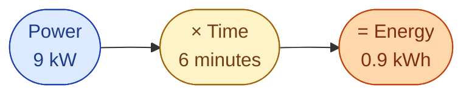

The market sells **energy**, not power. Two words. Two different things.

- **Power** is a *rate*. The kettle is using 9 kW right now. Think of it as the **speedometer**.
- **Energy** is an *amount*. The kettle used 0.9 kWh in the last 6 minutes. Think of it as the **odometer**.

You get energy by multiplying power by time.

Same formula at the big scale. A 2 MW wind turbine running flat out for one hour gives 2 MWh. At a Nord Pool price of 600 SEK/MWh, that hour is worth 1,200 SEK.

## Where each unit shows up

| You see this | It is talking about |
| --- | --- |
| **MW** on a turbine, a generator, a battery | power (rate) |
| **MWh** on a market price, a bill, yearly output | energy (amount) |
| **kW** on a heat pump or a charger | power (rate) |
| **kWh** on your monthly bill | energy (amount) |

Quick test. *My house used 6 kW yesterday.* What is wrong with that sentence? *6 kW* is a rate, not an amount. They probably meant 6 kWh.

## Next

Now the strange rule that shapes the rest of the market. See [The one weird rule]({{ '/energy/concepts/003-real-time-clearing/' | relative_url }}).
