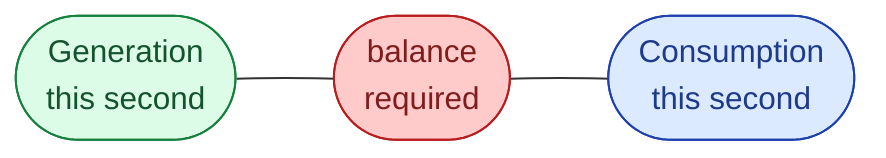
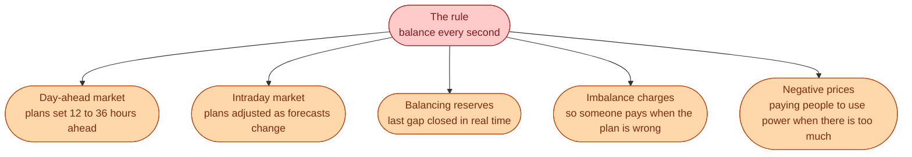

A bakery bakes bread in the morning and sells it in the afternoon. A warehouse holds water bottles for months. Electricity gets none of that. The wires hold almost nothing.

So whatever Sweden is using right now, Sweden has to be making *right now*. Not over the hour. Not on average. **This second.**

If we make less than we use, the grid frequency falls. If we make more than we use, the frequency rises. Either way, the system has about **a few seconds** to fix it.

That one rule is where everything else in the market comes from.

## What follows from the rule

Each of these is the market trying to keep two numbers matched, second by second, across a whole country.

## A small Swedish example

A cold January morning in Stockholm. People wake up. Heat pumps and electric heaters click on within 30 minutes of each other. Demand jumps by a few hundred MW.

The day-ahead bids for these hours were placed yesterday at noon, before anyone knew today would be this cold. So the plan is now slightly wrong.

Three things happen, in order, with no human in the loop:

1. Frequency dips a little, because demand briefly outran supply.
2. **FCR** reserves push more power in within seconds and stop the dip.
3. Intraday prices rise. Traders buy extra MWh for the morning. Generators ramp up.

No phone calls. No emails. The price and the automatic reserves do the work. That is the rule being followed in real time.

## Next

When the system is off balance, frequency is how you see it. See [Frequency: the heartbeat]({{ '/energy/concepts/004-frequency-heartbeat/' | relative_url }}).
