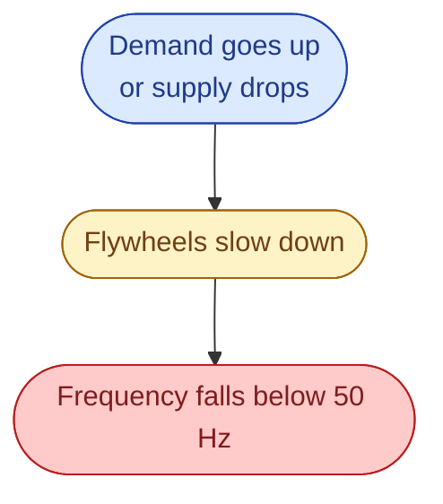
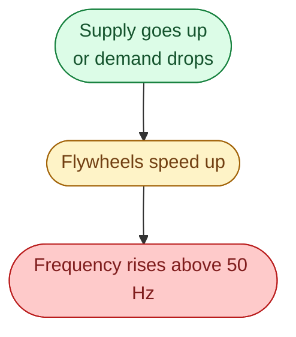

Walk into a Swedish control room and ask the operator what they look at first. The answer is the **frequency**. One number. Same value everywhere on the grid. Updated every millisecond. It tells you straight away if supply and demand are matched.

In Sweden, Norway, Finland, and eastern Denmark (all on the same grid) the target is **50.00 Hz**. Stay close, and life is good. Drift, and the system has very little time to fix it.

## Why the number moves

Picture every spinning generator on the grid as a heavy flywheel. They are all locked together, all turning at the same speed, all storing energy in their spinning mass. Together they act like one giant shared engine.

Now someone turns on a heater. The engine has to deliver more energy. If the fuel (water, steam, wind) does not arrive instantly, that extra energy has to come from somewhere. It comes from the flywheels slowing down. Slower flywheels means lower frequency.

The opposite is also true. If supply suddenly jumps up (wind picks up), the flywheels absorb the extra energy and speed up. Frequency goes above 50.

So the frequency is just a direct reading of balance. No latency. Same value across the whole grid.

## The bands the operator watches

Five zones to know.

| Range | What it means |
| --- | --- |
| 49.90 to 50.10 Hz | Healthy. **FCR-N** is keeping it tight. |
| 49.80 to 49.90, or 50.10 to 50.20 | A little off. Operator pays attention. |
| Outside 49.80 to 50.20 | Real disturbance. **FCR-D** activates fast. |
| Below 49.50 Hz | Emergency. Real consumers can be cut off automatically. |
| Below 49.00 Hz | Risk of full collapse. Generators trip to protect themselves. |

Most days the operator sees nothing but the first row.

## How to read a real trace

Open Svenska kraftnät's *Kontrollrummet* page and watch the live frequency for half an hour. Two patterns to spot.

A small dip that recovers in a few seconds. The system is breathing. A forecast missed a little, FCR pushed back, fine. Not interesting.

A sharp dip that stays low for minutes. A generator tripped offline. Reserves are pulling the frequency back. Worth a closer look.

## Next

When frequency moves, something has to push it back. That something is the layered reserves. See [Reserves: what catches the gap]({{ '/energy/concepts/005-supply-equals-demand/' | relative_url }}).
