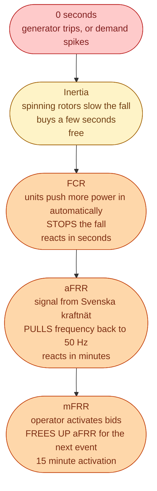
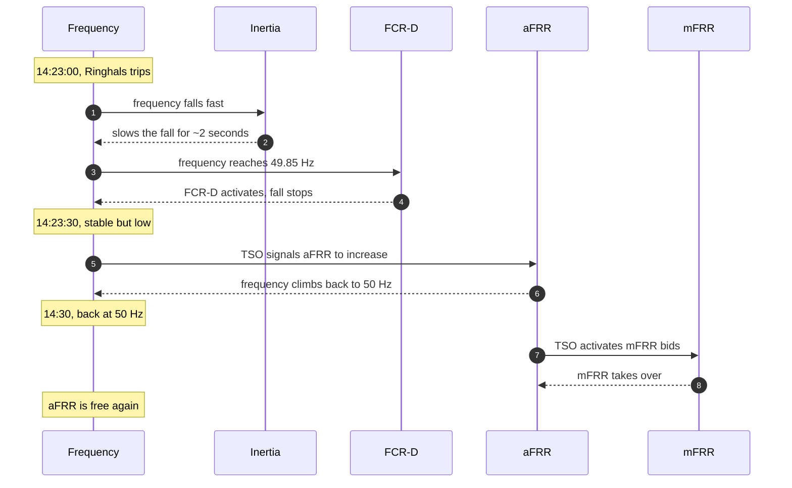

The day-ahead plan is always a little wrong. Wind blows harder than forecast. A factory turns on a furnace. A nuclear unit trips. The plan and reality drift apart, and the system has to close the gap *in real time*.

It does this with **three layers of reserves**. Each one is slower and deeper than the one before. The fire department gives a good picture for this.

- A smoke alarm goes off first. Fast, automatic, short-lived.
- A kitchen extinguisher comes next. Slower, but bigger.
- A fire engine arrives last. Slowest, but it actually puts the fire out.

The grid works the same way.

## The three layers

Three verbs, in this order: **contain, restore, replace**. If you remember those, the rest is just naming.

| Reserve | Job | Reacts in | Paid for |
| --- | --- | --- | --- |
| Inertia | Slow the rate of change | milliseconds | Free, comes with spinning generators |
| **FCR-N** | Hold frequency tight on normal days | seconds | Being available |
| **FCR-D** | Stop a serious dip or rise | seconds | Being available |
| **aFRR** | Pull frequency back to 50 Hz | seconds to minutes | Available + activated |
| **mFRR** | Take over from aFRR | 15 minutes | Mostly activated |

## A real example, step by step

A 600 MW unit at Ringhals trips offline at 14:23 on a Tuesday. Demand does not change. Suddenly there are 600 MW more demand than supply.

The whole event takes 15 to 30 minutes. Nobody in Stockholm noticed their lights flicker. But somewhere a battery in Skellefteå dumped power for 90 seconds. Somewhere a hydro plant in Jämtland opened a valve a little more. The market paid those assets to be ready, and is now paying them for the energy they delivered.

## You are mostly paying for *readiness*, not energy

This is the part that catches people new to the industry.

A reserve product mostly pays a fee for **being available**, in SEK per MW per hour. A battery sitting at half charge, doing nothing, still gets paid. The energy delivered when an event finally happens is a smaller bonus on top.

Why? Because the system cannot wait until something goes wrong before finding a unit. The unit has to be armed and contracted in advance. The capacity fee buys that readiness.

## Why this is where the real work lives

If you join a Swedish energy company today and your job touches dispatch, trading algorithms, or asset optimisation, you will spend most of your time on these reserve markets. Not on day-ahead.

Day-ahead is a screen with a number on it. The reserve markets are where the *operational complexity* lives. Tight timescales. Noisy data. Real automation. Real revenue. Batteries earn their best returns here, in **FCR-D**.

## Next

That covers the system half. Now the physical half: how electricity actually travels from a generator to your wall. See [From generator to your socket]({{ '/energy/concepts/006-path-from-generator-to-socket/' | relative_url }}).
