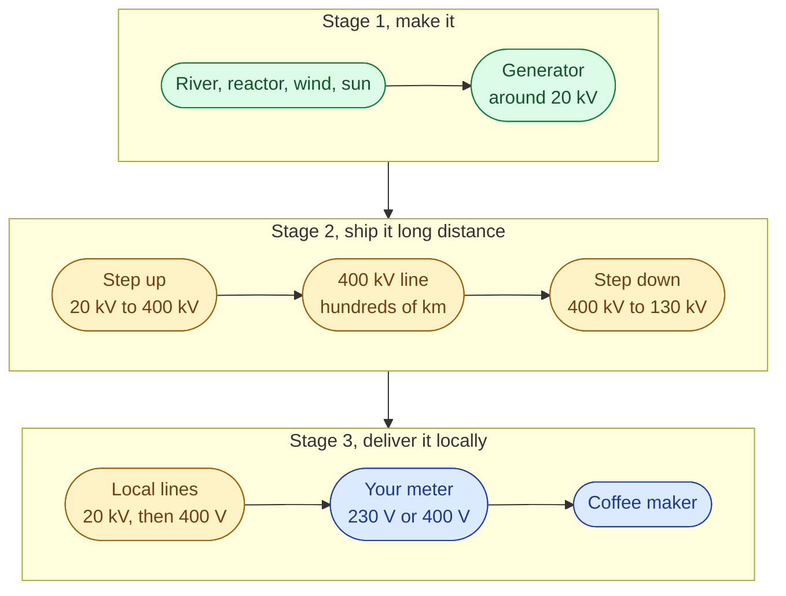
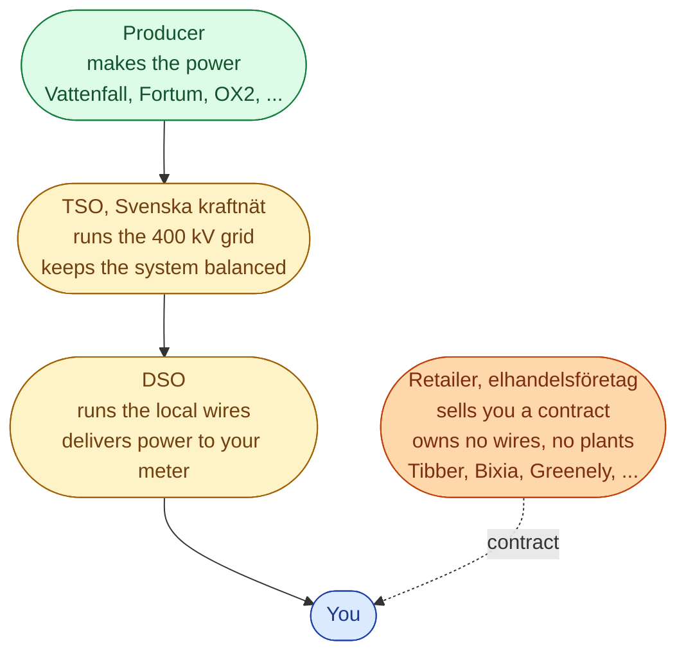
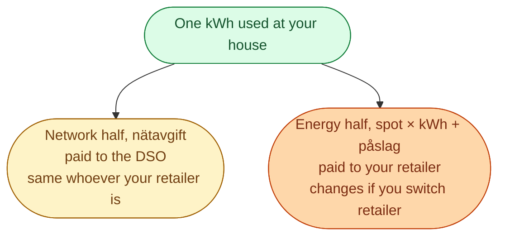

A kWh used in Malmö may have been made one second ago at a hydro plant 1,500 km away in Norrland. The trip goes through several voltage levels and three different operators. We are going to walk the trip, then explain why your bill always has two parts.

## The journey, grouped into three stages

Why three stages? Because each stage is run by a different kind of company.

| Stage | Who runs it | Voltage |
| --- | --- | --- |
| Make it | Producer (Vattenfall, Fortum, OX2, Statkraft, ...) | up to ~20 kV |
| Ship it | **TSO**, Svenska kraftnät | 400 kV and 220 kV |
| Deliver it locally | **DSO** (Vattenfall Eldistribution, Ellevio, E.ON, ...) | 130 kV down to 400 V |

One TSO for the whole country. Around 170 DSOs across Sweden. You cannot pick your DSO. It is set by where you live.

## Three operators, three different jobs

Most newcomer confusion in Sweden comes from mixing up these roles.

Same parent brand can wear different hats. *Vattenfall* shows up as a producer (operates Forsmark), a DSO (Vattenfall Eldistribution), and a retailer (Vattenfall Sälj). Swedish law keeps these as **legally separate** companies under the same parent, so the wire business cannot favour the contract business.

## Why your bill has two halves

The same kWh is billed twice, once by the retailer and once by the DSO.

The state then adds **energiskatt** and 25 percent **moms** on top.

Three simple rules for everyday life.

- Power outage? Call the **DSO**. They own the wire.
- Bill looks wrong? Call the **retailer**. They sold you the contract.
- Want to switch supplier? Switch the **retailer**. The DSO stays the same.

## One kWh, traced

Walk through one kWh used in a Lund apartment on a Wednesday evening.

1. Made by a Vattenfall hydro plant in Jämtland.
2. Sent south on Svenska kraftnät's 400 kV grid through SE2, SE3, then into SE4.
3. Stepped down through an E.ON regional substation, 130 kV down to 20 kV.
4. Travelled the last few hundred metres on E.ON's local 400 V wire.
5. Past the meter, into the lamp.
6. Billed by **Tibber** for the spot price plus their **påslag**.
7. Billed by **E.ON Distribution** (a separate legal company) for the **nätavgift**.
8. **Energiskatt** and **moms** added.

One kWh. Five companies. Two bills.

## Next

The path uses 400 kV in the middle and 230 V at home. Time to see why. See [Why we ship power at high voltage]({{ '/energy/concepts/007-ac-three-phase-high-voltage/' | relative_url }}).
