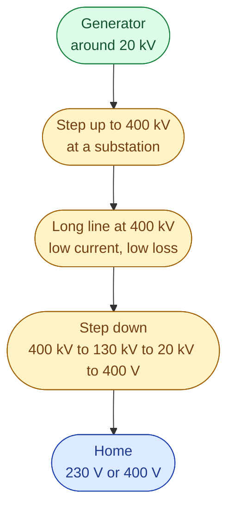
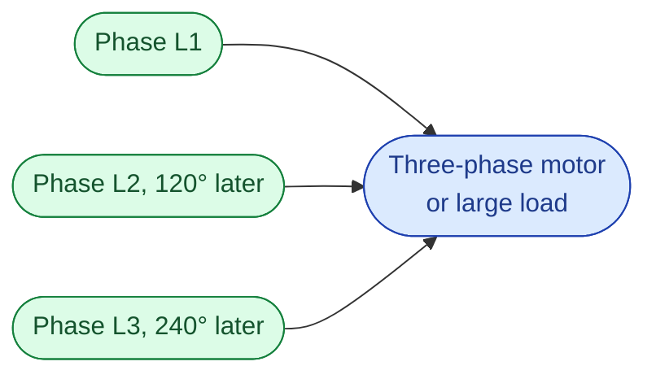

Long power lines run at 400 kV. Your kitchen wall runs at 230 V. The same wires, doing the same job, at very different voltages. There is a clean reason.

Three short questions to answer:

1. Why high voltage for long distances?
2. Why three wires (three phases)?
3. Why AC, not DC?

## Why high voltage

The heat lost in a wire follows one rule.

> **loss = current squared × resistance**

The word *squared* is the key. **Double the current, four times the loss.** Halve the current, a quarter of the loss.

For the same amount of power, you can ship it as high voltage with low current, or low voltage with high current. High voltage wins on losses by a lot.

Think of a garden hose. You can push water slowly with high pressure, or fast with low pressure. Same water delivered per second. But the fast version heats the hose much more from friction. Electricity behaves the same way.

So we **step the voltage up** at the generator with a transformer, ship it across the country, and **step it back down** near where it is used.

A quick feel for the numbers. Sending 1,000 MW down 500 km of line:

| Voltage | What happens |
| --- | --- |
| 20 kV | Wire melts. Not possible. |
| 130 kV | Around 30 percent of the power is lost as heat. |
| 400 kV | Around 3 percent lost. |

Same wire. Same power. The voltage choice decides the loss.

## Why three phases

A single AC wire delivers power in pulses. Twice every cycle it crosses zero. Fine for a lamp. Bad for a big motor, which would stutter along with the pulses.

Three wires, offset in time by 120 degrees, fix this. At any moment, at least one wire is delivering near its peak. The sum is smooth, steady power. A three-phase motor also knows which way to spin without any extra circuit, because the magnetic field is already rotating.

Almost everything from generation to your house is three phase. A Swedish house with an EV charger, sauna, or electric heating gets all three phases at 400 V. An apartment often gets just one of the three phases at 230 V. Same supply. Different number of wires going in.

## Why AC, not DC

Transformers only work on AC. Without transformers you cannot easily change voltage. Without changing voltage you cannot ship power long distance without huge losses.

Edison pushed DC. Tesla and Westinghouse pushed AC. AC won for that one practical reason.

That said, some modern long undersea cables use **HVDC** (high-voltage direct current). **NordLink** between Norway and Germany, and **SwePol** between Sweden and Poland, are HVDC. HVDC makes sense when the cable is very long, or when you need to connect two grids that are not in sync.

## One synchronous grid, one frequency

Every generator on the same AC grid spins at the same speed. They cannot help it. They are mechanically linked through the wires by magnetism.

This is why an entire group of countries can behave like one big shared engine. The **Nordic synchronous area** covers Sweden, Norway, Finland, and eastern Denmark. All of it sits at 50 Hz. Continental Europe is a separate synchronous area, at its own 50 Hz. To send power between two synchronous areas, you need an HVDC link.

## Next

You now know how power moves. The next entry zooms into who runs each part of the chain. See [Who is who]({{ '/energy/concepts/008-who-is-who-actor-map/' | relative_url }}).
