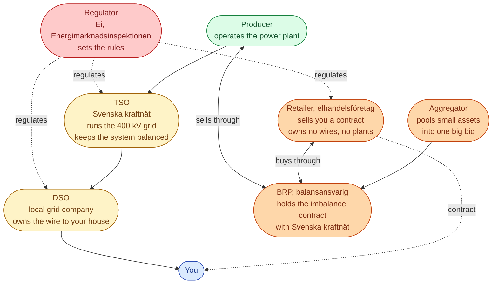

The hardest thing for newcomers in Sweden is that one parent company can show up in three roles. Vattenfall makes power at Forsmark, owns wires through Vattenfall Eldistribution, and sells you contracts through Vattenfall Sälj. Three jobs. By law, three separate companies. Same brand on top.

This page puts each role in its right place, so the rest of the library makes sense.

## The whole map in one picture

Yellow boxes carry **electrons**. Orange boxes carry **money**. Red is the **regulator**.

## One sentence per role

| Role | What they do | Real names |
| --- | --- | --- |
| **Producer** | Makes the power. | Vattenfall, Fortum, Statkraft, Uniper, OX2 |
| **TSO** | One per country. Owns the national high-voltage grid. Keeps balance. | Svenska kraftnät |
| **DSO** | Owns the local wires to your meter. Regulated monopoly. | Vattenfall Eldistribution, Ellevio, E.ON Energidistribution, ~170 others |
| **Retailer** | Sells you a contract. Owns no wires, no plants. | Tibber, Bixia, Greenely, Vattenfall Sälj |
| **BRP** | The company that gets billed when a plan was wrong. | Often the same company as the producer or retailer, sometimes separate |
| **Aggregator** | Bundles small flexibility into a market bid. | Sympower, CheckWatt, Tibber Pulse, Flower |
| **Regulator** | Approves what the DSO can charge. Polices the rest. | Ei (Energimarknadsinspektionen) |

## Why the unbundling

Swedish law forces a clean line between wires and contracts. A DSO cannot also be a retailer in the same legal entity. The same parent group can own both, but they must be separate companies, with separate accounts and separate IT.

This is why Vattenfall shows up three times. Each Vattenfall company has a different job, a different licence, and a different boss for the regulator.

When you read *Vattenfall raises prices*, always ask which Vattenfall.

- *The producer* changed its bid into Nord Pool.
- *The retailer* changed the **påslag** on your contract.
- *The DSO* asked Ei to approve a new **nätavgift**.

Three different stories.

## Next

Each Swedish bidding zone has its own price. See [The four Swedish bidding zones]({{ '/energy/concepts/009-bidding-zones/' | relative_url }}).
