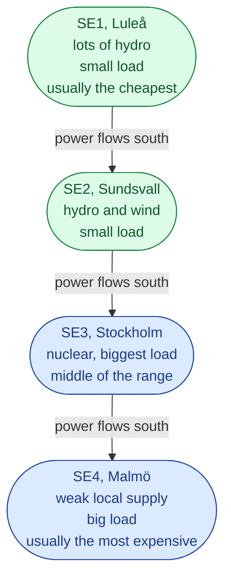
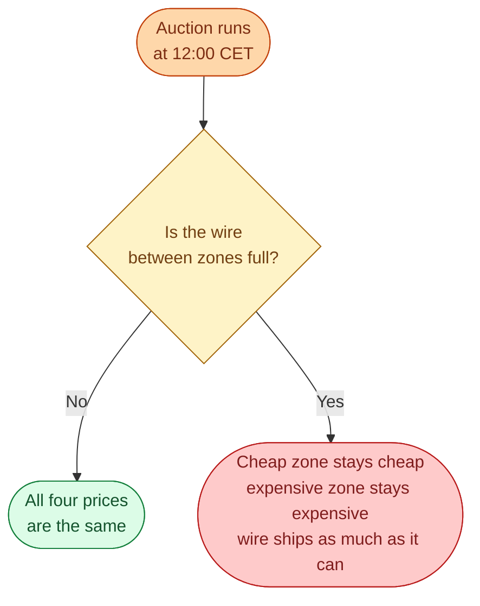

Sweden is one country. But for the wholesale electricity market, it is four countries. Each region gets its own hourly price. On a normal day the four prices are close. On a tight day, SE4 in Malmö can be five to ten times higher than SE1 in Luleå.

The four zones exist for one reason: the wires between north and south cannot carry all the power that the market would like to ship. Splitting the country into zones is the market's way of telling everyone *the wire is full, please rearrange*.

## The four zones

A clean way to remember it. **North has the power. South has the people.** Power flows south almost every day.

## When prices match, when they split

The Nord Pool auction tries to give everyone the lowest possible price. It always *wants* the four zones to be at the same price. But if the wire between two zones is full, the auction has to give up and price them separately.

So when you see big price differences between SE1 and SE4 on the news, it almost always means the same thing: the 400 kV north-south backbone is at its limit.

## Why this matters in practice

A few real consequences you will see often.

**SE4 prices follow continental Europe.** When the wires south to Germany and Denmark are not full, SE4 couples to the German price, which is mostly set by gas. So a cold day in Berlin can spike the bill in Malmö.

**SE1 prices stay low when the lines are full.** A wind storm in northern Sweden can drive SE1 close to zero (or negative) while SE3 and SE4 stay high. The wind power cannot leave.

**Building things in SE3 or SE4 is harder.** New data centres, new factories, and new electrified industry want to connect where the demand is, which is also where prices are high and the grid is most constrained. This is the single biggest political fight in Swedish energy today.

## Next

When the auction has to pick a price, it stacks bids cheap to expensive. The last bid accepted sets the price. See [Merit order]({{ '/energy/concepts/010-merit-order/' | relative_url }}).
