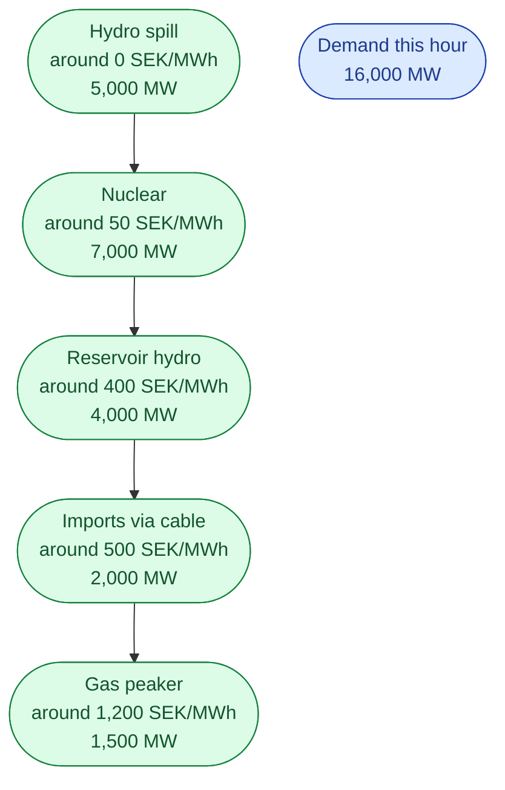
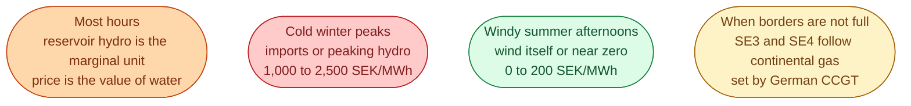

Every hour, the Nord Pool auction picks one price for each zone. That single price decides what gets paid to a hydro plant in Jämtland, a nuclear unit at Forsmark, and a wind farm in Skåne. They all get the same number.

The way that number is chosen is the **merit order**. Once you see it, the rest of the wholesale market falls into place.

## The picture

Every generator submits, for each hour, a bid: *I will produce this many MW at this price*. The auction sorts all the bids from **cheapest to most expensive**. Then it stacks them up until the stack matches demand for that hour. The last bid that gets accepted sets the price for everyone above it.

Stack the cheap ones first. 5,000 + 7,000 + 4,000 = 16,000 MW. That covers demand. The last bid accepted is reservoir hydro at 400 SEK/MWh. So **everyone who cleared gets paid 400**.

If demand had been 16,500 MW, imports at 500 SEK/MWh would have been the last bid in. Everyone above it would get paid 500. The hydro and nuclear plants did not change. The price did, because the marginal unit did.

## Why everyone gets paid the same price

This is the bit that catches people. It sounds unfair. It is actually the design.

If you bid your true cost, the worst that can happen is you get exactly your cost back. So bidding low is risky and bidding high risks not running at all. The auction rewards honesty. It is called **uniform pricing**, and almost every European electricity market uses it.

## Who usually sets the Nordic price

The Nordic system is special. **Hydro is usually the marginal unit.** A hydro operator does not bid a fuel cost. Water is free. Instead they bid the *opportunity cost*: the price they would have got by saving the water for a more expensive hour. So Nordic prices move with reservoir levels and the weather forecast, not with the price of gas, *most of the time*.

When the cables to Germany are not full and the gas price spikes in Berlin, SE3 and SE4 follow. That is why a German gas crisis becomes a Swedish bill problem.

## What the picture explains

Three things, in one go.

- Cheap plants make their best margin in expensive hours. A nuclear unit that bid 50 still gets paid 1,500 when gas sets the price. That is the design, not a glitch.
- Most of the energy in any given hour comes from the *cheap* plants near the bottom of the stack. The marginal unit produces only the *last bit*.
- Reading a price spike: someone expensive ended up at the top of the stack. Either demand was unusually high, or a cheap plant was unavailable, or the cable to a cheaper neighbour was full.

## Next

The auction at 12:00 CET is one beat in a longer daily rhythm. See [The daily clock]({{ '/energy/concepts/011-day-in-the-market/' | relative_url }}).
