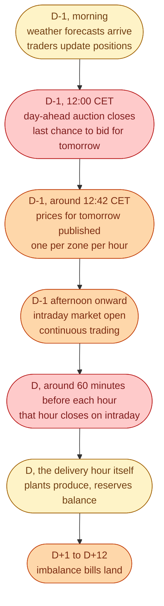

The Swedish energy market runs on a clock that does not change. Same beats. Same times. Every day of the year. If you can name what happens at 12:00 CET on D-1 and what happens at hour-1 on the day of delivery, you can follow almost every meeting in the industry.

We walk through one full day, then list what each actor is doing at each beat.

## The clock, in one timeline

Three markets stacked in time, then one settlement window at the end. Nothing about this changes day to day.

## What happens at each beat

| Time | What happens |
| --- | --- |
| **D-1 morning** | Forecasts update. Traders set their bids. |
| **D-1, 12:00 CET** | Day-ahead auction closes. After this, no more bids for tomorrow's auction. |
| **D-1, ~12:42 CET** | Prices for all 24 hours of tomorrow published. One per zone. |
| **D-1 afternoon onward** | Intraday market opens. Continuous trading, around the clock. |
| **D, 60 minutes before each hour** | That hour closes for trading. The plan is final. |
| **D, the hour itself** | Plants produce. Reserves activate if needed. The TSO balances. |
| **D+1 to D+12** | TSO measures the gap between plan and reality. Sends bills. |

## A wind retailer, one full day

Walk through one day from inside a 200 MW wind portfolio in SE3.

1. **D-1, 09:00.** Pull the morning forecast. Estimate wind production for tomorrow, hour by hour.
2. **D-1, 10:30.** Submit bids to Nord Pool. Offer the forecast production at zero price (always wanting to sell).
3. **D-1, 12:00.** Gate closes.
4. **D-1, 12:42.** Prices published. SE3 will average 600 SEK/MWh tomorrow. Peak of 1,400 from 17 to 19.
5. **D-1, 15:00 onward.** Intraday opens. As new forecasts arrive, trim positions hour by hour.
6. **D, 13:00.** Forecast updates. Wind will drop early evening. Buy back 30 MWh on intraday for hour 17 to avoid being short.
7. **D, 16:00.** Hour 17 closes on intraday. Plan is final.
8. **D, 17:00 to 18:00.** Wind comes in 5 MWh below plan. Imbalance.
9. **D+10.** Imbalance bill arrives. Owes 5 MWh times the imbalance price for that hour.

That same cycle runs every day, for every BRP, for every MWh.

## Why the clock is so rigid

The clock is rigid because the rule from earlier is rigid. Generation must equal consumption every second. Bids have to close *before* delivery so plants can plan production. Forecasts have to update *during* the day so traders can adjust. Reserves have to be armed *before* the hour they might be needed.

Every fixed time on the clock is the answer to one question: *when does the next set of information arrive, and who needs it next?*

## Next

Now two views of the data that engineers stare at all day. See [Reading the data]({{ '/energy/concepts/012-reading-the-data/' | relative_url }}).
