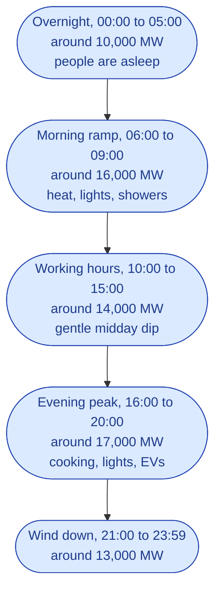
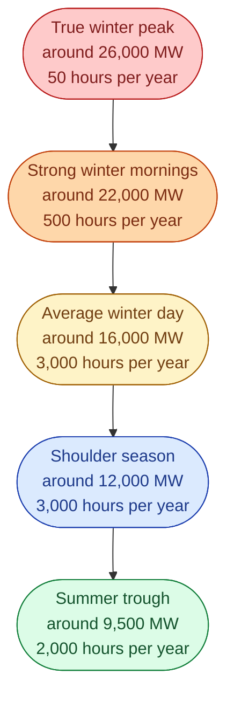
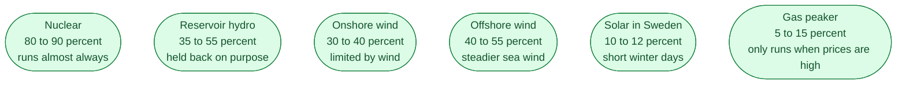

Every analytical conversation in this business starts with one of two charts. The **load curve** answers *what happens when*. The **duration curve** answers *how often each level happens*. And one number, the **capacity factor**, summarises a whole year of a generator in one digit.

Get fluent with these three and you can follow almost any meeting about energy strategy.

## The load curve: what happens when

A load curve plots demand in MW on the vertical axis and time on the horizontal axis. A winter weekday in Sweden has a very clear shape.

A load curve answers questions like *when is the peak today*, *how fast does the system ramp*, *did we hit a constraint at any moment*. You read it left to right, like a story.

## The duration curve: how often each level happens

Now take a whole year of hourly values and sort them from biggest to smallest. The shape that comes out is the **duration curve**. The horizontal axis is no longer time. It is *number of hours per year where demand was at least this high*.

A duration curve answers very different questions. *How much firm capacity do I need to invest in. How many hours per year does my peaker actually run. If I shave off the top 50 hours, what happens.*

| Question | Use the load curve | Use the duration curve |
| --- | --- | --- |
| When is peak today? | yes | no |
| How many hours of high prices per year? | no | yes |
| Will the system get tight this evening? | yes | no |
| Worth building a 500 MW peaker? | no | yes |

A simple rule: load curve for operations, duration curve for investment.

## Capacity factor: one number to compare generators

The duration curve shows the whole shape. The **capacity factor** shows just the average.

> **capacity factor = actual energy in a year / what it could have made if it ran flat out**

A year has 8,760 hours. If a 1 MW unit produces 4,380 MWh in a year, its capacity factor is 50 percent.

This is why 1,000 MW of new nuclear and 1,000 MW of new solar are *not the same product*. The nuclear unit produces around 7,500 GWh per year. The solar plants produce around 1,000 GWh per year. Same MW on the press release, **seven times** the energy from the nuclear unit.

Capacity factor is the number that lets you turn a MW headline into the MWh that actually matter.

## Next

The same MW vs MWh split, but for storage. See [Storage on the grid]({{ '/energy/concepts/013-storage/' | relative_url }}).
