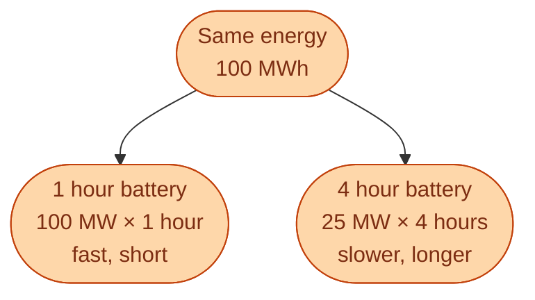
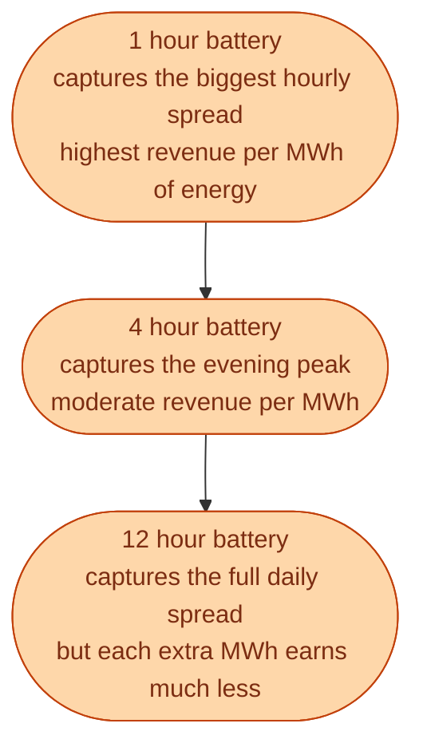

When someone says *we built a 100 MWh battery*, they have told you only half the story. The other half is *how fast can it discharge*. Two batteries with the same energy rating can be completely different products.

This is the most useful idea to take away from the storage world: **every storage asset has two numbers, and the ratio between them is what matters.**

- **Power, in MW.** How fast it can charge or discharge.
- **Energy, in MWh.** How much it can hold in total.
- **Duration, in hours.** Energy divided by power. *This* is the product.

A 100 MWh battery with 100 MW inverters is a **1 hour battery**. A 100 MWh battery with 25 MW inverters is a **4 hour battery**. Same energy. Very different product. Different market. Different price.

## The duration ladder

Different durations solve different problems. Match the asset to the job.

| Duration | Use case | Tech |
| --- | --- | --- |
| Seconds | **FCR-D**, fast frequency catch | Lithium battery with grid-forming inverter |
| Minutes to 2 hours | **aFRR**, intraday arbitrage | Lithium battery |
| 4 to 12 hours | Day-ahead arbitrage, evening peak | Larger lithium, flow battery |
| 12 hours to days | Cover weather fronts | Pumped hydro |
| Weeks to seasons | Winter-summer shift | Hydro reservoirs |

Lithium dominates the seconds-to-hours range. Pumped hydro dominates daily to weekly. Long duration is still mostly an unsolved business problem outside of countries with big hydro reservoirs.

## Why long duration is hard

The cost of a battery grows with the **energy** number (MWh), not so much with the **power** number (MW). And the value of energy capacity drops fast as duration grows, because the price spread inside a day is bounded.

This is why nobody has built a 100 hour lithium battery on economics alone. Doubling duration roughly doubles cost. It does not roughly double revenue.

Sweden has a quiet advantage here. Hydro reservoirs already are a multi-week to multi-season battery, already paid for, with enormous capacity. Norway has even more. This is the main reason the Nordic system handles wind and solar variability so much better than continental Europe.

## Where batteries actually earn money in Sweden today

Most early lithium projects in Sweden were built for one product: **FCR-D**. Fast, small (5 to 20 MW, often 1 hour), bidding into the fast frequency reserve. That market valued response speed in milliseconds, which is exactly what a battery is great at.

The next wave is **aFRR** and intraday arbitrage. Durations of 1 to 2 hours start to make sense there. Pure day-ahead arbitrage is still hard in the Nordics because hydro is already very good at that job and keeps daily spreads narrow.

## Why this matters for the rule

Storage is not unlimited backup. It is *not* a buffer for the whole grid. It is small assets, deployed for specific jobs, mostly for fast frequency response and short intraday shifting. The rule from earlier still holds: balance every second. Storage is one of the tools that helps. Not the cure.

## Next

That finishes the foundations. Now we zoom into who does what, starting with Svenska kraftnät. See [Svenska kraftnät: what the TSO actually does]({{ '/energy/concepts/014-svenska-kraftnat/' | relative_url }}).
