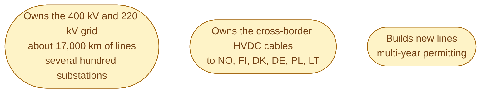
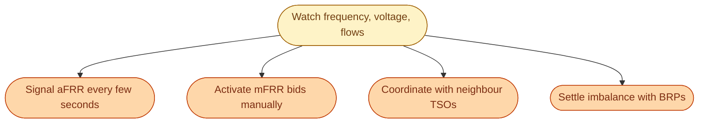

Svenska kraftnät is the Swedish TSO. State owned. Around 1,000 employees. Headquartered in Sundbyberg. They sit at the centre of the Swedish energy market every second of every day, and most people in the country have no idea they exist.

Three big jobs to know.

## Job 1: own and operate the 400 kV grid

Svk owns the **national transmission grid**. Roughly 17,000 kilometres of high-voltage lines, plus several hundred substations. The 400 kV lines that carry hydro south from Norrland and the cross-border cables to Norway, Finland, Denmark, Germany, Poland, and Lithuania are all theirs.

When you read in the news that Sweden cannot connect new industry in SE4 because the grid is full, the missing wires are usually Svk's wires.

## Job 2: keep the system balanced in real time

This is the operational core. The control room in Sundbyberg watches the frequency every millisecond and dispatches reserves when reality differs from plan.

The control room never closes. There are operators on duty at 03:00 on a Sunday in July, watching the same screens.

## Job 3: run the balancing and reserve markets

Svk procures **FCR-N**, **FCR-D up**, **FCR-D down**, **aFRR**, and **mFRR**. Each is a separate market with its own auction, its own technical rules, and its own settlement. Producers, retailers, batteries, and aggregators bid in. Svk pays them.

This is where most of the operational money flows in the modern Swedish energy market. A 10 MW battery in Skellefteå earns its revenue from Svk's reserve auctions, not from selling MWh on Nord Pool.

## What Svk does *not* do

Useful list, because newcomers often guess wrong.

- Svk does not own any power plants.
- Svk does not own local distribution wires. Those are the DSO's.
- Svk does not sell electricity to consumers. Retailers do.
- Svk does not set retail prices. The market does.
- Svk does not approve nätavgift levels. Ei does.

Svk is the wires, the control room, and the reserve markets. Nothing else.

## How to follow what Svk is doing

A few real places to look.

- **Kontrollrummet** (kontrollrummet.svk.se) shows live frequency, current production mix, current flows.
- **Mimer** is Svk's open data platform for historical balancing and reserve data.
- **Svk's annual report** is unusually readable for a state agency, and is the best summary of what the Swedish grid did each year.

If you take one habit from this entry, take this one: bookmark *Kontrollrummet* and glance at it once a day for a week. You will start to feel how the grid breathes.

## Next

After the TSO comes the DSO. The wires from the backbone to your house. See [DSO: tariffs and the local monopoly]({{ '/energy/concepts/015-dso/' | relative_url }}).
