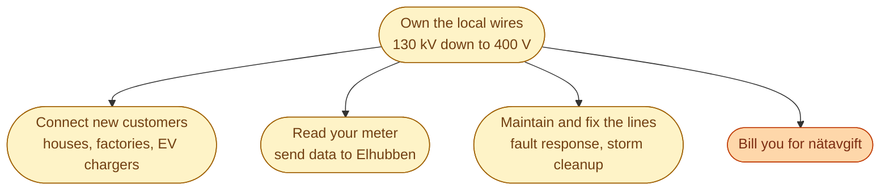
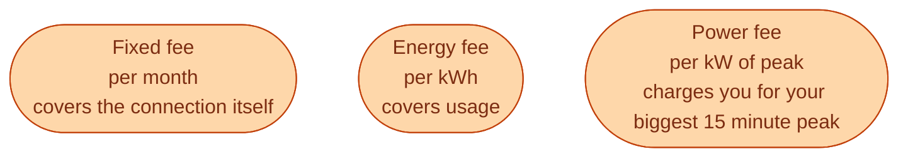

A DSO is the local grid company. They own the wire from the regional substation to your meter. Sweden has around 170 of them. The big ones are **Vattenfall Eldistribution**, **Ellevio**, and **E.ON Energidistribution**. The small ones are often municipal, serving one city or part of one.

You cannot pick your DSO. Where you live decides who delivers power to your address. The DSO is a **regulated monopoly** in its area.

## What they actually do

When a storm knocks down a tree on a line, the DSO sends the truck. When you install a heat pump and need a fuse upgrade, you call the DSO. They are the company physically connected to your house.

## Why the bill is regional and political

The DSO bill (**nätavgift**) is a real chunk of your electricity bill, often half. It pays for the wires, the maintenance, the meter, and the DSO's profit.

The price is **not set by the DSO alone**. Ei reviews and approves the maximum revenue each DSO can collect over a four-year regulatory period. The DSO then decides how to split that revenue across its customer types (houses, apartments, businesses).

This is one of the most political topics in Swedish energy. Every four years there is a public fight about whether the approved revenue is fair, whether DSOs are over-earning, and whether the tariff design is fair across customer types. Ei is at the centre of it.

## Tariff structure: more than just kWh

A modern Swedish nätavgift usually has three components.

The third component, the **power fee** (effektkomponent), is the new one. It charges customers for the highest 15-minute peak they pulled in a month. This is meant to push houses to charge EVs at off-peak hours, run dishwashers overnight, and so on. Some DSOs have rolled it out. Others have not. The design is still being argued about.

## The DSO's new job: managing the local energy transition

Five years ago the DSO's job was mostly to deliver power *down* the wire. Today it is bidirectional. Solar panels on roofs push power *up* the wire. EV chargers pull big peaks. Heat pumps shift load to cold mornings. Data centres ask for 50 MW connections in places the grid was not designed for.

This is why DSOs have become a hot topic in the Swedish market. Their job has grown without their grid keeping up, and a lot of new business in the country runs into a *we cannot connect you yet* answer from the local DSO.

## Three rules of thumb for everyday life

- Power outage? Call the **DSO**, not your retailer.
- Want to install solar or a battery? You need to register with the **DSO**.
- DSO bill went up? Look at the latest Ei decision. Not the DSO.

## Next

The next role is the one nobody outside the industry has heard of. See [The BRP and the imbalance contract]({{ '/energy/concepts/016-brp/' | relative_url }}).
