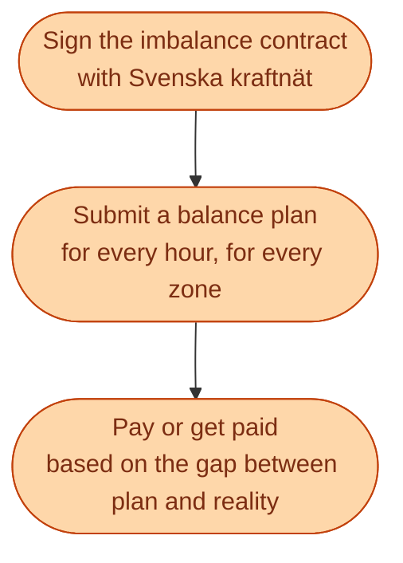
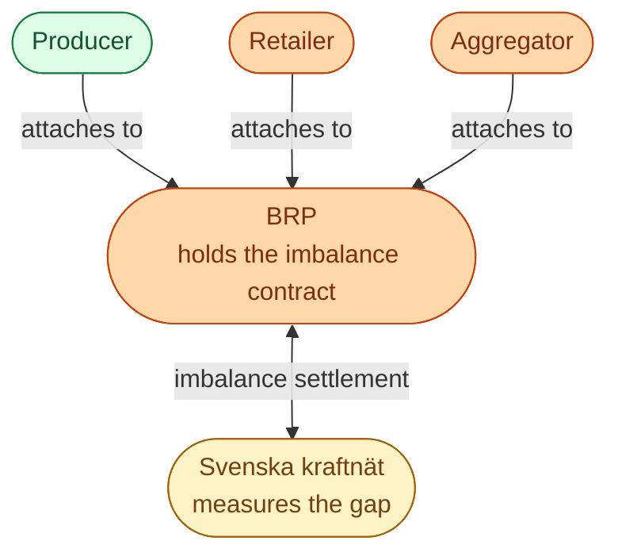

The BRP (**balansansvarig**, Balance Responsible Party) is the company that promises Svenska kraftnät: *I will be financially responsible for the gap between my plan and my reality*. Every MWh produced or consumed in Sweden has to sit inside some BRP's portfolio. No exceptions.

Most newcomers miss this role at first because it is invisible to consumers. You never sign a contract with a BRP. You never see them on your bill. But every retailer and every producer has one behind them.

## What the BRP actually signs up for

A BRP submits, for every hour and every zone, a plan saying *I will deliver this much or consume this much*. After the hour ends, the TSO measures the actual values, calculates the gap, and bills the BRP at the **imbalance price** for that hour.

## Why this role has to exist

The system needs *somebody* to be financially on the hook for each MWh. Otherwise nobody has any reason to forecast well, to submit accurate plans, or to buy on intraday when the forecast changes.

The imbalance fee is the discipline. If a BRP is short (produced less than planned, or consumed more), they pay. If they are long (produced more than planned), they sometimes pay and sometimes get paid, depending on how the system was that hour.

This is the lever that pushes everyone in the market to act on the rule from earlier: balance every second.

## How a BRP fits into the bigger picture

A producer can be its own BRP (most big ones are). A small retailer often uses a third party as its BRP rather than becoming one itself. An aggregator that pools home batteries usually attaches its portfolio to a partner BRP.

The role can be inside the same legal company as the producer or retailer, or in a separate company. What matters is the contract with Svk. Whoever holds *that* is the BRP for that MWh.

## What this means for an engineer crossing in

If your role touches forecasting, dispatch, or trading, you are working **for the BRP**, whether you know it or not.

- Better forecasts reduce imbalance fees.
- Smarter intraday trading reduces imbalance fees.
- Faster reaction to weather changes reduces imbalance fees.

Every one of these efforts has a number attached to it: SEK saved on imbalance. The BRP is the cost centre that tracks it.

## A small example

A retailer has 50,000 customers in SE3. They estimated tomorrow's hourly consumption based on weather and customer history, then bought matching MWh on the day-ahead auction.

Tomorrow, an unexpected cold front pushes heating demand up by 5 percent. The retailer is short.

- Their BRP pays the imbalance fee for every MWh of shortfall, for every hour of the cold front.
- The team's job is to catch the cold front *during the day*, on intraday, and buy back the missing MWh **before** delivery. The earlier they catch it, the less the imbalance fee.

That cycle, repeated, is most of the daily work of a retailer's trading team.

## Next

The customer-facing side of the chain. See [The retailer: contracts, switching, churn]({{ '/energy/concepts/017-retailer/' | relative_url }}).
