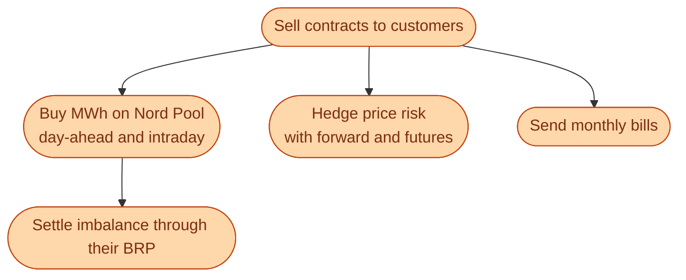
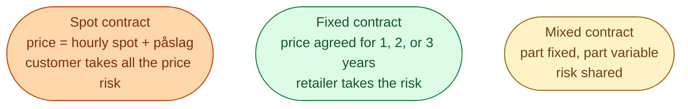

A retailer (**elhandelsföretag**) is the company that sells you a contract for electricity. They own no power plants. They own no wires. What they own is a customer book and a trading desk. They buy MWh on Nord Pool and resell it on contracts to households and businesses.

There are around 120 active retailers in Sweden. The big ones include Vattenfall Sälj, Fortum Markets, Bixia, and Tibber. The market is very competitive. Customers can switch any time, and many do.

## What the retailer actually does

The trading desk is the engine. The customer service team is the face. The two are linked by one number: the **påslag**.

## The three main contract types

**Spot.** The customer pays the actual hourly Nord Pool spot price times their kWh, plus the retailer's påslag (a small markup, often 1 to 5 öre per kWh). The customer carries the price risk. If spot is 10 SEK/kWh tonight at 18:00, they pay 10 SEK/kWh for what they use at 18:00.

**Fixed.** The customer pays a fixed price per kWh for the whole contract term. The retailer locks in that price by buying matching futures on the forward market. The retailer carries the risk. If spot blows up after the contract starts, the retailer is in trouble, not the customer.

**Mixed.** Part of the consumption is at fixed price, the rest at spot. A compromise between the two extremes.

Around 60 percent of Swedish households are on spot contracts today, up from much less a decade ago. Tibber and similar app-first retailers built their whole business on spot.

## How retailers make money

The math is simple. They buy at a wholesale-weighted price. They sell at a customer-weighted price. The gap is mostly the påslag plus any imbalance savings minus the costs.

| Cost | What it covers |
| --- | --- |
| **Wholesale purchase** | The MWh themselves, at spot or forward prices |
| **Imbalance fees** | What their BRP pays for forecast errors |
| **Hedge costs** | The premium paid for fixed-price futures |
| **Customer acquisition** | Marketing, switching incentives, churn replacement |
| **Operations** | IT, billing, customer service, regulatory |

A retailer on thin margins (Tibber-style) lives or dies on getting forecasting and intraday trading right. A retailer on fat margins (legacy fixed-price) lives or dies on customer churn.

## Switching is fast and cheap

Sweden has one of the most liquid retail markets in Europe. You can switch retailers any time, with no fee, and the new contract starts at the next billing cycle (usually 2 to 4 weeks later).

This is why retailer churn is high (around 12 percent per year). It is also why retailers spend so much on marketing and on lock-in incentives like signup bonuses or app features.

## What this means for an engineer crossing in

If you join a Swedish retailer, your work splits into two halves.

- **Wholesale side.** Forecasting, intraday trading, imbalance optimisation, hedging. This is where the real margin is captured or lost.
- **Customer side.** Pricing algorithms, churn prediction, app features, smart-meter data analytics. This is where the customer book is grown and kept.

The Tibber-style retailers have invested heavily on the customer side, with consumer apps showing hourly spot prices, smart-charging features, and home-battery integrations. The legacy retailers are catching up.

## Next

The newest role in the market. See [The aggregator: pooling small flexibility]({{ '/energy/concepts/018-aggregator/' | relative_url }}).
