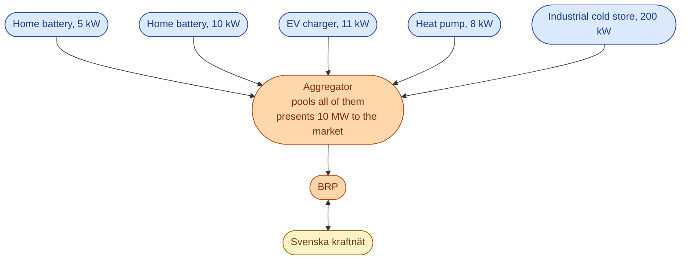
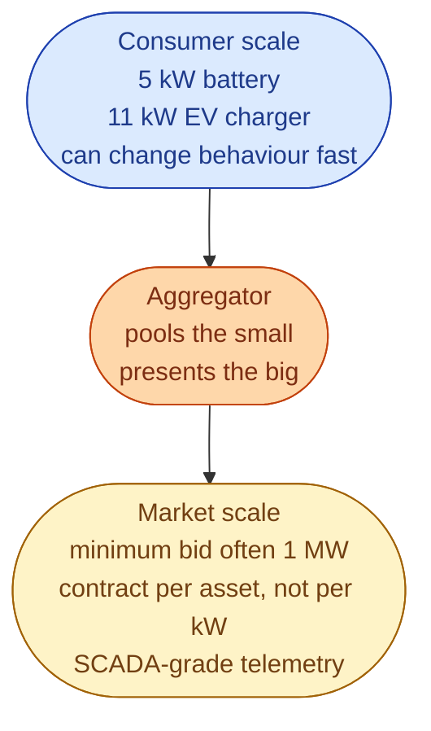

The reserve markets like big bids. A 10 MW battery is easy to bid in. A single home battery at 5 kW is not. The TSO does not want to manage 100,000 individual contracts with households.

So a new role has grown to fill that gap. The **aggregator** pools many small assets (home batteries, EV chargers, smart heat pumps, industrial demand response) and presents them to the reserve markets as one combined asset.

Names you will see in Sweden: **Sympower**, **CheckWatt**, **Tibber Pulse**, **Flower**, and a growing list.

## What the aggregator does

Below the line, the aggregator runs a lot of IT. Real-time telemetry from every asset. Fast signal dispatch when the market activates them. Settlement back to each individual owner.

Above the line, the aggregator looks like a single 10 MW asset to the BRP and to Svenska kraftnät.

## The two real markets they play in

Most of the value today is in two products.

**FCR-D** is the easiest entry. A home battery can react in milliseconds to a frequency dip. A pool of 1,000 batteries acting in unison is a credible 5 MW FCR-D bid.

**mFRR** for industrial flexibility. A cold store can shift its compressor off for 30 minutes without spoiling food. A large EV charger can pause for 15 minutes. Aggregated together, these become real mFRR bids.

aFRR is harder. It needs a faster, more continuous response. Some aggregators are working towards it but it is not yet a mainstream product for pooled small assets.

## Why the aggregator role exists at all

A clean way to think about it: the aggregator is the layer that translates between *consumer scale* and *market scale*.

Without aggregators, all the small-scale flexibility in Sweden would be wasted from a system point of view. There are millions of EV chargers, heat pumps, and home batteries that could in principle help balance the grid. But they only do so if somebody pools them.

## How the household sees it

A customer signs up with the aggregator (often through an app, sometimes integrated with their retailer's app). They agree that the aggregator can sometimes pause their EV charger for 15 minutes, or discharge their home battery for a frequency event. In return, they get a payment each month, usually 50 to 500 SEK depending on the asset.

For most households this is invisible: they never notice the pause. For the system, it is a real source of flexibility that did not exist five years ago.

## What this means for an engineer crossing in

If your background is software, the aggregator side of the market is the easiest to enter. It is mostly an IT company that happens to know energy.

- Real-time telemetry pipelines from 100,000 devices.
- Dispatch algorithms that react in seconds to a TSO signal.
- Settlement engines that split a market payment across 10,000 small owners.
- Forecasting per asset class (what will the heat pumps do tomorrow?).
- Customer apps that explain a complicated thing in a simple way.

The big aggregator companies are hiring more software engineers than power engineers.

## Next

The role that sets the rules everyone else has to follow. See [Ei: what the regulator decides]({{ '/energy/concepts/019-ei-regulator/' | relative_url }}).
