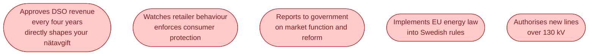

Ei stands for **Energimarknadsinspektionen**. The Swedish Energy Markets Inspectorate. Roughly 200 employees in Eskilstuna. Their job is to make sure the Swedish energy markets work fairly, to enforce the rules, and to translate EU energy law into Swedish practice.

They do not run the grid. They do not trade. They do not sell electricity. But they decide some of the most important numbers in the whole industry.

## What Ei actually decides

The big one is the first one. Every four years, Ei sets the maximum revenue each DSO can collect from its customers (the **intäktsram**, revenue cap). That number is the foundation of every Swedish household's network bill.

When Ei sets the cap higher, DSOs can invest more in grid upgrades, but household bills rise. When Ei sets it lower, household bills are protected, but grid investment slows. This is one of the most fought-over decisions in Swedish energy, every four years, in court.

## How Ei differs from Svenska kraftnät

Newcomers often mix these up. They are very different.

| | Ei | Svenska kraftnät |
| --- | --- | --- |
| What they are | Regulator | Grid operator |
| What they own | Nothing physical | The 400 kV grid |
| What they decide | Rules and tariff caps | Real-time dispatch and reserves |
| Who they report to | Government, Riksdag | Government |
| Reaction speed | Months to years | Milliseconds |

A clean way to think: **Ei sets the rules. Svenska kraftnät plays the game**.

## The international layer

Ei is also Sweden's point of contact for ACER, the EU Agency for the Cooperation of Energy Regulators. When EU energy directives become law, Ei is usually the agency that writes the Swedish version and decides how it gets enforced.

This matters more than it sounds. The Clean Energy Package, REMIT (market abuse rules), the cross-border capacity rules, the new flexibility regulations all flow through Ei before they hit Swedish companies.

## Where to follow them

- **ei.se** has every decision they have published. Searchable.
- Their **annual review** of the Swedish market is one of the best single documents on the state of Swedish energy.
- The **revenue cap process** has its own page with hearings, submissions, and decisions, four years at a time.

If you are about to read a news article about *DSO bills going up next year*, the original source you actually want is on ei.se.

## Next

That completes the actor map. Now we open the wholesale market itself, starting with the exchange where most of the trading happens. See [Nord Pool: the exchange itself]({{ '/energy/concepts/020-nord-pool/' | relative_url }}).
