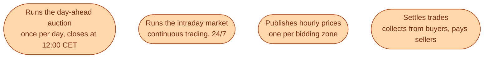

Nord Pool is a power exchange. Think of it the way you would think of a stock exchange, except instead of shares of companies, the thing being traded is **MWh of electricity delivered in a specific hour in a specific bidding zone**.

It started in 1996 in Norway and Sweden. Today it runs the day-ahead and intraday markets for the Nordics, the Baltics, and parts of central Europe. Headquarters in Oslo. Around 350 employees. Their auction is the single most important event in the Swedish energy day.

## What Nord Pool actually does

Notice what Nord Pool does **not** do. They do not own any generation. They do not own any wires. They do not balance the system. They are a marketplace and a clearinghouse, nothing else.

## Who trades on Nord Pool

The members are big enough to bid and have a credit relationship with the exchange.

| Member type | Examples |
| --- | --- |
| Big producers | Vattenfall, Fortum, Statkraft, Uniper |
| Big retailers | Tibber, Bixia, Fortum Markets |
| Industrial consumers | Boliden, SCA, large data centres |
| Trading houses | Axpo, Centrica, Statkraft Energy Trading |
| Aggregators | Sympower, Flower (via their BRP) |

A household never trades directly on Nord Pool. Their retailer does, on their behalf.

## How a trade actually works

A simplified picture of one MWh, one hour, one zone.

1. **Before 12:00 CET on D-1.** A wind producer in SE3 submits an offer: *I will deliver 50 MW at any price above 0 SEK/MWh in hour 14 tomorrow.*
2. **Same window.** A retailer in SE3 submits a bid: *I will buy 200 MW for hour 14 at any price below 1,500 SEK/MWh.*
3. **12:00 CET.** Gate closes. Auction runs.
4. **Around 12:42 CET.** Clearing price published. Say 600 SEK/MWh for SE3 hour 14.
5. **The hour itself.** The wind producer delivers physical MWh to the grid. The retailer's customers consume them. Nord Pool's role is only commercial: tracking who owes what.
6. **D+2.** Nord Pool settles. Money moves from buyer to seller, minus a small exchange fee.

The exchange is the layer that makes step 4 happen at the same time, in one auction, with one price per zone.

## Why Nord Pool matters beyond just being a marketplace

Three reasons.

**It is the price reference.** The Nord Pool spot price for your zone is what almost every retail contract is linked to. *Spot + påslag* on your bill means the Nord Pool day-ahead spot.

**It is the data source.** Everyone in the Swedish energy industry follows Nord Pool prices. Forecasts, dashboards, risk models, daily standups. Even people who never trade are following the number.

**It is the coupling point with Europe.** When Nord Pool's auction couples with the rest of Europe (through SDAC), the Swedish price moves in step with the German price, the French price, and so on, until a border is full.

## Where to look

- **nordpoolgroup.com** for the live and historical price data. Free for casual use.
- The **Day-ahead Auction** page shows tomorrow's prices about 30 to 45 minutes after the noon gate.
- The **intraday platform** is on a separate page and is more useful for working traders than for casual readers.

## Next

The auction itself runs an algorithm called EUPHEMIA. The name is intimidating. The idea is simple. See [How the day-ahead auction clears]({{ '/energy/concepts/021-day-ahead-clearing/' | relative_url }}).
