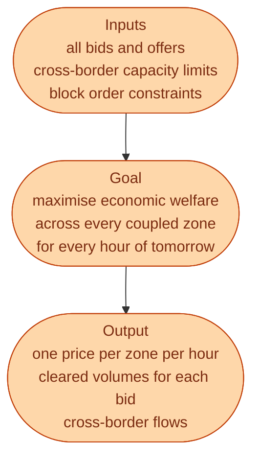
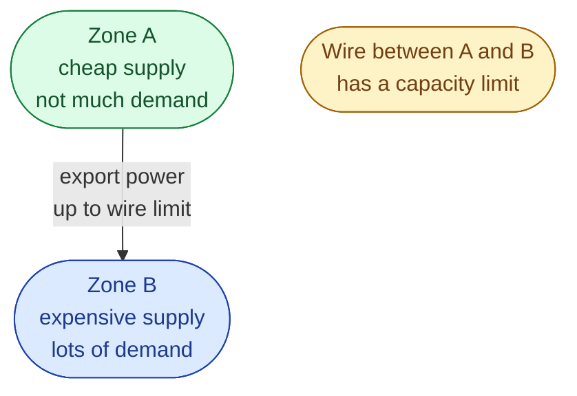

At 12:00 CET on D-1, the day-ahead gate closes. Forty minutes later, prices are published for every hour of tomorrow in every coupled zone in Europe. In between, an algorithm called **EUPHEMIA** runs the auction.

EUPHEMIA stands for *Pan-European Hybrid Electricity Market Integration Algorithm*. The name is awful. The job it does is clean.

## What the algorithm is trying to do

*Maximise economic welfare* sounds abstract. In practice it means: clear the cheapest supply with the highest-value demand, hour by hour, across all coupled zones, **while respecting the wires between zones**.

## A clean way to picture it

Forget the algorithm for a second. Picture a 24-hour spreadsheet across many zones.

For each hour and each zone, you have:

- A supply curve (all the offers stacked from cheap to expensive).
- A demand curve (all the bids stacked from high-value to low).
- A wire capacity to each neighbouring zone.

The auction asks one question: *what set of prices and flows leaves the most value on the table for everyone, taken together?*

If the wire is not full, the auction equalises the price in A and B. Same number. If the wire is full, the auction gives up on equalising. Zone A stays cheap. Zone B stays expensive. The wire ships whatever it can.

That is what *bidding zones split* means. The wire was the limit.

## Two outputs nobody talks about

EUPHEMIA also delivers two outputs that newcomers do not think to ask for, but that matter operationally.

**Cross-border flows for every hour.** The algorithm decides not just prices but also which zone exports how much to which neighbour, in every hour. This determines what physical flow Svenska kraftnät has to handle.

**Congestion rent.** When two coupled zones clear at different prices, the wire between them generates *congestion rent*: the cheap zone collects the cheap price, the expensive zone pays the expensive price, and the difference goes to the TSOs on each side. This is a real source of revenue for Svenska kraftnät and is meant to be reinvested in new lines.

## Why it has to be one big algorithm

Every coupled zone in Europe is solved **at the same time**, in **one optimisation**. Not zone by zone. Not iteratively. One big problem.

This is because the zones are linked: a flow from Norway to Germany also affects the price in Sweden, the price in Denmark, the price in the Netherlands. You cannot solve them independently and get a consistent answer.

EUPHEMIA is the algorithm that handles this all in one shot. It runs in 12 to 17 minutes, every day, for a problem that spans 25+ countries. That is the engineering achievement hiding behind the awful name.

## What can go wrong

A few real-world cases.

**EUPHEMIA cannot find a solution.** Very rare, but it has happened. When complex bid types and tight wire limits create an infeasible problem, the algorithm fails over to a simpler version, or to manual operator intervention.

**Late delivery.** If the algorithm runs long, prices come out at 12:55 instead of 12:42. Traders complain, but the markets still settle.

**Decoupling.** When a particular zone is temporarily disconnected (technical issue, regulatory intervention), the auction runs without it. Sweden has been decoupled briefly in the past during major events.

## Next

Real bids are not just *I will sell at X*. There are several bid types, and they shape who wins. See [Bid types: hourly, block, complex]({{ '/energy/concepts/022-bid-types/' | relative_url }}).
