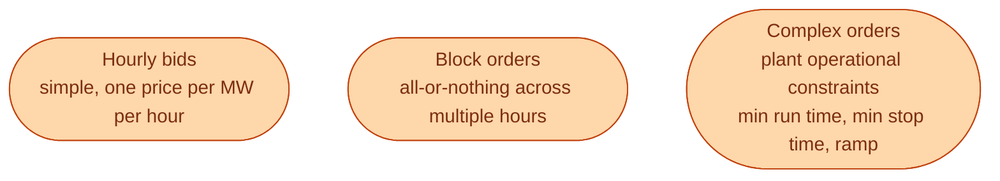
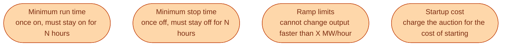

A wind farm can stop and start at any time. A nuclear unit cannot. A combined-cycle gas plant takes hours to start and burns fuel during the startup whether it produces useful MW or not.

The auction has to handle all of this in one optimisation. So Nord Pool offers several bid types. Each one expresses a real physical constraint of a real plant.

## The three families of bids

## Hourly bids

The basic kind. *For hour 14, I will sell 50 MW at any price above 400 SEK/MWh.* Independent hour by hour. The auction can accept some hours and reject others. Each hour is a separate decision.

Wind, solar, batteries, retailers, and small flexible loads all bid this way. So do some hydro plants for individual hours.

| Field | What it means |
| --- | --- |
| Zone | SE1, SE2, SE3, SE4 (or one of the foreign zones for foreign assets) |
| Hour | 1 to 24 of the next day |
| MW | how much to sell or buy |
| Price | the price ceiling (for buy) or floor (for sell) |

## Block orders

A block is *all or nothing across multiple hours*. *For hours 06 to 20, sell 100 MW at any price above 500 SEK/MWh, but only if all 15 hours clear together*. If even one of the 15 hours would not clear at 500, the whole block is rejected.

A coal plant might bid a block because once it is running, it cannot easily stop and restart for one cheap hour. A combined-cycle plant might bid the morning ramp as a block because it has minimum run-time requirements.

Block orders make the auction harder. The algorithm has to decide *blocks of decisions* rather than individual hours. This is part of what makes EUPHEMIA an interesting algorithm.

## Complex orders

The newest family. A complex order lets a plant operator express more of its real operating constraints.

The exchange does not always offer every complex bid type for every zone. The Nordic market has a slightly different set than continental Europe.

## Why bid types matter beyond the plant

Two reasons newcomers should care.

**They explain price shapes.** When you see the day-ahead price stay flat at the same level for 6 morning hours and then jump, it is often because a big block order cleared together at that price and set the bar for the whole window.

**They are where most algorithmic trading work lives.** A retailer with a portfolio of flexible loads, batteries, and PPAs has to decide *which type of bid to submit for each piece*. The choice changes the expected revenue and the imbalance risk.

If you join a trading desk at a Swedish utility, you will spend more time on bid-type selection than on price prediction.

## What this means for an engineer crossing in

Build a small Python notebook that downloads one day of Nord Pool prices and one day of cross-border flows from the ENTSO-E Transparency Platform. Plot them next to each other. You will start to see the block orders show up as flat hours of identical prices. Once you can see them, you understand half the market.

## Next

The hydro that lives in northern Sweden is the marginal unit most hours, and its bidding logic is its own subject. See [Why hydro usually sets the Nordic price]({{ '/energy/concepts/023-hydro-marginal/' | relative_url }}).
