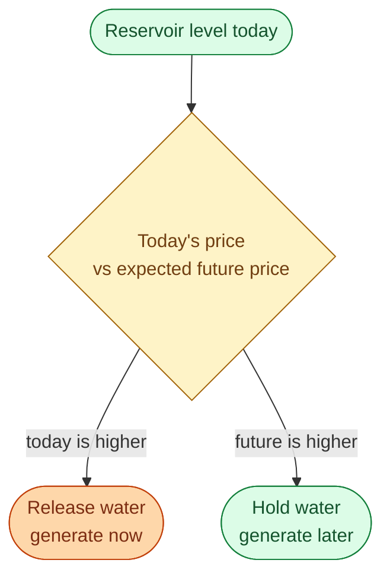
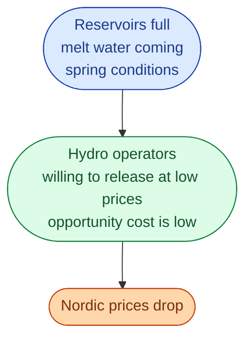
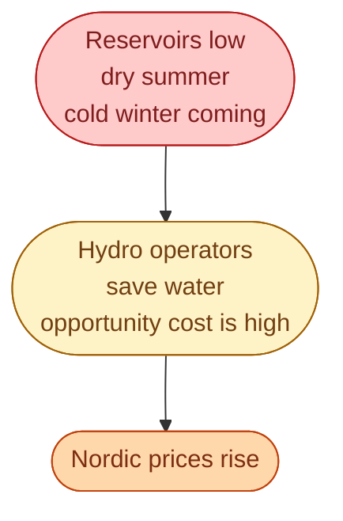

In continental Europe, the marginal unit (the one that sets the price most hours) is gas. The gas plant bids a price tied to the cost of gas plus the cost of carbon allowances. When gas spikes, prices spike. Simple cause and effect.

In the Nordics, things work differently. The marginal unit is usually **reservoir hydro**. And hydro has no fuel cost. So what is the hydro operator bidding?

This is the most useful idea to take away from the Nordic market: a hydro operator is a **scheduler**, not a producer. The bid is the *opportunity cost* of water.

## What opportunity cost means here

A reservoir holds a finite amount of water. Once the operator uses one MWh of water today, that MWh is gone. They cannot get it back. So every time they decide to release water, they are saying: *the price today is better than the price I expect to get next week*.

That comparison is the bid.

So the hydro bid is not zero. It is the future value of the water, discounted. Operators use complex models to estimate this number every day. The result is the bid that goes into Nord Pool.

## Why this makes the Nordic price special

Most hours, the marginal unit in SE3 is somewhere between nuclear (very cheap) and gas (very expensive). It is reservoir hydro. The operator's *opportunity cost* sets the price for everyone above it in the merit stack.

This is why the Nordic price moves with **reservoir levels and weather forecasts**, not with the gas price (most of the time).

If you follow Swedish energy news for one season, you will see this play out: the Norwegian and Swedish hydrology report becomes the most-cited document of the month.

## When hydro is *not* the marginal unit

Three situations switch the marginal unit away from hydro.

**Borders not full, continental coupling active.** The cables to Germany have spare capacity. The SE3 price couples to the German price, set by gas. Hydro becomes inframarginal: it still runs, it just gets paid the gas price instead of the water price.

**Very high demand, hydro tapped out.** A cold winter morning. All available hydro is already running. The marginal unit moves up the stack to imports, peaking hydro at higher reservoirs, or peakers. Price spikes follow.

**Very high supply, hydro spilling.** A windy summer afternoon. So much wind production that hydro operators stop holding back. Bids drop near zero. Sometimes negative.

So hydro sets the price *most* hours, but not *every* hour. The exceptions are exactly the most interesting hours.

## What this means for everyone else

A few real consequences.

**Wind and solar in Sweden get paid the hydro price most of the time.** Their bids are near zero, but they receive the marginal-unit price, which is the hydro operator's opportunity cost. This is much better than near-zero.

**A wet year drops everyone's revenue.** Hydro bids low, marginal price falls, every generator in the stack gets paid less. A wet summer is bad news for any merchant project, not just hydro.

**The biggest power players are the hydro schedulers.** Vattenfall, Fortum, and Statkraft together control most of the Nordic reservoir hydro. Their daily scheduling decisions are the single biggest input into Nordic prices.

## Next

Cross-border flows reshape the merit order every hour. See [How cross-zonal capacity is allocated]({{ '/energy/concepts/024-cross-zonal-capacity/' | relative_url }}).
