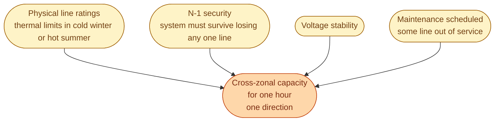
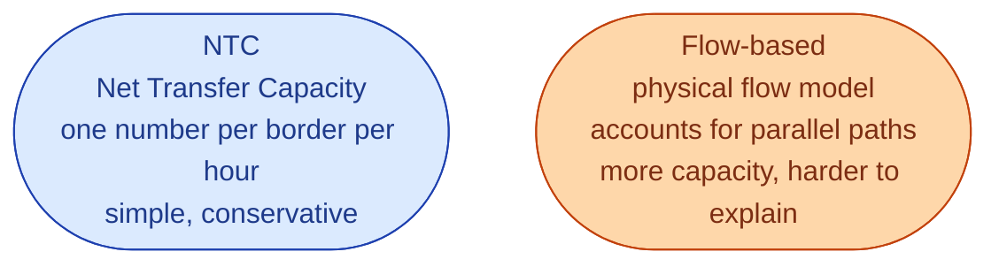

The wires between bidding zones have physical limits. They can carry only so much power before they overheat, or before the rest of the grid becomes unstable. The number that gets put into the day-ahead auction (*you may flow up to X MW from SE3 to SE4 in hour 14 tomorrow*) is called the **cross-zonal capacity**, or CZC.

That single number, set per hour per border per direction, is one of the most consequential inputs into the European auction.

## Who sets it

The TSO sets it. For Sweden, Svenska kraftnät publishes capacity values for every border (SE1-SE2, SE2-SE3, SE3-SE4, SE4-DK1, SE4-DE, and so on) for every hour of tomorrow. They send these values to Nord Pool and the algorithm uses them.

The TSO sets the value by looking at:

So CZC is *the available capacity after security checks*. Not the nameplate capacity of the line.

## Why this is the most-fought-over number

Two reasons.

**It directly decides who pays what.** When SE3-SE4 capacity is small, SE4 stays expensive while SE3 stays cheap. SE4 consumers pay more. When the same number is large, prices converge. Politicians, industry groups, and Ei all watch this carefully.

**It is allowed to be conservative.** The TSO can play it safe. The EU pushes back: a too-conservative number means consumers in expensive zones pay more than they need to. There is a long-running argument about how the number should be computed and how transparent the method should be.

## NTC vs flow-based

Two methods coexist in Europe.

**NTC** is the old method. It says: this border can carry X MW. Period. Easy to publish. Easy to explain. Conservative by design.

**Flow-based** is the new method, used in continental Europe since 2015. It models the actual physics: a transaction from Sweden to Germany also pushes flow on the Sweden-Denmark line, on the Denmark-Germany line, on the Norway-Sweden line, all at once. By modelling this properly, more total trade can be allowed without violating any line's security.

The Nordics are migrating from NTC to flow-based. It is one of the bigger changes happening in the Swedish market right now. It tends to make day-ahead prices more efficient (fewer hours of needless price splits), at the cost of being much harder to explain to anyone outside the industry.

## What you will see as a result

Three patterns.

**Hours where SE3 and SE4 prices are identical.** The wire was not the limit. Trade flowed freely. Prices converged.

**Hours where SE3 is at 400 SEK/MWh and SE4 is at 1,800.** The wire was at the limit. The auction split prices because it had to.

**Days where the cross-border cable to Germany is out for maintenance.** Sweden's coupling to the continental gas price weakens. Prices in SE3 and SE4 stay much closer to the rest of Sweden than usual.

## Where to look at real data

- **Svenska kraftnät** publishes the CZC values for every Swedish border, per hour, on their data portal.
- **ENTSO-E Transparency Platform** has the same data for every European border, plus the actual physical flows that resulted.

Comparing the *allocated* capacity to the *actually used* flow over a month tells you a lot about how the market is performing.

## Next

Sweden's auction is not just Swedish. It is part of a coupled European market. See [SDAC: pan-European price coupling]({{ '/energy/concepts/025-sdac/' | relative_url }}).
