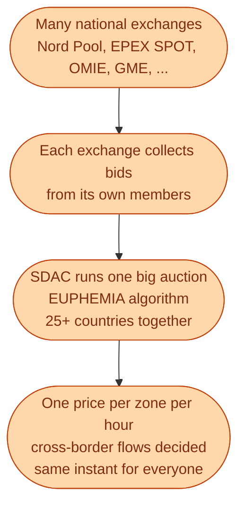
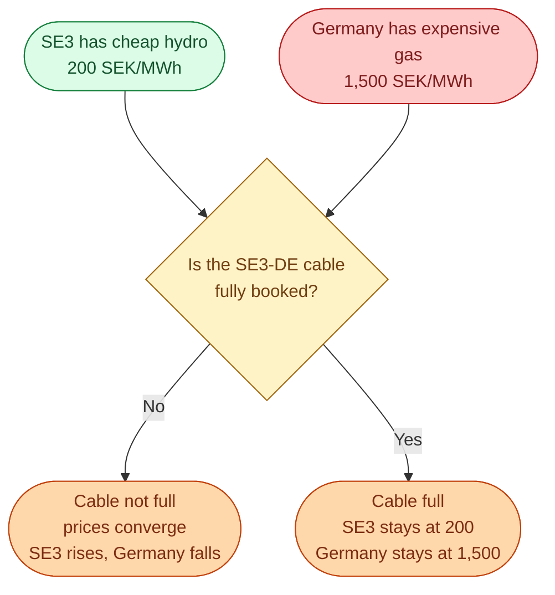

SDAC stands for **Single Day-Ahead Coupling**. It is the umbrella project that connects almost every electricity market in Europe into one synchronised auction. When the noon gate closes, all the coupled zones clear together in one optimisation. The result: one consistent set of prices across the whole continent, hour by hour.

This is why a winter morning in Berlin can spike the price in Malmö. Sweden is not running its market alone.

## What SDAC actually does

The exchanges still exist. Nord Pool still runs the Nordics. EPEX SPOT still runs Germany, France, the Netherlands. But the *auction clearing* happens once, at the same time, across all of them.

## What *coupled* really means

If two zones are coupled and the wire between them is **not full**, the auction will give them the same price. The cheap zone exports power. The expensive zone imports. The wire fills up only until prices equalise.

If the wire is **full**, the auction gives up on equalising. The cheap zone stays cheap. The expensive zone stays expensive. The wire ships its maximum.

This is the picture that explains 95 percent of cross-border price news. When you read *Swedish prices follow German gas crisis*, the cables were not full and SDAC equalised the prices. When you read *Swedish prices decouple from Europe*, the cables filled up and SDAC let them split.

## Why this was a big deal

Before SDAC, each market cleared on its own and traders had to *separately* trade cross-border capacity between zones. It was slow, less efficient, and prone to bottlenecks where a cheap zone could not export to a needy expensive zone.

After SDAC, the auction does both jobs at once: decides prices *and* decides flows. The result is that European consumers, on average, pay lower prices than they would have under the old system. The same single algorithm sees the whole continent and optimises across it.

## The catch: it cuts both ways

SDAC made the European market more efficient *on average*. But it also created the link that means a Berlin gas crisis becomes a Malmö bill problem. The same coupling that brings prices down in normal years makes them go up together in crisis years.

This is part of the reason 2022 was so painful in Sweden. The Russian gas shock spiked German prices. Cables to Sweden were not always full. SDAC coupled the prices. SE3 and SE4 followed Germany up.

## A small daily example

A normal Wednesday in May.

- SDAC clears at 12:00 CET.
- Most cross-border cables in Europe are not full.
- Most coupled zones clear at very similar prices, somewhere in the 400 to 700 SEK/MWh range.

A cold morning in November.

- SDAC clears at 12:00 CET.
- The SE3-DE cable is full, exporting from Sweden to Germany.
- Sweden is *exporting* its cheaper hydro to Germany.
- SE3 still feels the German price somewhat (depending on neighbour-zone dynamics).
- SE4 fully couples to Germany. SE4 hits 2,000 SEK/MWh.
- Meanwhile SE1 and SE2 stay at 300 because the wire south from SE2 to SE3 is full too.

That single hour produced four very different prices in one country, all out of the same SDAC auction.

## Next

Time to read a real Nord Pool day, hour by hour. See [Reading one Nord Pool day]({{ '/energy/concepts/026-reading-nord-pool-day/' | relative_url }}).
