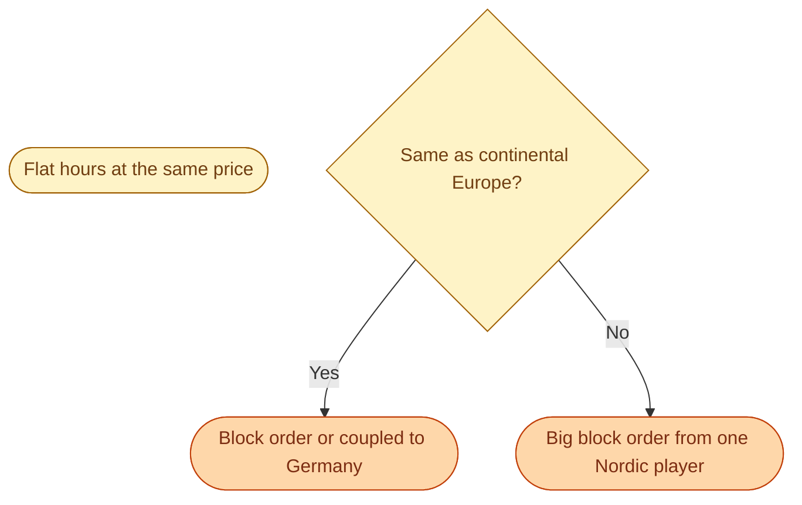
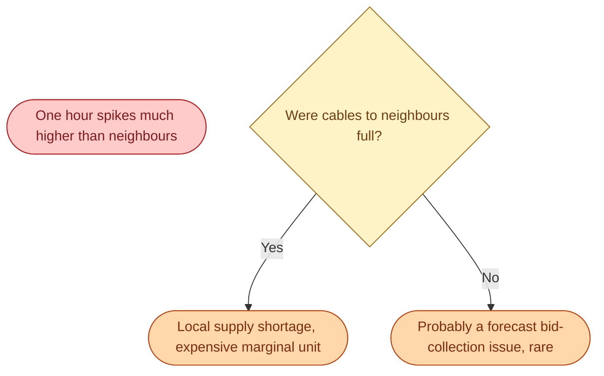
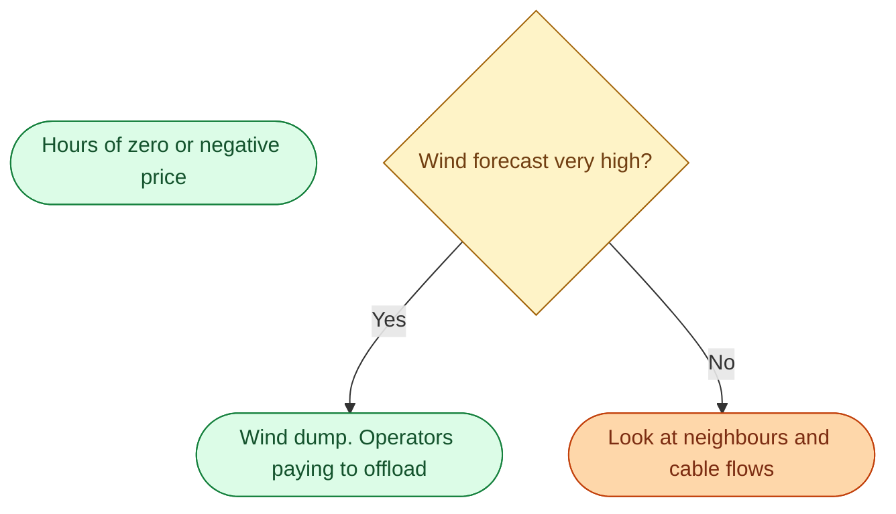

A Nord Pool price chart is 24 numbers, one per hour, for each zone. That tiny image carries more information than people realise. Reading it well is one of the most useful skills you can pick up in this market.

Here is a typical SE3 day in late autumn. We will walk it hour by hour.

## A typical autumn day in SE3

| Hour | Price (SEK/MWh) | What was happening |
| --- | --- | --- |
| 00 to 05 | 350 | Overnight low. Demand small. Hydro and nuclear easily cover it. |
| 06 | 700 | Morning ramp begins. Heating turns on. Hydro starts releasing more. |
| 07 to 09 | 1,100 | Peak morning. Cold dark mornings drive heat-pump demand. |
| 10 to 14 | 600 | Working hours. Demand steady but spread out. Solar pushes prices a little down on the continent. |
| 15 | 750 | Demand starts climbing again. People come home. |
| 17 to 19 | 1,400 | Evening peak. Cooking + lights + EVs. Highest hours of the day. |
| 20 to 22 | 800 | Coming down. People wind down. |
| 23 | 450 | Night returns. |

## What the shape tells you

The two-hump shape is the **morning peak** and the **evening peak**. Almost every Swedish weekday in winter looks like this. In summer the morning peak gets weaker because heating disappears. The evening peak stays.

The depth of the **midday dip** depends on solar. In Sweden, solar is small, so the dip is shallow. In Germany or Spain, solar pushes midday prices much lower, sometimes to zero.

The height of the **evening peak** depends on three things: how cold it is, how much wind is forecast, and how full the cables to neighbours are. A cold, calm, congested evening can push the 17-19 hours past 5,000 SEK/MWh.

## Spotting unusual hours

Practice this and you will get fast at it.

## A small useful habit

Open the Nord Pool day-ahead page at 12:45 every day. Look at the shape of tomorrow's curve. Compare SE3 and SE4. Compare to SE1 and SE2. Note the gap.

Within a few weeks of doing this every day, you start to *feel* the system. You will start predicting which days will spike, which will be flat, and roughly when. That feel is most of what makes a good trader, a good analyst, or a good engineer in this domain.

## Where else to look

- **Nord Pool day-ahead page** for the prices themselves.
- **Svenska kraftnät Kontrollrummet** for the current physical situation.
- **The weather forecast** for tomorrow's prices. Wind and temperature are 80 percent of the explanation.

A weather forecast in this industry is not a hobby. It is the most important input to your day.

## Next

The repeating patterns within a Nord Pool day. See [Common day-ahead patterns]({{ '/energy/concepts/027-common-patterns/' | relative_url }}).
