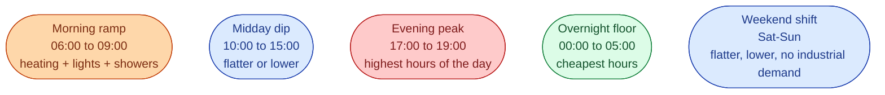

After a few months of watching Nord Pool prices, the same handful of shapes appear over and over. Knowing them by name speeds up your reading of any new day. Most days are a combination of two or three of them.

## The five patterns to recognise

Most weekdays in winter have all four of the daily patterns. Weekends mute the morning and evening peaks.

## Pattern 1: morning ramp

Demand climbs steeply between 06:00 and 09:00. Heating turns on, then showers, then offices.

What it tells you. The system needs to ramp up. Hydro releases more water. Imports increase if cables are not full. Prices rise.

What changes the shape. Cold mornings make it steeper. Dark mornings make it earlier and stronger. Weekends and holidays make it later and weaker.

## Pattern 2: midday dip

Between 10:00 and 15:00 the price usually flattens or dips a little. Industrial demand is steady. Solar (on the continent) adds supply.

What it tells you. The system is at steady demand. No surprises.

What changes the shape. Heavy solar across the continent can pull SE3 and SE4 down sharply (when cables couple us to them). In Sweden alone, solar is small, so the dip is shallow.

## Pattern 3: evening peak

Between 17:00 and 19:00, demand peaks for the day. Cooking, lights, EVs charging, evening heating.

What it tells you. This is where the most expensive hours live. Almost all daily price records happen here.

What changes the shape. Cold evenings push it higher. Strong wind pulls it down. Tight cables to neighbours leave SE4 exposed. The day after a holiday, the peak can move slightly.

## Pattern 4: overnight floor

Between 00:00 and 05:00 the day-ahead price is at its lowest. Demand is small. Hydro and nuclear easily cover it. Cheap hours for storage to charge.

What it tells you. The system has spare cheap supply. Anyone with a flexible load (heat pumps, EV chargers, batteries) wants to run now.

What changes the shape. Very strong overnight wind can push prices to zero or negative, especially in summer.

## Pattern 5: weekend shift

Saturdays and Sundays look like flatter versions of weekdays. The morning ramp comes later. The evening peak is smaller. Industrial demand is gone.

What it tells you. A different day shape, not just a lower one. You cannot model weekends as *Monday minus 20 percent*. The whole curve moves.

## Putting the patterns together

A typical SE3 winter weekday has all four daily patterns clearly. A summer weekday is muted. A Sunday is gentler still.

A useful exercise: pull two days of SE3 prices, one in January, one in July. Compare the four patterns. The January day will have a strong morning ramp, a steep evening peak, deep night floor, and a noticeable but small midday dip. The July day will have a gentle shape, weaker peaks, and prices a fraction of January's.

## What this means for an engineer crossing in

Two practical takeaways.

**Most of the value in trading comes from getting these patterns right** for *unusual* days. Trading desks build their alpha on identifying when tomorrow will *not* be a normal day. Cold front coming in? Big maintenance outage? Public holiday on a Tuesday? Each of these breaks the patterns slightly.

**Anything you build that uses Nord Pool prices** (a forecasting model, a battery dispatch algorithm, a customer-facing tool) needs to know these patterns. Otherwise it will recommend silly things, like charging a battery in the morning peak.

## Next

Day-ahead is half the story. The other half is the market that runs after it. See [Why intraday exists]({{ '/energy/concepts/028-why-intraday/' | relative_url }}).
