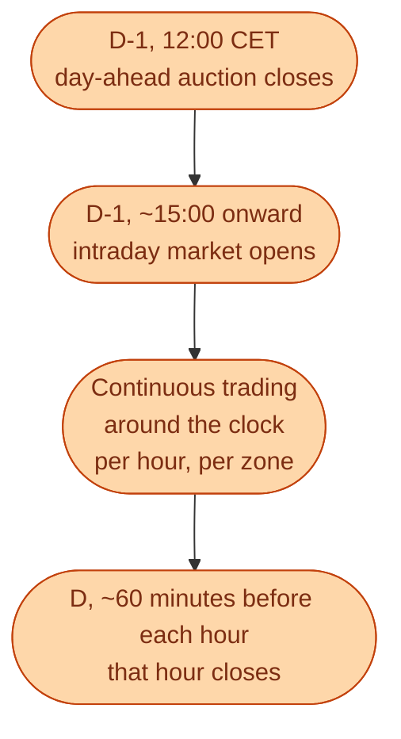
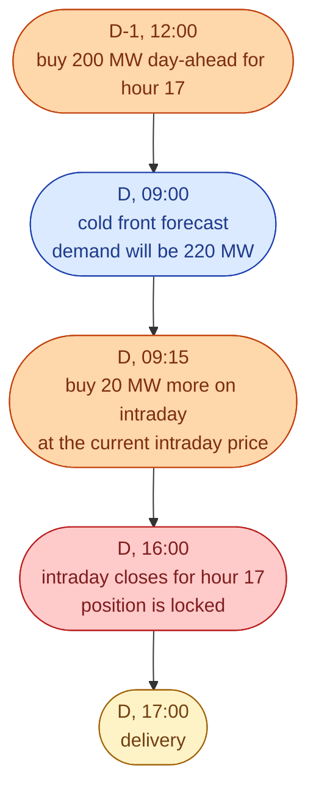

The day-ahead auction closes at 12:00 CET on D-1. From that moment until the actual delivery hour, *new information arrives*. The weather forecast updates. A generator unexpectedly trips. A factory cancels a shift. None of it was known when the day-ahead bids were submitted.

Without a second market, every party would just have to live with the wrong plan and pay the imbalance fee later. With a second market, they can adjust. That second market is **intraday**.

## What intraday actually is

Unlike day-ahead, which is an **auction** (one clearing price per hour), intraday is **continuous**. Bids and offers are matched the moment they are compatible, like a stock exchange. Each match has its own price. Two trades for the same hour can clear at very different prices an hour apart.

## Why continuous, not auction

Information arrives **continuously**. A wind forecast update at 09:00 says one thing. At 15:00 it says another. By 23:00, another. Traders want to act on each update as it arrives, not wait for the next auction.

Continuous trading lets them. The price you pay reflects the information *at the moment you traded*.

## A small example

A retailer in SE3 bought 200 MW on day-ahead for tomorrow's hour 17. Their forecast at noon said this would match their customers' demand.

The 20 MW the retailer bought at 09:15 protected them from a much larger imbalance bill at settlement. The intraday market is the layer where this protection happens.

## Who actually trades intraday

A different mix from day-ahead.

| Player | Why they care about intraday |
| --- | --- |
| Wind and solar operators | Their forecasts change every few hours. Day-ahead alone misses too much. |
| Retailers | Real-time demand forecasts shift. Heat waves, cold fronts, big events. |
| Batteries and storage | Day-ahead picks the broad shape. Intraday picks the exact best hours. |
| Industrial loads | Cancelled shifts, broken equipment, surprise orders. |
| Trading houses | Pure arbitrage between zones, hours, and platforms. |

A purely nuclear plant trades little on intraday. A purely hydro plant trades some. Anything weather-driven trades a lot.

## What the intraday market is *not*

Two common misconceptions.

**It is not a replacement for day-ahead.** Most volume still clears at the day-ahead auction. Intraday is the adjustment layer. The bigger half of the work is still done at noon on D-1.

**It is not where balancing happens.** Once a delivery hour starts, intraday is closed for that hour. Anything not settled by the gate becomes the TSO's problem and gets handled by reserves. Intraday is *before* the hour, not *during* it.

## What this means for an engineer crossing in

If you are joining a trading desk in 2026, intraday is the part of the day where the most algorithmic work is happening. The platform is fast, continuous, and increasingly automated. Most of the manual trading has moved to algorithms.

The skills that matter here.

- Real-time data pipelines (prices, flows, weather, ENTSO-E feeds).
- Forecasting models that update every 15 minutes.
- Optimisation that decides *when* to trade and *how much*, given evolving information.
- Risk monitoring that catches a bad model before it blows up the book.

This is one of the most software-engineering-adjacent parts of the energy industry. People with API and ML experience can contribute fast.

## Next

The technical platform behind intraday is called XBID. See [XBID: continuous trading across borders]({{ '/energy/concepts/029-xbid/' | relative_url }}).
