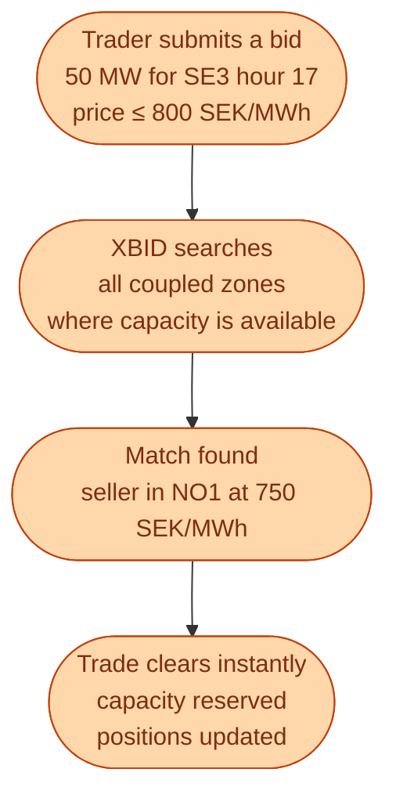

XBID stands for **Cross-Border Intraday**. It is the central matching engine that powers continuous intraday trading across most of Europe. When a trader in Stockholm submits an offer for an hour in SE3 tomorrow, XBID looks for matching bids from any coupled zone where the cross-border capacity is available, and matches them as soon as it can.

The user-facing platforms vary. Nord Pool runs the Nordic and Baltic front-end. EPEX SPOT runs the continental one. But the matching engine behind them all is XBID.

## What XBID actually does

Two things to notice. First, the trade can happen across a border in real time. Second, it consumes part of the cross-border capacity left over after the day-ahead auction. There is no second auction for capacity. It is allocated first-come, first-served.

## The intraday order book

For each hour and each zone, XBID keeps an order book. A buy list and a sell list, sorted by price. The moment a buy bid is above (or equal to) the lowest sell offer, they match.

| Side | Quantity | Price | Zone |
| --- | --- | --- | --- |
| Sell | 30 MW | 720 SEK/MWh | SE3 hour 17 |
| Sell | 50 MW | 750 SEK/MWh | SE3 hour 17 |
| Sell | 20 MW | 800 SEK/MWh | SE3 hour 17 |
| Buy | 40 MW | 820 SEK/MWh | SE3 hour 17 |
| Buy | 30 MW | 700 SEK/MWh | SE3 hour 17 |

The 820 buy matches the 720 sell first, then the 750 sell for the rest. Both trades clear immediately, at the **sell-side price**. The 700 buy waits in the book.

## Cross-border in practice

A bid in SE3 can match a sell in NO1 if there is capacity on the SE3-NO1 cable for that hour. XBID checks this automatically. The trader does not need to know about it.

The system reserves the used capacity, and removes that much from the pool available for the next trade on the same border for the same hour. Once a border is full, no more cross-zonal matching can happen for that hour.

This is why some intraday hours see prices stay split across zones the same way day-ahead does. The capacity left after day-ahead was not enough to equalise.

## What changed when XBID launched (2018)

Before XBID, intraday was zone by zone, slower, and required a separate cross-border capacity nomination. Trades that should have happened did not, because the friction was too high.

After XBID, a trader sees one big cross-European order book filtered by zone, and trades match in milliseconds. Volumes on the Nordic intraday market roughly **doubled** in the years after XBID went live.

## Gate closure times

A subtle but important detail: each zone has its own intraday gate closure. In the Nordics it is typically **60 minutes before the start of the delivery hour**. In some continental zones it is 30 minutes or even 15 minutes. After gate closure for a given hour in a given zone, that hour is closed in that zone.

This matters when planning your trading strategy. If you trade across both SE3 and DE, you have to know that the German gate may close later than the Swedish one for the same hour.

## What this means for an engineer crossing in

If you are building anything that touches intraday, two patterns will dominate your time.

**API integration.** XBID exposes a real-time trading API. Your software has to publish orders, receive matches, and react fast. The platforms are reliable but the protocols are specific and worth learning before your first trade.

**Latency optimisation.** Not high-frequency trading like equities, but milliseconds still matter. A trade that clears 100 ms after a forecast update is more valuable than one that clears 5 minutes after.

The infrastructure is more financial-trading than industrial. Anyone with a fintech background will recognise the shape immediately.

## Next

A walked example of how intraday actually changes a wind portfolio's day. See [Intraday for a wind portfolio]({{ '/energy/concepts/030-intraday-wind-example/' | relative_url }}).
