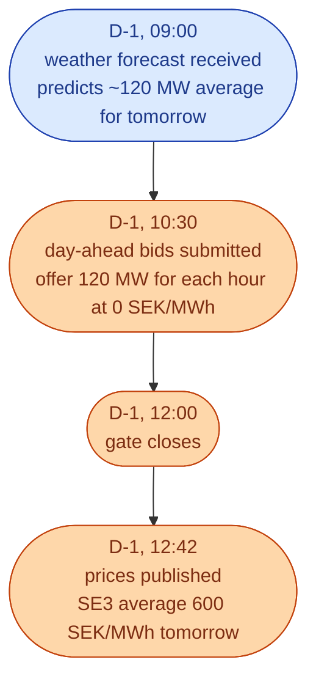
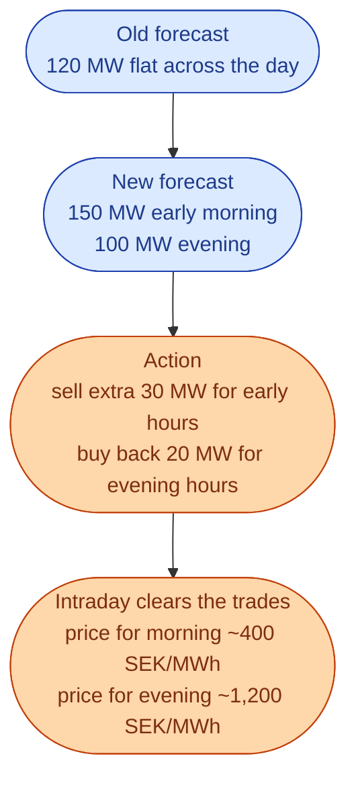
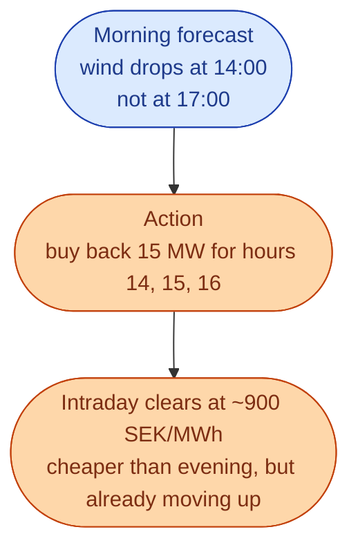
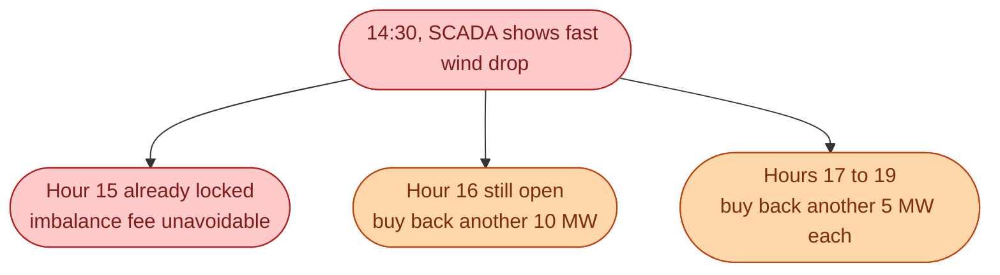

A 200 MW wind aggregator in SE3. Wind farms spread across the zone. The team's job is to maximise the value of every MWh produced while keeping imbalance fees small.

Walking through one day shows what intraday actually does.

## The starting position

At this point the day-ahead position is set. **They have committed to deliver 120 MW for each hour of tomorrow.** Their next job is to adjust this commitment as the forecast changes.

## Forecast update one: late afternoon

At 17:00 on D-1, a new weather forecast arrives. It shows stronger wind in the early morning and weaker wind in the evening.

The trader sells the extra 30 MW for hours 02 to 06 (when intraday is cheap because demand is low). They buy back 20 MW for hours 17 to 19 (when intraday is expensive because demand is high).

Result. The portfolio now matches its new forecast more closely, *and* the trader captured a 800 SEK/MWh spread on the buy-back hours.

## Forecast update two: morning of delivery

At 08:00 on D, the operational forecast shows another shift. Wind dies down faster than expected in the afternoon.

The trader catches it early. Buying back at 900 SEK/MWh is much better than paying an imbalance fee at evening peak prices of 1,500 SEK/MWh.

## Forecast update three: real-time

At 14:30, real-time SCADA data shows wind dropping even faster than the morning forecast. The 14:00 hour is already running. The 15:00 gate closes at 14:00, so it is already closed. The trader can only adjust hours 16 onward.

Some imbalance is now unavoidable. The trader has reduced it as much as the gates allow.

## End of day result

At 23:00, the last hour clears. Tomorrow the team will look at:

- **Day-ahead revenue.** What they earned from the original 120 MW sales.
- **Intraday adjustments.** Net buy-back cost for the hours they adjusted.
- **Imbalance fee.** The residual gap between the final plan and the actual production.

A well-traded day might look like this:

| Component | SEK |
| --- | --- |
| Day-ahead revenue | +1.4 million |
| Intraday buy-backs | -180,000 |
| Intraday extra sells | +90,000 |
| Imbalance fee | -45,000 |
| **Net** | **+1.27 million** |

A badly-traded day with the same wind production might look like this:

| Component | SEK |
| --- | --- |
| Day-ahead revenue | +1.4 million |
| Intraday buy-backs | 0 (did not catch the forecast updates) |
| Intraday extra sells | 0 |
| Imbalance fee | -300,000 |
| **Net** | **+1.1 million** |

Same wind. Same plant. Different team. **170,000 SEK** of difference, just in one day.

## What this means for an engineer crossing in

This is where automation pays off. A team that can catch every forecast update fast and execute trades in seconds beats one that catches the same updates an hour late.

The big algorithmic projects at Swedish wind traders today are exactly this: real-time forecast ingestion, automated intraday execution, and risk monitoring that catches mistakes before they compound.

## Next

The European intraday platform that goes beyond XBID. See [SIDC: the European intraday platform]({{ '/energy/concepts/031-sidc/' | relative_url }}).
