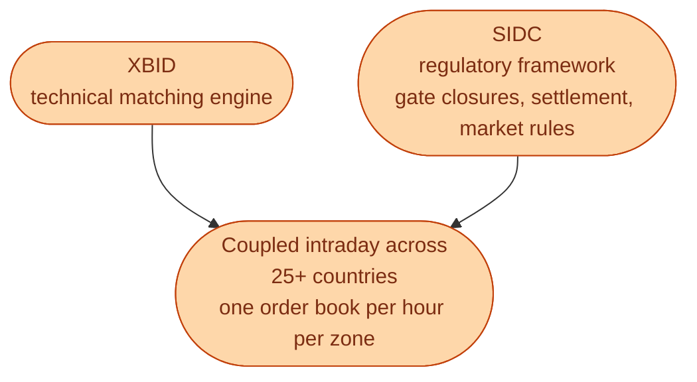
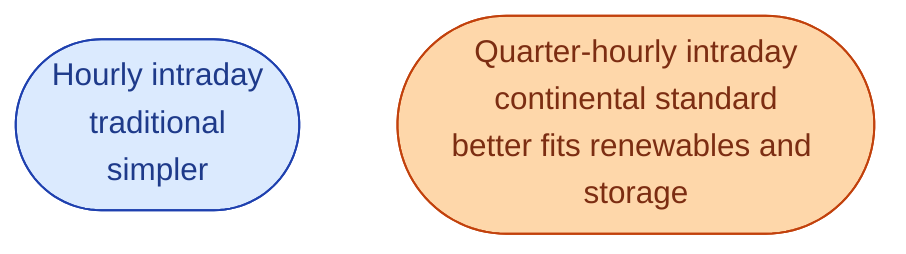

SIDC stands for **Single Intraday Coupling**. It is the EU-level project that coordinates intraday trading across most of Europe. XBID is the technical matching engine. SIDC is the regulatory and operational framework around it: the rules, the gate-closure harmonisation, the coupling agreements between TSOs.

If SDAC is the day-ahead version of *one Europe-wide market*, SIDC is the intraday version of the same idea.

## What SIDC actually delivers

Two practical effects.

**Cross-border continuous trading.** A trader anywhere in the coupled area can find a counterparty anywhere in the coupled area, as long as cross-border capacity is left over from day-ahead.

**Standardised gates.** Most coupled zones have moved toward gate closures 60 minutes before delivery, with some at 30 or 15 minutes for specific borders. This was a long process. Many zones started with their own clock.

## Why this matters more for some trades

A retailer in SE3 selling 10 MW for hour 17 may find a buyer in DE, AT, or NL through SIDC. Without SIDC, they would only see SE3 counterparties. With SIDC, they see the whole pool, *subject to cross-border capacity being available*.

For wind and solar traders, this is a real revenue lever. Their adjustments need to match whoever has the matching need on the other side, and that party might be in another country.

## Three-quarter-hour and quarter-hour products

A subtle but important detail. Many continental zones already trade in **15-minute** intraday products, not just hourly. Germany has been doing this for years. The Nordics historically used hourly only.

This is changing. The Nordics are moving toward shorter intraday delivery periods (often 15-minute) over the coming years. The rationale: shorter products let renewables traders match real-time variability better, and let batteries shift more precisely.

If you are joining the Swedish market in 2026 or later, this transition will affect your work. Forecasting models, dispatch algorithms, and risk models all have to handle finer time resolution.

## SIDC versus auctions

A growing question in the market: should intraday stay purely continuous, or should there be **intraday auctions** too?

A few continental zones already run intraday auctions on top of continuous trading: short auctions at certain times (often 15:00 D-1, 22:00 D-1, 10:00 D) that aggregate liquidity into one clearing event. The idea is that some hours benefit from concentrated liquidity rather than scattered continuous matches.

This is an ongoing policy discussion. The Nordics may or may not adopt this. For now, intraday in Sweden is fully continuous.

## What this means for an engineer crossing in

Three things to keep in mind.

**Build for multi-resolution products.** Hourly today, quarter-hourly tomorrow. Your data models, dashboards, and trading algorithms should handle both without rework.

**Watch the gate closure rules.** They are not the same in every zone. They are not always the same forever. Stay current.

**Read the joint TSO publications.** ENTSO-E publishes SIDC roadmap updates regularly. The next changes are usually flagged 12 to 18 months in advance.

## Next

That finishes the wholesale market. Now the operational layer: balancing. The reserves you have heard about, one at a time. See [FCR-N: holding the line]({{ '/energy/concepts/032-fcr-n/' | relative_url }}).
