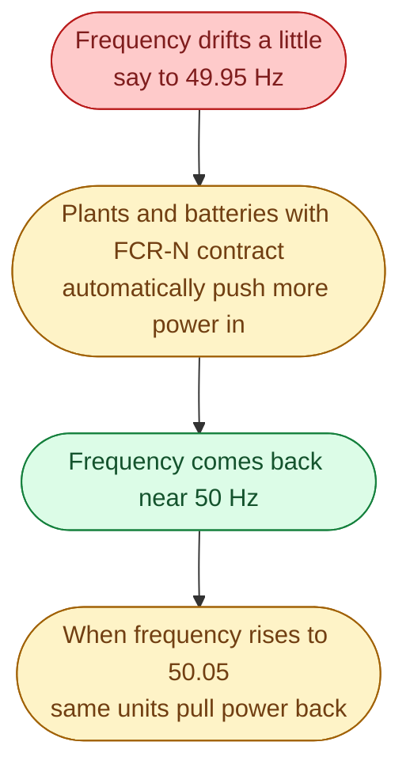

FCR stands for **Frequency Containment Reserve**. The -N suffix means *Normal*. This is the reserve that fixes small frequency wobbles every minute of every day. While you are reading this sentence, somewhere on the Nordic grid, FCR-N is being activated.

It is the smallest reserve, the fastest, and the one that runs most often. You can think of it as the trim adjustment on a sailboat. Not the big tactical move, just the constant fine adjustment to keep the boat going straight.

## What FCR-N does

A few key features.

**Symmetric.** A unit with an FCR-N contract must be able to push *more* power in when frequency falls **and** pull power back when frequency rises. They sell both directions.

**Automatic.** No operator decision. The unit responds to its own measurement of frequency, through a control law called **droop control**. As frequency dips from 50.00 toward 49.90, the unit gradually raises its output, proportional to the dip.

**Always active.** A unit with an FCR-N contract is constantly responding. Not just during big events. Even on a calm Wednesday afternoon, frequency wobbles between 49.95 and 50.05 hundreds of times an hour, and FCR-N is gently tugging it back each time.

## How big is FCR-N

For the whole Nordic synchronous area, the FCR-N requirement is around **600 MW**. Sweden contributes its share, currently roughly **190 MW**. The same number for Norway, Finland, and eastern Denmark.

That is the amount that has to be **standing by**, every hour, *to be activated automatically*. It is not 190 MW being produced. It is 190 MW of *headroom*, ready to move when frequency wobbles.

## How it gets bought

Svenska kraftnät runs an FCR-N market. Plants, batteries, and aggregators submit bids: *I will provide X MW of FCR-N for hour Y at price Z SEK/MW per hour*. Svk takes the cheapest bids until they have their 190 MW. Everyone who wins gets paid the marginal bid price.

Markets are now mostly **daily auctions** held on D-1 alongside the day-ahead. Some have moved toward hourly auctions on the same day. The trend is faster and more granular.

| Field | Typical value |
| --- | --- |
| Volume needed | ~190 MW (Sweden's share) |
| Auction frequency | Daily on D-1 |
| Price paid | Marginal SEK/MW per hour |
| Activation | Automatic, droop-controlled |

## Who provides FCR-N

In Sweden today, the main providers are:

- **Hydro plants.** They can adjust output very quickly within their operating range. Most FCR-N still comes from hydro.
- **Batteries.** Lithium batteries respond in milliseconds. They are well suited for FCR-N, although the symmetric requirement means they must keep room for both directions.
- **Some industrial loads** via aggregators.

Nuclear contributes less because its output is harder to modulate. Wind and solar contribute less because they cannot easily push *more* output unless they were already curtailed.

## What this means for an engineer crossing in

FCR-N is one of the most stable revenue streams in the Swedish reserve markets. Battery investors have built businesses on it. The capacity payments are relatively predictable.

If you build dispatch software for a battery, FCR-N is often the first product you support. The logic is straightforward (respond to frequency with a fixed droop), but the operational requirements (always available, always ready, fast telemetry to Svk) are strict.

## Next

When the frequency falls hard, the next layer is FCR-D. See [FCR-D up and down]({{ '/energy/concepts/033-fcr-d/' | relative_url }}).
