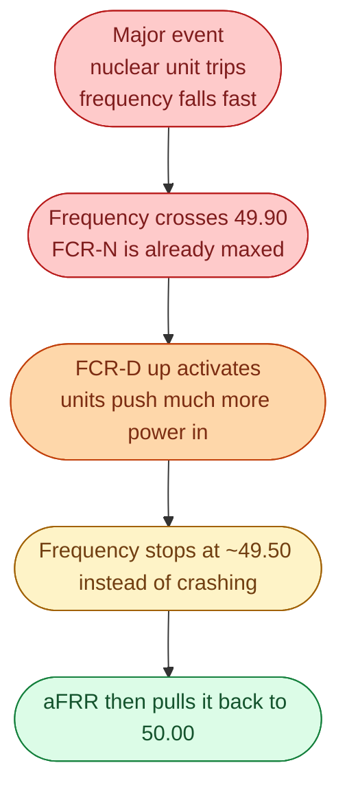
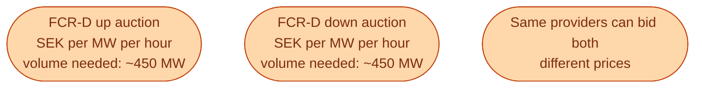
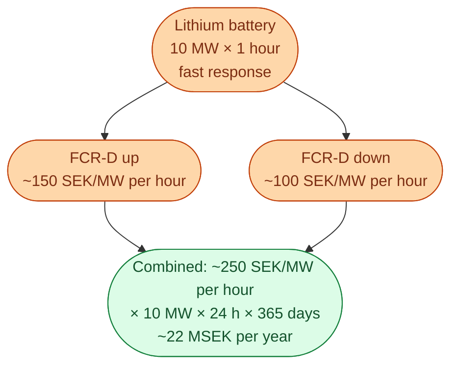

FCR-D stands for **Frequency Containment Reserve, Disturbance**. The -D suffix means *Disturbance*: a serious event, like a nuclear unit tripping offline or a sudden loss of a major interconnector. FCR-N handles the small everyday wobbles. FCR-D handles the alarming ones.

The reserve is **asymmetric**. There is FCR-D **up** (more power into the grid, for when frequency falls hard) and FCR-D **down** (less power, for when frequency rises hard). Plants and batteries can sell either, or both as separate products.

## What FCR-D actually does

FCR-D **stops** a serious frequency excursion. It does not bring it back to 50.00. That is aFRR's job. FCR-D's only mission is to **catch the fall** (or the rise) before it becomes dangerous.

## How big is FCR-D

The Nordic synchronous area needs around **1,400 MW** of FCR-D up and similar of FCR-D down. Sweden's share is around **450 MW** of each. Much bigger than FCR-N because the events are much bigger.

The volume is sized so the system can survive losing the **largest single unit** on the grid (often a nuclear unit or a major HVDC interconnector). If something that big trips, FCR-D has to be big enough to catch it.

## How it gets bought

Like FCR-N, Svenska kraftnät runs auctions for FCR-D. Daily on D-1 is the main format. Each product (up and down) is auctioned separately.

A battery can sell FCR-D up at 100 SEK/MW per hour and FCR-D down at 60 SEK/MW per hour, depending on what the market is paying. Different products. Different prices.

## Why FCR-D is the battery market

This is the part that matters for the Swedish energy transition.

A battery's biggest competitive advantage over hydro is **response speed**. Hydro can respond in tens of seconds. A battery responds in milliseconds. For FCR-D, where the goal is to catch a fast fall, the millisecond advantage is real.

So Swedish grid-scale battery projects have been built almost exclusively for FCR-D. A 10 MW lithium battery sized for 1 hour of energy is the canonical product. It bids into FCR-D up and FCR-D down, often takes both, and earns a capacity payment for the whole month.

Numbers are illustrative, prices change. But this is roughly why the first wave of Swedish battery projects pencilled out at all. FCR-D was the only revenue stream big enough to make the numbers work.

## The qualification process

To bid into FCR-D, an asset has to be **qualified** by Svenska kraftnät. The process tests that the asset can respond fast enough, that its telemetry is reliable, and that it can sustain the response for the required time (usually 5 to 15 minutes for FCR-D up, longer for FCR-D down).

This is not a paperwork process. It is real testing, often over weeks. Battery operators have to schedule activation tests, prove their controls work, and pass before they can earn revenue. Plan around it when building.

## What this means for an engineer crossing in

If you join a battery operator, an aggregator, or any company touching FCR-D dispatch, you will learn this market deeply in your first month. The technical requirements are exacting. The revenue is meaningful. The IT work (real-time telemetry, control loops, qualification testing, settlement reconciliation) is real engineering.

This is one of the few corners of the energy industry where building good software is a direct, measurable revenue lever.

## Next

After FCR-D contains the event, aFRR restores the frequency. See [aFRR: the automatic restoration loop]({{ '/energy/concepts/034-afrr/' | relative_url }}).
