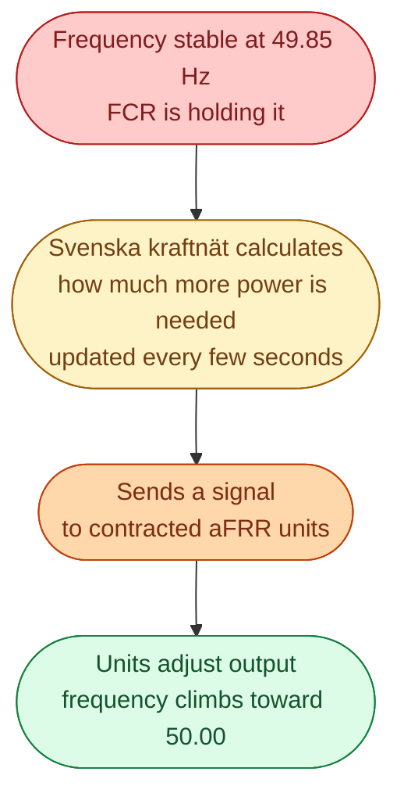
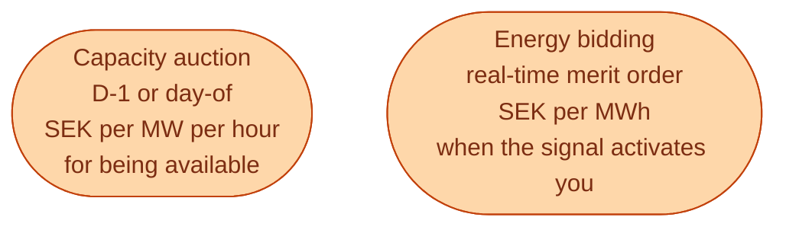

aFRR stands for **automatic Frequency Restoration Reserve**. After FCR has stopped the frequency from falling further, aFRR is the reserve that *pulls it back to 50.00*. It operates on a slower timescale (seconds to minutes), and unlike FCR (which each unit decides for itself based on local frequency), aFRR is dispatched from one central place: Svenska kraftnät's control room.

If FCR is a reflex, aFRR is a coordinated response.

## What aFRR actually does

The signal is called the **AGC signal** (Automatic Generation Control). It is updated every 2 to 10 seconds. Each contracted unit receives its share of the signal in real time and adjusts its output accordingly.

aFRR is **automatic** in the sense that no human operator picks individual unit responses. The signal handles that. But it is **centralised** in the sense that the signal comes from one TSO computer, not from each unit's local frequency measurement.

## How big and how fast

| Property | Typical value |
| --- | --- |
| Sweden's share | ~150 MW up and down (varies by hour) |
| Time to respond | Within 5 minutes to reach full output |
| Signal update | Every 2 to 10 seconds |
| Activation type | Centralised AGC signal |
| Direction | Up and down, often as separate products |

The volume needed varies by hour, depending on the size of the largest credible imbalance, expected forecast errors, and the FCR reserves already procured.

## How it gets bought

aFRR is procured both ahead of time (capacity) and at activation (energy).

This two-part payment is normal for the deeper reserves. The capacity payment compensates the asset for being ready. The activation payment compensates for the energy it actually delivers.

A hydro plant contracted for 20 MW of aFRR up gets the capacity fee every hour, whether it is activated or not. When the AGC signal asks it to deliver 5 MWh of upward energy in a given hour, it also gets the activation payment for that 5 MWh.

## Who provides aFRR

aFRR favours plants that can respond reasonably fast but for longer durations than a battery can typically sustain.

- **Hydro.** The dominant Swedish provider. Reservoir plants can sustain higher output for an hour or more.
- **CHP and bioenergy.** Some providers in Sweden.
- **Large batteries (2 to 4 hour duration).** Increasingly competing, as the European market design favours them.
- **Industrial demand response via aggregators.** Some pilots, growing.

A 1-hour FCR-D battery is too small for aFRR. A 4-hour battery starts to make sense, especially as the European aFRR market couples (see below).

## The European coupling: PICASSO

Like day-ahead has SDAC and intraday has SIDC, aFRR has its own European coupling project: **PICASSO** (Platform for the International Coordination of Automated Frequency Restoration and Stable System Operation).

PICASSO lets aFRR bids in one country be activated from a TSO in another, as long as cross-border capacity allows. The Nordics are joining PICASSO in phases. This will widen the pool of aFRR providers and change the economics for Swedish suppliers.

## What this means for an engineer crossing in

aFRR is more technically demanding than FCR. The asset has to listen for a real-time signal, sustain a multi-minute response, and report telemetry continuously back to Svk. Building dispatch software for aFRR is a step up in complexity from FCR-D.

The reward is access to a larger market, increasingly Europe-wide. As PICASSO rolls out, aFRR will be one of the most interesting growth areas in the Nordic reserve markets.

## Next

aFRR runs for a few minutes. Then mFRR takes over for the longer haul. See [mFRR: the manual reserve]({{ '/energy/concepts/035-mfrr/' | relative_url }}).
