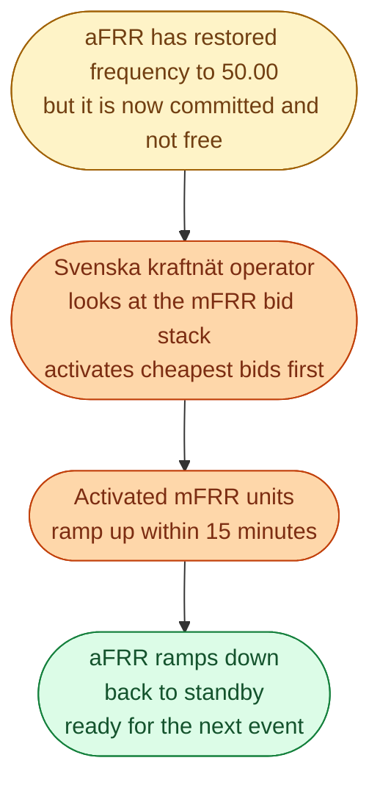
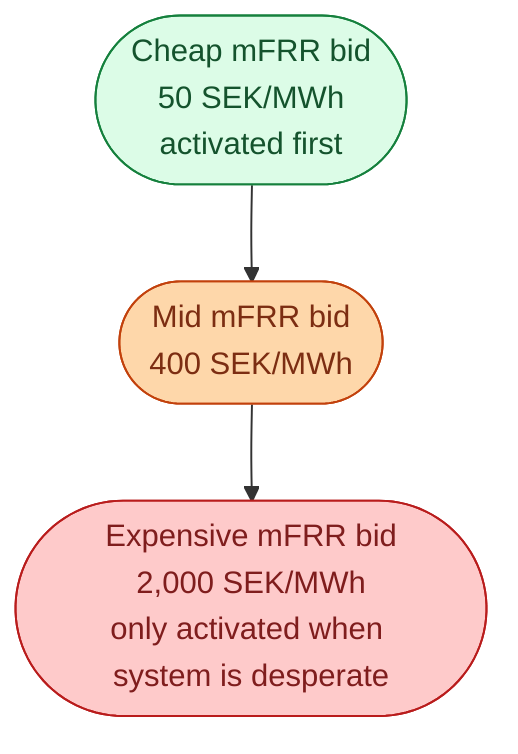

mFRR stands for **manual Frequency Restoration Reserve**. After FCR caught the event and aFRR pulled the frequency back, mFRR is the reserve that **takes over the load** so aFRR is free again for the next event. It is the slowest of the four reserves, and the only one where a human operator at Svenska kraftnät makes the call.

Think of it as the fire engine arriving after the kitchen extinguisher already put the fire out. The job now is the deeper cleanup.

## What mFRR actually does

mFRR has a 15-minute activation time. The unit does not need to react in seconds. It needs to be running and at its bid power within 15 minutes of the operator's command.

## The merit order for mFRR

Unlike FCR and aFRR, mFRR uses a pure **merit order activation**. Bids are stacked from cheapest to most expensive. When Svk needs upward mFRR, they activate the cheapest available bid first. When they need more, they go up the stack.

The price of the marginal activated mFRR bid sets the **balancing energy price** for that activation. This price feeds into the imbalance settlement.

## Capacity and energy payments

Some mFRR is procured ahead of time, with a capacity payment for being ready. Some is purely energy: a unit submits a bid for the next 4-hour block, and only gets paid if it is activated.

| Type | What you get | What you owe |
| --- | --- | --- |
| Procured mFRR capacity | Capacity fee plus activation fee | Must respond if called |
| Energy-only mFRR | Activation fee if called, nothing otherwise | Must respond if called |

Most Swedish mFRR today is **energy-only**. Capacity-procured mFRR is more common in continental Europe.

## Who provides mFRR

The widest pool of providers of any reserve.

- **Hydro plants.** The bulk of Swedish mFRR. Reservoirs can sustain output for many hours.
- **CHP plants.** Especially during the heating season when they are flexible.
- **Industrial demand response.** Cold stores, aluminium smelters, server farms, all via aggregators.
- **Some HVDC interconnectors.** Yes, you can bid an interconnector into mFRR.
- **Larger batteries.** Increasingly, as battery sizes grow.

mFRR is the most diverse reserve market by participant type.

## The European coupling: MARI

Like aFRR has PICASSO, mFRR has its own European coupling project: **MARI** (Manually Activated Reserves Initiative). The same idea: bids in one country can be activated by a TSO in another, if cross-border capacity allows.

Sweden is partially in MARI today. Full rollout is in progress. The expected effect is more liquidity, more competition, and prices closer to the European average over time.

## How mFRR ties to imbalance settlement

mFRR activation prices feed directly into the **imbalance price** for the hour. The single-price imbalance model in the Nordics uses the price of the marginal mFRR activation, with some adjustments, as the imbalance price.

So a BRP that was short during an hour where mFRR was activated upward at 2,000 SEK/MWh will pay around that for their imbalance. A BRP that was long in the same hour might *receive* the same number, depending on direction.

This is why mFRR matters even to people who never bid into it. The price of mFRR is the price of being wrong.

## What this means for an engineer crossing in

mFRR is where flexibility meets economics. The decisions about when to bid, at what price, with what duration, are real optimisation problems for the asset owner. The price spreads can be significant, and the data is reasonably available (Svk publishes mFRR activation history).

A useful side project: pull a month of Swedish mFRR activation prices from Svk's open data, plot them against day-ahead prices for the same hours, and see where the big mismatches are. You will quickly see the patterns that traders trade on.

## Next

The reserves we have just covered determine the price of being wrong. See [Imbalance settlement: how BRPs pay or get paid]({{ '/energy/concepts/036-imbalance-settlement/' | relative_url }}).
