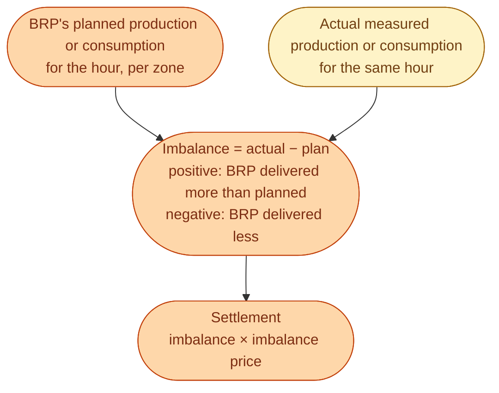
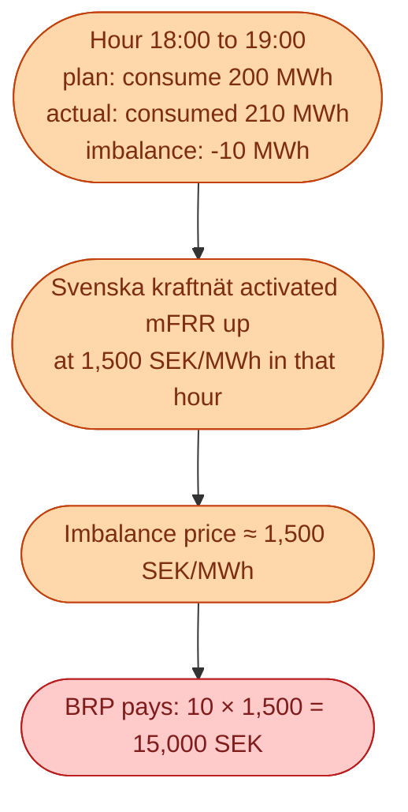
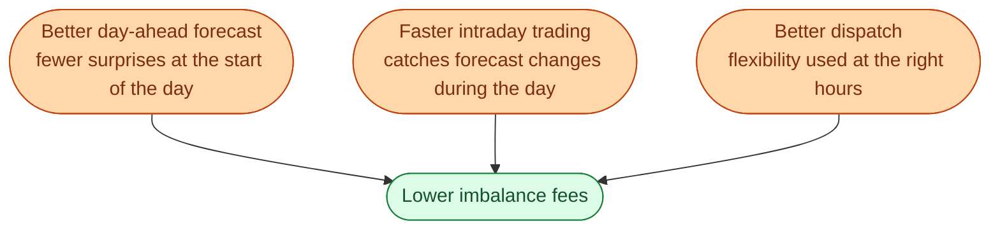

After every delivery hour ends, the TSO does the math. For each BRP and each hour, it measures *the plan* (what the BRP submitted) and *the actual* (what happened on the wires). The gap is the BRP's **imbalance**. The BRP gets billed (or paid) at the **imbalance price** for that hour.

This single number is the discipline that holds the whole market together. Every forecasting effort, every intraday trade, every dispatch decision a BRP makes is trying to keep this bill small.

## The math, simply

The imbalance price comes from the actual mFRR activations that happened during that hour. If Svenska kraftnät had to activate upward mFRR at 2,000 SEK/MWh, the imbalance price is around that. If they had to activate downward mFRR at -100 SEK/MWh, the imbalance price is around that.

## A small worked example

A retailer is a BRP for a 200 MW portfolio in SE3.

The BRP was short 10 MWh in a tight hour. They pay 15,000 SEK. If the same 10 MWh shortfall happened in a cheap overnight hour where the imbalance price was 200, they would have paid only 2,000 SEK. **The cost of being wrong depends on when you are wrong.**

## Why this matters more than people think

A BRP that is wrong by 1 percent across the year, in a normal year, might pay a few million SEK in imbalance fees. The same BRP, in a volatile year (2022 saw this), could pay ten times that.

Every effort to reduce imbalance has a direct, visible payoff. This is why forecasting, intraday trading, and dispatch automation are not optional in a modern energy company. They are the single biggest cost lever.

Every one of these projects is justified by the imbalance savings it generates.

## How the bill arrives

The flow is roughly:

1. **Delivery hour ends.** Meter data flows from DSOs through **Elhubben** to the TSO.
2. **Data validation.** Svk checks the meter data and the BRP-reported balance plans.
3. **Calculation.** For each BRP, sum production and consumption per hour, per zone. Compute imbalance.
4. **Pricing.** Apply the imbalance price for that hour.
5. **Invoicing.** Usually within 10 to 14 days after delivery.

For a BRP with a few hundred customers, this is a small number of rows per day. For a BRP with 100,000 customers, it is millions of rows per month and a real data engineering challenge.

## What this means for an engineer crossing in

If you are working at a BRP or for a BRP, your KPI is often *imbalance fees as a percentage of revenue*. A target of under 0.5 percent is normal. Anything above 1 percent is a problem worth investigating.

Three useful skills.

- Reading and reconciling meter data from Elhubben.
- Building intraday execution tools that act on forecast errors fast.
- Modelling the imbalance price distribution and forecasting when it will be expensive.

The first one is the most underrated. Meter data quality issues cost more BRPs more money than bad forecasts do.

## Next

Why the Nordics use a single imbalance price and what it means. See [Single-price imbalance: the European model]({{ '/energy/concepts/037-single-price-imbalance/' | relative_url }}).
