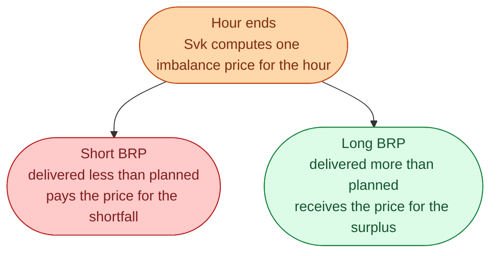
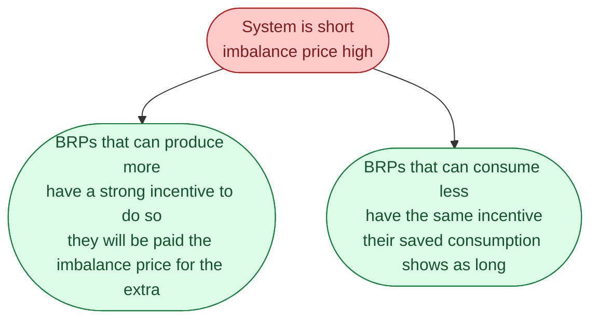

The Nordic and European model for imbalance settlement is the **single-price** model. Whether a BRP was *long* (delivered more than planned) or *short* (delivered less than planned), they all face the same imbalance price for that hour.

This sounds technical and it is. But it shapes the trading behaviour of every BRP, and once you understand it, you can read why traders react to certain hours the way they do.

## How single price works

The price is the same number for both. If it is 1,500 SEK/MWh upward, the short BRP pays 1,500 and the long BRP receives 1,500.

## Compare to two-price (old system)

Before the single-price model, the Nordics used a **two-price** system. Long BRPs got a worse deal than short BRPs (or vice versa), depending on which direction the system needed help.

Two-price was meant to **discourage** BRPs from being long when the system was short. It worked, but it added complexity and produced strange trading incentives.

Single-price is simpler. It says: **whichever side of the imbalance you were on, the system valued that energy at this price**. If you were long when the system needed energy, your extra MWh helped, and you get paid the system's value for that help. If you were short when the system was short, you took energy the system needed, and you pay accordingly.

## The behaviour single-price encourages

This is the part that matters in practice.

So single-price effectively turns every BRP into a small participant in the balancing market, *without them having to actively bid into the balancing markets*. If they over-deliver during a tight hour, they automatically get paid for the help.

This is a subtle but important point. It means traders watch the **expected imbalance price** for every hour, not just the day-ahead price. A hydro operator might choose to *spill more water than necessary* in an hour where they expect the imbalance price to be 2,000, because that 2,000 will land in their account.

## Single price = same price for both directions

A subtle clarification. The single-price model gives **one** number per hour, but it has a sign. An hour where the system was short and mFRR was activated upward has a high *positive* imbalance price. An hour where the system was long and mFRR was activated downward can have a *negative* imbalance price.

| System state in the hour | Imbalance price sign | Who pays whom |
| --- | --- | --- |
| System short, mFRR up activated | high positive | short BRPs pay, long BRPs get paid |
| System long, mFRR down activated | low or negative | long BRPs pay, short BRPs get paid |
| Balanced | close to day-ahead spot | small payments either way |

## A small example, both directions

Two BRPs in SE3 for hour 18 on a cold winter evening.

- **BRP X** planned 100 MW, delivered 95 MW. They are short 5 MWh.
- **BRP Y** planned 50 MW, delivered 55 MW. They are long 5 MWh.

System was short. mFRR up activated at 2,000 SEK/MWh. Imbalance price for the hour: 2,000 SEK/MWh.

- BRP X pays 5 × 2,000 = 10,000 SEK.
- BRP Y receives 5 × 2,000 = 10,000 SEK.

The 10,000 SEK that BRP X paid funded the 10,000 SEK that BRP Y received (approximately). Plus what Svk paid the mFRR provider. The numbers all balance through Svk's books.

## What this means for an engineer crossing in

The most important consequence: BRPs are *incentivised to be in the right direction*, not just balanced. If you can predict that an hour will have a high upward imbalance price, you can intentionally be slightly long, and benefit.

Some sophisticated trading desks build models exactly for this: a forecast of next-hour imbalance prices, used to adjust dispatch slightly toward the expected helpful direction. This is one of the more interesting algorithmic plays in the modern Nordic market.

## Next

How an asset proves it can do the job it claims. See [Reserve qualification]({{ '/energy/concepts/038-reserve-qualification/' | relative_url }}).
