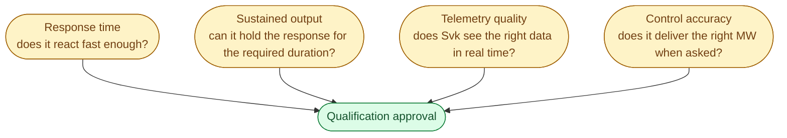
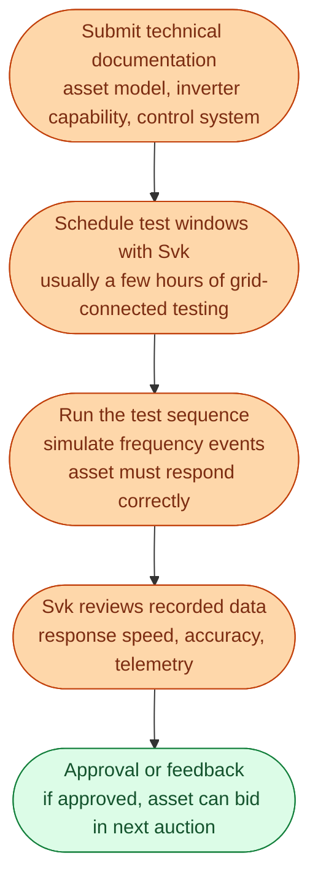
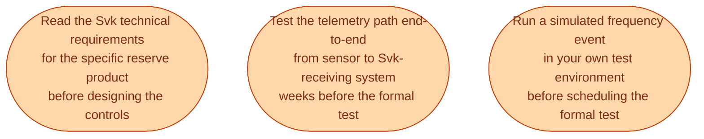

A battery operator with a new 10 MW project does not just sign up to FCR-D and start earning. Svenska kraftnät requires every reserve-providing asset to be **qualified** first. The asset has to prove, through real tests, that it can respond fast enough, sustain the response long enough, and report telemetry accurately.

This step takes weeks to months. It is real engineering work, and missing it is one of the most common ways new projects miss their revenue date.

## What the qualification proves

Different reserves have different requirements. FCR-D requires very fast response (within seconds), but only for 5 to 15 minutes. aFRR requires slower response but for longer durations and with more accurate tracking of the central signal. mFRR requires the asset to ramp to a specified MW within 15 minutes.

## The qualification process

A simplified picture for a battery applying for FCR-D.

Typical timeline from filing to approval: **6 to 16 weeks**, sometimes longer for unusual asset types. Build this into project plans.

## Common failure modes

The most common reasons projects fail or delay qualification.

**Telemetry not landing where Svk expects it.** Svk has a specified data protocol and a list of required fields with specific naming conventions. A small mismatch (a unit error, a missing field, a wrong polling interval) can fail the qualification.

**Response too slow under real-grid conditions.** A battery that responds correctly in a controlled bench test can be slower in the field. Network delays, inverter handshakes, control system overhead all add up. Field testing reveals it.

**Asset cannot hold the response.** A 1-hour battery declared as a 10 MW FCR-D resource must deliver 10 MW for 15 minutes (with some reserve for the rest of the hour). If the actual deliverable is 8 MW for 15 minutes, the asset is not 10 MW for FCR-D.

**Telemetry inaccuracies.** Reported state of charge differs from actual. Reported output differs from measured. These small mismatches stop qualification, and they often only show up during the test.

## What the operator can do to prepare

If you are an engineer involved in a new battery, aggregation, or hydro asset trying to qualify, three things help.

The biggest mistake is treating qualification as a final compliance step rather than a design constraint from the start.

## The implications for aggregators

For aggregators, qualification is more complex. They are presenting many small assets as one. Svk requires:

- **Pool-level response** that meets the same speed, accuracy, and duration requirements as a single asset would.
- **Telemetry from the pool** that reflects the actual real-time behaviour of the underlying assets.
- **Demonstration that asset dropouts** (a single home battery offline) do not collapse the pool below the contracted level.

Many aggregators struggle here in their first qualification attempt because the underlying assets are too inconsistent. The aggregation layer has to compensate.

## What this means for an engineer crossing in

Qualification is one of the most underrated parts of the reserve market. It is where good systems engineering directly translates into revenue start dates.

If you join a battery developer, an aggregator, or a utility expanding into reserves, expect to spend real time on:

- Reading the Svk technical documents (they are dense, in Swedish, often updated).
- Setting up the telemetry pipeline to Svk's specification.
- Building a test harness that exercises every required scenario before the real qualification.

The teams that do this well start earning revenue six months earlier than the teams that wing it.

## Next

The first wave of Swedish battery projects almost all bid into the same product. See [Batteries in FCR-D: the first real Swedish business case]({{ '/energy/concepts/039-batteries-fcr-d/' | relative_url }}).
