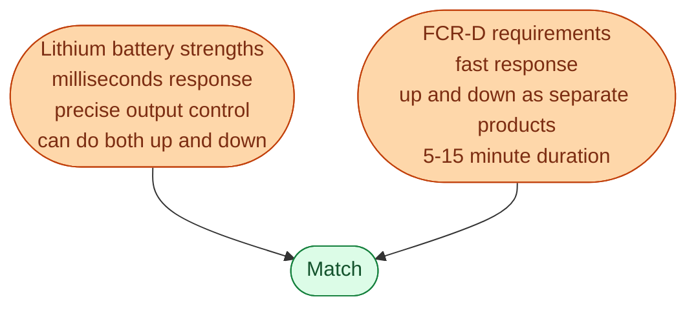
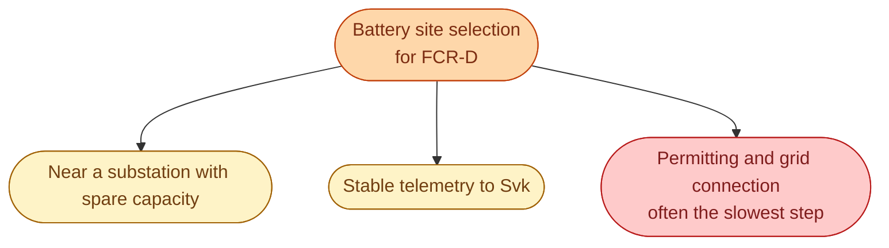
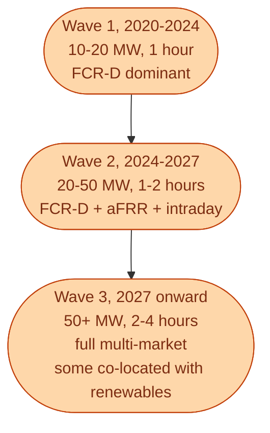

Walk past a new lithium battery project in Sweden built between 2020 and 2024. There is around a 90 percent chance it was sized as **10 to 20 MW, 1 hour** and bid almost exclusively into **FCR-D**. This was not an accident. It was the one product where the economics added up.

The story of how that product became the *default Swedish battery business case*, and how it is now slowly diversifying, is a useful window into how reserve markets and asset design fit together.

## Why FCR-D was the first home for batteries

Three reasons FCR-D and lithium batteries fit each other so well.

**Response speed.** Hydro can respond in tens of seconds. Lithium responds in milliseconds. For FCR-D, where the goal is to catch a sudden fall, the millisecond advantage is technically valuable.

**Asymmetric duration.** FCR-D up only needs a 5 to 15 minute response. A 1-hour battery has plenty of margin. A larger battery is overkill.

**Both directions.** A battery can sell FCR-D up *and* FCR-D down from the same hardware. Hydro can too, but with more complications. Batteries can do both freely.

## The numbers that worked

The illustrative business case for a Swedish 10 MW / 10 MWh battery built in 2022:

| Component | Annual revenue |
| --- | --- |
| FCR-D up at ~150 SEK/MW per hour | ~13 MSEK |
| FCR-D down at ~100 SEK/MW per hour | ~9 MSEK |
| Energy activations (small) | ~1 MSEK |
| **Total reserve revenue** | **~23 MSEK** |
| Capex (rough) | 60-100 MSEK |
| **Payback (rough)** | **3 to 5 years** |

Numbers vary by year and project. But this was the shape that justified the early Swedish projects. Without FCR-D, the numbers did not work.

## What this means in practice for site selection

A battery sized for FCR-D does not need to be near load. It does not need to be near generation. It just needs a grid connection big enough to inject and absorb its rated power.

The permitting and DSO grid-connection process is now the biggest bottleneck for new battery projects in Sweden. Building the battery itself is fast. Getting permission to connect to the grid is not.

## Why the FCR-D-only model is changing

A few forces are pushing battery owners to expand beyond FCR-D.

**Market saturation.** As more batteries qualify and bid into FCR-D, the auction prices fall. The first 100 MW of qualified battery capacity was hugely profitable. The 500th MW earns less per MW.

**Longer-duration products growing.** aFRR is becoming more accessible to batteries. PICASSO coupling is expanding the market. 2-hour and 4-hour batteries are now competitive.

**Day-ahead and intraday arbitrage.** With more renewables on the system, the daily price spread is widening. A 4-hour battery can capture the spread between cheap morning and expensive evening with real revenue.

**Industrial PPAs.** Some battery owners are signing deals with industrial customers (data centres, factories) that pay for peak shaving or backup power.

## The next wave of Swedish batteries

A simplified picture of where the market is heading.

Each wave adds more markets, more complexity, and more software needs.

## What this means for an engineer crossing in

Battery operations is one of the most software-driven corners of the Swedish energy market today. A typical battery operator runs:

- A real-time dispatch engine that can switch between FCR-D, aFRR, intraday, and day-ahead depending on which is most profitable.
- A forecasting layer that predicts state of charge, market prices, and activation risk.
- A settlement engine that reconciles Svk's payments with the asset's actual delivery.
- An optimisation layer that decides week-ahead and day-ahead positioning.

This is one of the easiest entry points into Swedish energy for engineers from software, fintech, or industrial automation. The system runs on data and code, and the revenue is meaningfully connected to engineering quality.

## Closing of Section E

That covers the balancing markets. From FCR-N keeping the system gently aligned, through FCR-D catching big disturbances, aFRR restoring the frequency, mFRR taking over, imbalance settling the bills, qualification getting assets in, to batteries finding the first business model.

You now have the full picture of:

- **A**: how the market works at the foundations
- **B**: who the actors are in depth
- **C**: how the day-ahead wholesale market clears
- **D**: how intraday fills the gap
- **E**: how the system actually balances second by second

Sections A through E together are what makes an engineer market-literate in Swedish energy. The optional sections (F to L) would add depth on retail, generation tech, EU coupling, the transition, IT systems, and economics.

## Next

You have reached the end of Sections A through E. Return to the [concept index]({{ '/energy/concepts/' | relative_url }}) to revisit any topic.
