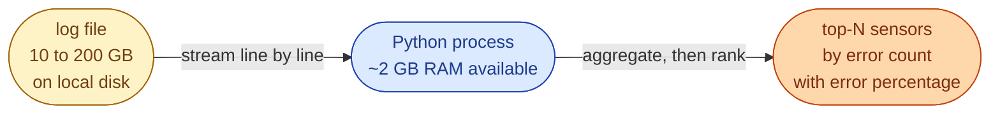



## Scenario

An IoT platform writes one log line per sensor reading. You are handed a single rotated log file that is **between 10 and 200 GB** and asked to figure out which sensors are misbehaving. The file lives on a single disk on a single machine. You do not have a cluster. You have one shift.

Each line has three space-separated fields.

```
2025-10-11T13:45:20Z sensor_12 OK
2025-10-11T13:45:21Z sensor_45 ERROR
2025-10-11T13:45:22Z sensor_12 ERROR
2025-10-11T13:45:25Z sensor_99 OK
```



The file does not fit in RAM. Sorting the whole thing on disk is wasteful when you only want the top 5.

## Task

Write a Python program that:

1. Reads the log file as a stream. The whole file must never be in memory at once.
2. Counts how many times each sensor reported `ERROR`.
3. Prints the top 5 sensors by error count, along with their OK count and their error rate.

## Bonus

- Handle the case where the sensor cardinality is itself in the millions and the counter dict would not fit in memory. Mention what data structure you would reach for.
- Mention how the solution changes if the file is on object storage (S3 or GCS) instead of local disk.

## What a Good Answer Covers

- A clear progression: brute force, the obvious right answer, then memory-bounded variants.
- Time and space complexity stated for each approach.
- An honest discussion of when each one is the right choice.
- Awareness that the right answer depends on the cardinality of sensors, not just the size of the file.


<div class="pr-solution-divider"></div>


_Reference implementation_ — `solution.py`

```python
"""
Problem 1, Log File Error Analysis
Author: Amirul Islam

Four solutions, ordered the way you would walk an interviewer through them.

    Approach 1: brute force, load the whole file into a list             (wrong)
    Approach 2: streaming single-pass Counter                            (right)
    Approach 3: streaming + bounded min-heap for top-N                   (memory-tight)
    Approach 4: massive cardinality, Count-Min Sketch + second pass      (sketch)

Each approach has its complexity stated. Run main() to use Approach 2 against
the sample log under ../../data/sensor_data.log.
"""

from __future__ import annotations

import heapq
from collections import Counter, defaultdict
from pathlib import Path
from typing import Iterable


# =============================================================================
# Approach 1, brute force, load every line into a list
# -----------------------------------------------------------------------------
# Time:  O(N) parse + O(K log K) final sort, where N = lines, K = unique sensors
# Space: O(N) lines held + O(K) counters
#
# Why this is wrong:
#   The problem states the file is 10 to 200 GB. readlines() will OOM long
#   before it finishes. Sorting every unique sensor at the end is also wasted
#   work when we only care about top-N.
#
# When to say it in an interview:
#   To open the discussion. Then immediately critique it.
# =============================================================================
def brute_force(file_path: str | Path, top_n: int = 5
                ) -> list[tuple[str, int, int, float]]:
    with open(file_path) as f:
        lines = f.readlines()                       # whole file in memory

    ok: dict[str, int] = defaultdict(int)
    err: dict[str, int] = defaultdict(int)
    for line in lines:
        parts = line.strip().split()
        if len(parts) != 3:
            continue
        _, sensor, status = parts
        if status == "OK":
            ok[sensor] += 1
        elif status == "ERROR":
            err[sensor] += 1

    rows = []
    for sensor in set(ok) | set(err):               # union touches every sensor
        e = err[sensor]
        total = ok[sensor] + e
        rows.append((sensor, ok[sensor], e, (e / total * 100) if total else 0.0))
    rows.sort(key=lambda r: r[2], reverse=True)     # sort all K, then slice top-N
    return rows[:top_n]


# =============================================================================
# Approach 2, streaming Counter, single pass
# -----------------------------------------------------------------------------
# Time:  O(N) parse + O(K log T) for top-N via heapq.nlargest, T = top_n
# Space: O(K) for the two counters
#
# This is the answer the interviewer wants you to land on first.
#   - We stream line by line. The file is never in memory.
#   - The counter holds one entry per unique sensor, not per line.
#   - For a typical fleet (10k to 100k sensors) the dict fits comfortably.
#   - heapq.nlargest beats sort + slice when T is small relative to K.
# =============================================================================
def streaming_counter(file_path: str | Path, top_n: int = 5
                      ) -> list[tuple[str, int, int, float]]:
    ok: Counter[str] = Counter()
    err: Counter[str] = Counter()

    with open(file_path) as f:
        for line in f:                              # iterator, never the whole file
            parts = line.strip().split()
            if len(parts) != 3:
                continue
            _, sensor, status = parts
            if status == "OK":
                ok[sensor] += 1
            elif status == "ERROR":
                err[sensor] += 1

    top = heapq.nlargest(top_n, err.items(), key=lambda kv: kv[1])
    out = []
    for sensor, e in top:
        total = ok[sensor] + e
        out.append((sensor, ok[sensor], e, (e / total * 100) if total else 0.0))
    return out


# =============================================================================
# Approach 3, streaming bounded min-heap, decide top-N as we go
# -----------------------------------------------------------------------------
# Time:  O(N) parse + O(K log T) maintenance, T = top_n
# Space: O(K) for the counters + O(T) for the heap
#
# Slight variation of Approach 2. Same time, same dict cost, but the framing
# matters in an interview: you are showing that you can keep only the top T
# candidates resident, not all K. It is the bridge to Approach 4.
# =============================================================================
def streaming_heap(file_path: str | Path, top_n: int = 5
                   ) -> list[tuple[str, int, int, float]]:
    ok: Counter[str] = Counter()
    err: Counter[str] = Counter()

    with open(file_path) as f:
        for line in f:
            parts = line.strip().split()
            if len(parts) != 3:
                continue
            _, sensor, status = parts
            if status == "OK":
                ok[sensor] += 1
            elif status == "ERROR":
                err[sensor] += 1

    heap: list[tuple[int, str]] = []                # min-heap by error count
    for sensor, e in err.items():
        if len(heap) < top_n:
            heapq.heappush(heap, (e, sensor))
        elif e > heap[0][0]:
            heapq.heapreplace(heap, (e, sensor))

    out = []
    for e, sensor in sorted(heap, reverse=True):
        total = ok[sensor] + e
        out.append((sensor, ok[sensor], e, (e / total * 100) if total else 0.0))
    return out


# =============================================================================
# Approach 4, Count-Min Sketch + second exact pass, cardinality unbounded
# -----------------------------------------------------------------------------
# Time:  O(N * d) for the sketch (d = sketch depth) + O(N) for the exact pass
# Space: O(w * d) for the sketch, independent of K
#         + O(C) for the candidate set during the second pass (C = top_n * K_factor)
#
# When to use it:
#   When the sensor cardinality is so large that even the running counter dict
#   will not fit in memory. The classic case is request IDs, user IDs, or URLs
#   at internet scale. We sketch the heavy hitters on pass one, then take only
#   a small candidate set into pass two for exact counts. Accuracy of the
#   sketch is bounded by width and depth.
#
# This is the spot where you mention Misra-Gries, Space-Saving, or Bloom filter
# variants if the interviewer wants to keep going. Numeric correctness is not
# the point; the point is to show you reach for bounded-memory algorithms when
# the inputs justify it.
# =============================================================================
def count_min_sketch_top_n(file_path: str | Path, top_n: int = 5,
                           width: int = 1 << 20, depth: int = 5,
                           heavy_threshold: int = 100,
                           ) -> list[tuple[str, int]]:
    import hashlib

    sketch = [[0] * width for _ in range(depth)]

    def _hashes(key: str) -> Iterable[int]:
        # Independent hash family via salted md5 of the key.
        for i in range(depth):
            h = hashlib.md5(f"{i}:{key}".encode()).digest()
            yield int.from_bytes(h[:8], "big") % width

    def update(key: str) -> None:
        for i, idx in enumerate(_hashes(key)):
            sketch[i][idx] += 1

    def estimate(key: str) -> int:
        return min(sketch[i][idx] for i, idx in enumerate(_hashes(key)))

    candidates: set[str] = set()
    with open(file_path) as f:
        for line in f:
            parts = line.strip().split()
            if len(parts) == 3 and parts[2] == "ERROR":
                update(parts[1])
                if estimate(parts[1]) > heavy_threshold:
                    candidates.add(parts[1])

    exact: Counter[str] = Counter()
    with open(file_path) as f:
        for line in f:
            parts = line.strip().split()
            if len(parts) == 3 and parts[2] == "ERROR" and parts[1] in candidates:
                exact[parts[1]] += 1

    return exact.most_common(top_n)


# =============================================================================
# CLI entry point: runs the answer the interviewer wants (Approach 2).
# =============================================================================
def main() -> None:
    rows = streaming_counter("../../data/sensor_data.log")
    print("Sensor ID | OK Count | Error Count | Error %")
    print("-" * 48)
    for sensor, ok_n, err_n, pct in rows:
        print(f"{sensor:<9} | {ok_n:<8} | {err_n:<11} | {pct:>6.2f}%")


if __name__ == "__main__":
    main()
```

