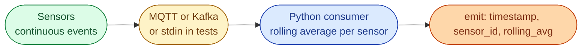



## Scenario

You are building a data pipeline for IoT sensors (battery storage, PV inverters, weather stations). Each sensor publishes a temperature reading every few seconds. The stream never ends.

```
2025-10-11T13:45:20Z sensor_1 25.4
2025-10-11T13:45:25Z sensor_1 26.1
2025-10-11T13:45:30Z sensor_2 22.8
2025-10-11T13:45:35Z sensor_1 27.0
2025-10-11T13:45:40Z sensor_2 23.4
```



The pipeline never stops. Memory budget is fixed per host. The number of unique sensors can grow over time.

## Task

For each incoming reading, emit a line of the form:

```
<timestamp> <sensor_id> <rolling_average>
```

where `rolling_average` is the mean of the **last 3 readings** for that sensor (including the current one).

## Constraints

- Memory must not grow with stream length. It can only grow with the number of unique sensors.
- The consumer must keep running even when an occasional line is malformed.
- The code should be easy to drop into a Kafka or MQTT consumer.

## Bonus

- Cap memory even when the sensor cardinality is huge (millions of unique IDs). Mention what data structure or eviction policy you would use.
- Make the window size configurable per sensor type.
- Discuss what changes if you need **time-based** windows (last 60 seconds) instead of **count-based** (last 3 readings).

## What a Good Answer Covers

- A clear progression: naive list, deque-based sliding window, incremental sum maintained as we go.
- Time and space complexity for each approach.
- Awareness that the right answer changes if you switch from count windows to time windows.
- Clean separation between the data structure and the I/O loop, so the same logic plugs into Kafka, MQTT, or a file.


<div class="pr-solution-divider"></div>


_Reference implementation_ — `solution.py`

```python
"""
Problem 2, Rolling Average of Sensor Readings
Author: Amirul Islam

Four solutions, ordered the way a senior would walk through them.

    Approach 1: naive list, recompute mean every time                    (wrong)
    Approach 2: deque(maxlen=W), recompute mean over W items             (correct)
    Approach 3: deque + running sum, O(1) per event                      (optimal-count)
    Approach 4: time-bounded window, deque + sum, evict by timestamp     (time windows)

The right answer for a count window is Approach 3. The right answer for a
time-based window is Approach 4. Approach 1 is included so the interview
discussion has somewhere to start.

Run main() to use Approach 3 against stdin or a sample file.
"""

from __future__ import annotations

import sys
from collections import deque
from typing import Iterator


# =============================================================================
# Approach 1, naive list, recompute the mean every time
# -----------------------------------------------------------------------------
# Time:  O(W) per event because sum(values) walks the window
# Space: O(W) per sensor where W = window size
#
# Why this is wrong even though it works:
#   sum() is recomputed for every reading. With W=3 it does not matter, with
#   W=1000 it absolutely does. Also a list with .pop(0) is O(W) per call.
# =============================================================================
def naive_list(stream: Iterator[str], window: int = 3) -> Iterator[str]:
    state: dict[str, list[float]] = {}
    for line in stream:
        parts = line.strip().split()
        if len(parts) != 3:
            continue
        ts, sensor, raw = parts
        try:
            value = float(raw)
        except ValueError:
            continue
        values = state.setdefault(sensor, [])
        values.append(value)
        if len(values) > window:
            values.pop(0)                          # O(W), shifts the list
        avg = sum(values) / len(values)            # O(W) every time
        yield f"{ts} {sensor} {avg:.2f}"


# =============================================================================
# Approach 2, deque with maxlen, recompute the mean
# -----------------------------------------------------------------------------
# Time:  O(W) per event for sum + O(1) for popleft when full
# Space: O(W) per sensor
#
# Strictly better than Approach 1 because the eviction is O(1), but the sum is
# still O(W). On a hot path with W in the hundreds this becomes the bottleneck.
# =============================================================================
def deque_window(stream: Iterator[str], window: int = 3) -> Iterator[str]:
    state: dict[str, deque[float]] = {}
    for line in stream:
        parts = line.strip().split()
        if len(parts) != 3:
            continue
        ts, sensor, raw = parts
        try:
            value = float(raw)
        except ValueError:
            continue
        dq = state.setdefault(sensor, deque(maxlen=window))
        dq.append(value)
        avg = sum(dq) / len(dq)                    # O(W) every event
        yield f"{ts} {sensor} {avg:.2f}"


# =============================================================================
# Approach 3, deque + running sum, O(1) per event
# -----------------------------------------------------------------------------
# Time:  O(1) per event
# Space: O(W) per sensor
#
# This is the answer the interviewer is looking for on a count-based window.
#   - dq.append, automatic dq.popleft when full
#   - keep a running sum that we add to on append and subtract from on evict
#   - mean is always sum / len(dq), no walk required
#
# State per sensor is (deque, running_sum). A wrapper struct or two parallel
# dicts both work; the deque inline is more compact.
# =============================================================================
def deque_running_sum(stream: Iterator[str], window: int = 3) -> Iterator[str]:
    windows: dict[str, deque[float]] = {}
    sums: dict[str, float] = {}

    for line in stream:
        parts = line.strip().split()
        if len(parts) != 3:
            continue
        ts, sensor, raw = parts
        try:
            value = float(raw)
        except ValueError:
            continue

        dq = windows.get(sensor)
        if dq is None:
            dq = deque(maxlen=window)
            windows[sensor] = dq
            sums[sensor] = 0.0

        # If the deque is full, the next append will silently drop the head.
        # Account for that before we lose it.
        if len(dq) == window:
            sums[sensor] -= dq[0]
        dq.append(value)
        sums[sensor] += value

        avg = sums[sensor] / len(dq)
        yield f"{ts} {sensor} {avg:.2f}"


# =============================================================================
# Approach 4, time-bounded window, O(amortized 1) per event
# -----------------------------------------------------------------------------
# Time:  Amortized O(1) per event, worst case O(W_old) when many old events
#        expire at once
# Space: O(W_per_sensor) where the size depends on event rate and window length
#
# Use this when the requirement is the last 60 seconds rather than the last 3
# readings. Evict from the head while head.ts is older than (current_ts - window).
#
# Subtlety: a slow sensor can have an old window that becomes empty between
# events. Decide on the semantics: emit on every event with the current
# window, or also emit a 'no data' event when the window has gone empty.
# =============================================================================
def time_window(stream: Iterator[str], window_seconds: float = 60.0
                ) -> Iterator[str]:
    from datetime import datetime

    windows: dict[str, deque[tuple[datetime, float]]] = {}
    sums: dict[str, float] = {}

    for line in stream:
        parts = line.strip().split()
        if len(parts) != 3:
            continue
        ts_str, sensor, raw = parts
        try:
            ts = datetime.fromisoformat(ts_str.replace("Z", "+00:00"))
            value = float(raw)
        except ValueError:
            continue

        dq = windows.setdefault(sensor, deque())
        if sensor not in sums:
            sums[sensor] = 0.0

        # Evict everything older than (ts - window_seconds)
        while dq and (ts - dq[0][0]).total_seconds() > window_seconds:
            _, old_v = dq.popleft()
            sums[sensor] -= old_v

        dq.append((ts, value))
        sums[sensor] += value

        avg = sums[sensor] / len(dq) if dq else 0.0
        yield f"{ts_str} {sensor} {avg:.2f}"


# =============================================================================
# CLI entry point: stream from stdin (or a file path argv[1]) using Approach 3.
# =============================================================================
def main() -> None:
    if len(sys.argv) > 1:
        f = open(sys.argv[1])
        stream = (line for line in f)
    else:
        stream = (line for line in sys.stdin)
    for out in deque_running_sum(stream, window=3):
        print(out)


if __name__ == "__main__":
    main()
```

