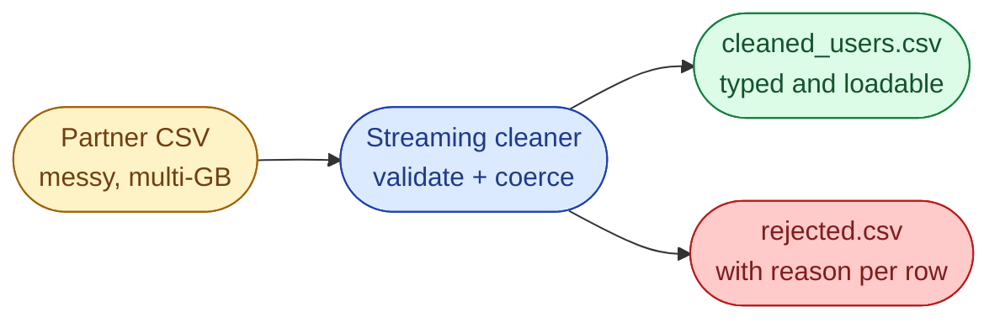



## Scenario

A partner API drops a daily CSV of user activity into your landing bucket. The warehouse team wants it in a clean, typed shape for BigQuery. The file is large enough that pandas-style *load everything* will OOM your worker, and the data is dirty in predictable ways.

```
user_id,name,email,signup_date,last_login,total_purchases
101,John Doe,john@example.com,2024-12-01,2025-10-10,15
102,Jane Doe,,2025-01-15,2025-09-30,22
103,Bob Smith,bob@example,2024-11-20,2025-10-05,abc
104,,maria@example.com,2025-02-10,,30
```



## Cleaning rules

| Rule | What to do |
| --- | --- |
| Missing or invalid `email` | Reject the row, write to `rejected.csv` with a reason |
| Missing `name` | Replace with `"Unknown"` |
| Missing `last_login` | Replace with `"N/A"` |
| `total_purchases` not an int | Coerce to `0` |
| `signup_date > last_login` | Add `is_date_valid = False`, else `True` |

## Task

Write `cleaned_users.csv` and `rejected.csv`. Process the input as a stream. The full file must never be in memory.

## Bonus

- Log per-rule reject counts at the end (how many rows failed each rule).
- Make the validators data-driven so adding a new rule does not require a new code branch.

## What a Good Answer Covers

- Streaming with `csv.DictReader`, not pandas.
- A validator-per-column pattern so the cleaning rules are testable in isolation.
- Explicit rejected-row output with reasons (auditability matters in production).
- Time and space complexity for each approach.


<div class="pr-solution-divider"></div>


_Reference implementation_ — `solution.py`

```python
"""
Problem 3, Transform and Clean Raw Data for Analytics
Author: Amirul Islam

Three solutions, ordered the way a senior would walk through them.

    Approach 1: pandas, read_csv + apply                                (wrong)
    Approach 2: streaming csv.DictReader, inline if/else                (works)
    Approach 3: streaming + validator registry + reject sink            (production)

The right answer is Approach 3. Approach 2 is the line many candidates
stop at; the reason to keep going is testability, observability, and
the explicit rejected.csv that an auditor will ask for.
"""

from __future__ import annotations

import csv
import re
import sys
from collections import Counter
from datetime import datetime
from typing import Callable, Iterable


EMAIL_RE = re.compile(r"^[^@\s]+@[^@\s]+\.[^@\s]+$")


# =============================================================================
# Approach 1, pandas, read_csv + apply
# -----------------------------------------------------------------------------
# Time:  O(N) but with a large constant for column-wise apply
# Space: O(N) for the DataFrame in memory
#
# Why it is wrong:
#   The problem says the file is large. Pandas loads the whole CSV into a
#   DataFrame. For multi-GB files this OOMs the worker, and even when it fits
#   the column-wise apply chains are slow.
#
# Useful as the *baseline* an analyst would write before you rewrite it.
# =============================================================================
def pandas_apply(in_path: str, out_path: str) -> None:
    import pandas as pd
    df = pd.read_csv(in_path)
    df = df[df["email"].fillna("").str.match(EMAIL_RE)]
    df["name"] = df["name"].fillna("Unknown")
    df["last_login"] = df["last_login"].fillna("N/A")
    df["total_purchases"] = pd.to_numeric(df["total_purchases"], errors="coerce").fillna(0).astype(int)
    df["is_date_valid"] = df.apply(
        lambda r: r["signup_date"] <= r["last_login"] if r["last_login"] != "N/A" else True,
        axis=1,
    )
    df.to_csv(out_path, index=False)


# =============================================================================
# Approach 2, streaming csv.DictReader, inline if/else
# -----------------------------------------------------------------------------
# Time:  O(N), single pass
# Space: O(1), one row at a time
#
# Memory is fine. The problem is maintainability: every new cleaning rule
# becomes another branch in the same loop, and there is no audit trail for
# rejected rows. Good enough for a one-off, not for production.
# =============================================================================
def streaming_inline(in_path: str, out_path: str) -> None:
    fields = ["user_id", "name", "email", "signup_date", "last_login",
              "total_purchases", "is_date_valid"]
    with open(in_path) as fin, open(out_path, "w", newline="") as fout:
        reader = csv.DictReader(fin)
        writer = csv.DictWriter(fout, fieldnames=fields)
        writer.writeheader()
        for row in reader:
            email = (row.get("email") or "").strip()
            if not EMAIL_RE.match(email):
                continue                                     # silently dropped, bad
            row["name"] = (row.get("name") or "").strip() or "Unknown"
            row["last_login"] = (row.get("last_login") or "").strip() or "N/A"
            try:
                row["total_purchases"] = int(row.get("total_purchases") or 0)
            except ValueError:
                row["total_purchases"] = 0
            sd = (row.get("signup_date") or "").strip()
            ll = row["last_login"]
            row["is_date_valid"] = ll == "N/A" or sd <= ll
            writer.writerow({k: row.get(k) for k in fields})


# =============================================================================
# Approach 3, streaming + validator registry + reject sink
# -----------------------------------------------------------------------------
# Time:  O(N) parse + O(R) per row across R rules, R is small constant
# Space: O(1) row + O(R) reject counters
#
# This is the answer a senior reaches for.
#   - Each rule is a small function: (row) -> (transformed_row, reject_reason | None)
#   - Rules are listed in a registry; adding one is appending to a list
#   - Rejects go to rejected.csv with the reason column
#   - A Counter tracks per-rule reject counts for the end-of-run log
#
# Easy to unit-test, easy to extend, easy to audit.
# =============================================================================
Rule = Callable[[dict], tuple[dict, str | None]]


def _require_email(row: dict) -> tuple[dict, str | None]:
    email = (row.get("email") or "").strip()
    if not EMAIL_RE.match(email):
        return row, "missing_or_invalid_email"
    row["email"] = email
    return row, None


def _default_name(row: dict) -> tuple[dict, str | None]:
    row["name"] = (row.get("name") or "").strip() or "Unknown"
    return row, None


def _default_last_login(row: dict) -> tuple[dict, str | None]:
    row["last_login"] = (row.get("last_login") or "").strip() or "N/A"
    return row, None


def _coerce_total_purchases(row: dict) -> tuple[dict, str | None]:
    try:
        row["total_purchases"] = int(row.get("total_purchases") or 0)
    except (TypeError, ValueError):
        row["total_purchases"] = 0
    return row, None


def _flag_date_validity(row: dict) -> tuple[dict, str | None]:
    sd = (row.get("signup_date") or "").strip()
    ll = row.get("last_login", "")
    row["is_date_valid"] = ll == "N/A" or (sd and sd <= ll)
    return row, None


RULES: list[Rule] = [
    _require_email,
    _default_name,
    _default_last_login,
    _coerce_total_purchases,
    _flag_date_validity,
]


def streaming_registry(in_path: str, out_path: str = "cleaned_users.csv",
                       reject_path: str = "rejected.csv",
                       rules: Iterable[Rule] = RULES) -> Counter[str]:
    out_fields = ["user_id", "name", "email", "signup_date", "last_login",
                  "total_purchases", "is_date_valid"]
    rejects: Counter[str] = Counter()

    with open(in_path) as fin, \
         open(out_path, "w", newline="") as fout, \
         open(reject_path, "w", newline="") as frej:
        reader = csv.DictReader(fin)
        writer = csv.DictWriter(fout, fieldnames=out_fields)
        rwriter = csv.DictWriter(frej, fieldnames=list(reader.fieldnames or []) + ["reason"])
        writer.writeheader()
        rwriter.writeheader()

        for row in reader:
            reject_reason = None
            for rule in rules:
                row, reason = rule(row)
                if reason is not None:
                    reject_reason = reason
                    break
            if reject_reason:
                rejects[reject_reason] += 1
                row["reason"] = reject_reason
                rwriter.writerow(row)
                continue
            writer.writerow({k: row.get(k) for k in out_fields})

    return rejects


def main() -> None:
    in_path = sys.argv[1] if len(sys.argv) > 1 else "../../data/users_raw.csv"
    counts = streaming_registry(in_path)
    if counts:
        print("Rejected rows by reason:")
        for reason, n in counts.most_common():
            print(f"  {reason}: {n}")
    else:
        print("All rows passed.")


if __name__ == "__main__":
    main()
```

