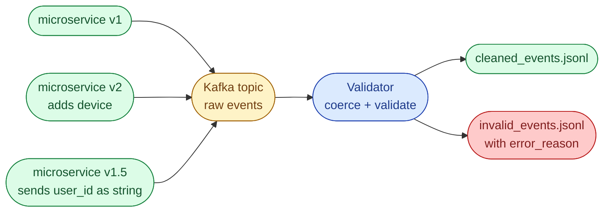



## Scenario

A streaming pipeline ingests user events from many microservices into Kafka. Producer teams move at different speeds: some send the v1 schema, some have already added a `device` field, some send `user_id` as a string when the contract says int. Downstream wants only clean, normalized events.

```json
{"user_id": 101, "event_type": "login", "timestamp": "2025-10-14T12:00:00Z"}
{"user_id": 102, "event_type": "purchase", "amount": 59.99, "timestamp": "2025-10-14T12:02:15Z"}
{"user_id": "103", "event_type": "logout", "timestamp": "2025-10-14T12:05:20Z"}
{"event_type": "login", "timestamp": "2025-10-14T12:07:00Z"}
```



## Schema

| Field | Type | Required | Notes |
| --- | --- | --- | --- |
| `user_id` | int | yes | Coerce from string if possible. Reject if missing or not coercible. |
| `event_type` | str | yes | One of `login`, `logout`, `purchase`. |
| `timestamp` | str | yes | Valid ISO 8601. |
| `amount` | float | no | Required for `purchase` only. Default to `0.0` if absent. |
| `device` | str | no | New optional field. Pass through if present. |
| any other field | - | no | Unknown fields are silently kept under `_extra`. |

## Task

Read `events.jsonl` line by line. Write valid normalized events to `cleaned_events.jsonl`. Write rejects to `invalid_events.jsonl` with an `error_reason`.

## Bonus

- Support schema **versioning** so a `schema_version` field on the event picks the right validator.
- Log per-error reject counts at the end.
- Discuss how this hooks into a real schema registry (Confluent, Glue) and the trade-offs versus Pydantic-only validation.

## What a Good Answer Covers

- An incremental progression: manual `try/except`, dataclass with coercion, Pydantic model with strict and lax variants.
- Awareness that unknown fields are *not* errors; they are a future-compatibility signal.
- The reject sink with reasons, because downstream owners will need it.
- Time and space complexity per approach (mostly trivial here; the interview signal is the design).


<div class="pr-solution-divider"></div>


_Reference implementation_ — `solution.py`

```python
"""
Problem 4, Schema Evolution and Validation for Streaming Events
Author: Amirul Islam

Three solutions, ordered the way a senior would walk through them.

    Approach 1: manual try/except per field                             (works, ugly)
    Approach 2: dataclass + explicit coercion                            (clean)
    Approach 3: Pydantic v2 model with strict=False + version dispatch   (production)

Pydantic is the right tool when you can take the dependency. If you cannot
(e.g. lambda cold-start budget), Approach 2 is the structured alternative.
"""

from __future__ import annotations

import json
import sys
from collections import Counter
from dataclasses import dataclass, field
from datetime import datetime
from typing import Any


VALID_EVENT_TYPES = {"login", "logout", "purchase"}


def _parse_iso8601(s: str) -> bool:
    try:
        datetime.fromisoformat(s.replace("Z", "+00:00"))
        return True
    except (TypeError, ValueError):
        return False


# =============================================================================
# Approach 1, manual try/except per field
# -----------------------------------------------------------------------------
# Time:  O(N), single pass over events
# Space: O(1) per event
#
# Works. Becomes a swamp the moment the schema grows past five fields. Every
# new producer change adds a branch and a test case at the same time.
# =============================================================================
def manual_loop(in_path: str, ok_path: str, bad_path: str) -> Counter[str]:
    rejects: Counter[str] = Counter()
    with open(in_path) as fin, open(ok_path, "w") as fok, open(bad_path, "w") as fbad:
        for line in fin:
            line = line.strip()
            if not line:
                continue
            try:
                ev = json.loads(line)
            except json.JSONDecodeError:
                rejects["bad_json"] += 1
                fbad.write(json.dumps({"raw": line, "error_reason": "bad_json"}) + "\n")
                continue

            # user_id required, coerce to int
            uid = ev.get("user_id")
            try:
                ev["user_id"] = int(uid)
            except (TypeError, ValueError):
                rejects["bad_user_id"] += 1
                ev["error_reason"] = "bad_user_id"
                fbad.write(json.dumps(ev) + "\n")
                continue

            # event_type required, must be in set
            et = ev.get("event_type")
            if et not in VALID_EVENT_TYPES:
                rejects["bad_event_type"] += 1
                ev["error_reason"] = "bad_event_type"
                fbad.write(json.dumps(ev) + "\n")
                continue

            # timestamp required, ISO 8601
            ts = ev.get("timestamp", "")
            if not _parse_iso8601(ts):
                rejects["bad_timestamp"] += 1
                ev["error_reason"] = "bad_timestamp"
                fbad.write(json.dumps(ev) + "\n")
                continue

            # amount only for purchase
            if et == "purchase":
                try:
                    ev["amount"] = float(ev.get("amount", 0.0))
                except (TypeError, ValueError):
                    ev["amount"] = 0.0
            else:
                ev["amount"] = 0.0

            fok.write(json.dumps(ev) + "\n")
    return rejects


# =============================================================================
# Approach 2, dataclass with explicit coercion helpers
# -----------------------------------------------------------------------------
# Time:  O(N)
# Space: O(1) per event + small dataclass overhead
#
# Tightens Approach 1 by moving coercion into named helpers and the dataclass.
# Unit-testable per coercer. Still no dependency footprint.
# =============================================================================
@dataclass
class Event:
    user_id: int
    event_type: str
    timestamp: str
    amount: float = 0.0
    device: str | None = None
    extra: dict[str, Any] = field(default_factory=dict)

    @classmethod
    def from_raw(cls, raw: dict) -> "Event":
        # Coerce user_id; raise so the loop above can route to the bad sink.
        try:
            user_id = int(raw["user_id"])
        except (KeyError, TypeError, ValueError) as e:
            raise ValueError("bad_user_id") from e

        event_type = raw.get("event_type")
        if event_type not in VALID_EVENT_TYPES:
            raise ValueError("bad_event_type")

        timestamp = raw.get("timestamp", "")
        if not _parse_iso8601(timestamp):
            raise ValueError("bad_timestamp")

        amount = 0.0
        if event_type == "purchase":
            try:
                amount = float(raw.get("amount", 0.0))
            except (TypeError, ValueError):
                amount = 0.0

        known = {"user_id", "event_type", "timestamp", "amount", "device"}
        extra = {k: v for k, v in raw.items() if k not in known}

        return cls(
            user_id=user_id,
            event_type=event_type,
            timestamp=timestamp,
            amount=amount,
            device=raw.get("device"),
            extra=extra,
        )

    def to_dict(self) -> dict:
        d = {"user_id": self.user_id, "event_type": self.event_type,
             "timestamp": self.timestamp, "amount": self.amount}
        if self.device is not None:
            d["device"] = self.device
        if self.extra:
            d["_extra"] = self.extra
        return d


def dataclass_pipeline(in_path: str, ok_path: str, bad_path: str) -> Counter[str]:
    rejects: Counter[str] = Counter()
    with open(in_path) as fin, open(ok_path, "w") as fok, open(bad_path, "w") as fbad:
        for line in fin:
            line = line.strip()
            if not line:
                continue
            try:
                raw = json.loads(line)
            except json.JSONDecodeError:
                rejects["bad_json"] += 1
                fbad.write(json.dumps({"raw": line, "error_reason": "bad_json"}) + "\n")
                continue
            try:
                ev = Event.from_raw(raw)
            except ValueError as e:
                reason = str(e)
                rejects[reason] += 1
                raw["error_reason"] = reason
                fbad.write(json.dumps(raw) + "\n")
                continue
            fok.write(json.dumps(ev.to_dict()) + "\n")
    return rejects


# =============================================================================
# Approach 3, Pydantic v2 + per-version validator dispatch
# -----------------------------------------------------------------------------
# Time:  O(N)
# Space: O(1) per event + the Pydantic model overhead
#
# When to use it:
#   When you can take the Pydantic dependency. Strict and lax modes give you
#   per-field control over coercion. Versioned models give you per-producer
#   schema selection (via a 'schema_version' field on the event).
#
# Pseudo-code is shown rather than full Pydantic models so this file stays
# importable without the dependency. In a real codebase the v1 and v2 classes
# would live in their own module and the dispatch table would be config.
# =============================================================================
def pydantic_dispatch(in_path: str, ok_path: str, bad_path: str) -> Counter[str]:
    """
    Sketch (kept dependency-free for this file):

        from pydantic import BaseModel, Field, ValidationError, field_validator

        class EventV1(BaseModel):
            model_config = {"extra": "allow"}
            user_id: int
            event_type: Literal["login", "logout", "purchase"]
            timestamp: str
            amount: float = 0.0
            device: str | None = None

            @field_validator("timestamp")
            @classmethod
            def _iso(cls, v): ...

        class EventV2(EventV1):
            device: str   # now required

        VALIDATORS = {1: EventV1, 2: EventV2}

        for raw in stream:
            version = raw.get("schema_version", 1)
            try:
                ev = VALIDATORS[version].model_validate(raw)
                ok.write(ev.model_dump_json() + "\\n")
            except ValidationError as e:
                bad.write(json.dumps({**raw, "error_reason": str(e)}) + "\\n")

    The advantage over Approach 2:
        - schema versions are first-class
        - error messages are structured (field, code) not just a single string
        - JSON-schema export comes free (useful for contracts and registries)
    """
    return dataclass_pipeline(in_path, ok_path, bad_path)  # fallback for now


def main() -> None:
    in_path = sys.argv[1] if len(sys.argv) > 1 else "../../data/events.jsonl"
    counts = dataclass_pipeline(in_path, "cleaned_events.jsonl", "invalid_events.jsonl")
    if counts:
        print("Rejected events by reason:")
        for reason, n in counts.most_common():
            print(f"  {reason}: {n}")
    else:
        print("All events passed validation.")


if __name__ == "__main__":
    main()
```

